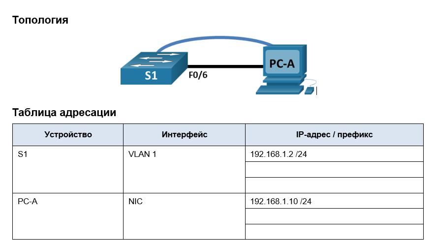
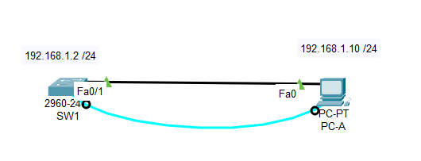

## ДЗ1. Базовая настройка коммутатора
>


##	Задачи
 1. Проверка конфигурации коммутатора по умолчанию.
 2. Создание сети и настройка основных параметров устройства.
    * Настройте базовые параметры коммутатора.
    * Настройте IP-адрес для ПК.
 3. Проверка сетевых подключений

    * Отобразите конфигурацию устройства.
    * Протестируйте сквозное соединение, отправив эхо-запрос.
    * Протестируйте возможности удаленного управления с помощью Telnet.


## Решение
### 1. Создание сети и проверка конфигурации коммутатора по умолчанию.
      
 Шаг 1. Создаим сеть согласно топологии в задании.

 
Топология



* Подсоединяю консольный кабель.
*	Устанавливаю консольное подключение к коммутатору с компьютера PC-A
 
> Для первоначальной настройки коммутатора нужно использовать консольное подключение потому, что коммутатор изначально не настроен для внешнего подключения. Именно поэтому невозможно подключится ни по Telnet протоколу, ни по SSH.
> 
Шаг 2. Проверяем настройки коммутатора по умолчанию.

На данном этапе проверяю такие параметры коммутатора по умолчанию, как текущие настройки коммутатора, данные IOS, свойства интерфейса, сведения о VLAN и флеш-память.

* Подключаюсь к коммутатору с помощью консоли и вхожу в привилегированный режим EXEC. Командой **show flash**, определяю, были ли созданы сети VLAN на коммутаторе.

```
Switch> enable
Switch#
Switch#sh flash
Directory of flash:/

    1  -rw-     4670455          <no date>  2960-lanbasek9-mz.150-2.SE4.bin
```
  Файла vlan.dat нет. Сети VLAN не создавались. При этом видно 

  * Проверяем наличие файла загрузочной конфигурации и содержимое конфигурации по умолчанию.

```
Switch#sh start
startup-config is not present
Switch#
Switch#sh run
```
Файл загрузочной конфигурации не создавался. А файл конфигурации по умолчанию пустой.

```
Switch#sh run
Building configuration...

Current configuration : 1080 bytes
!
version 15.0
no service timestamps log datetime msec
no service timestamps debug datetime msec
no service password-encryption
!
hostname Switch
!
!
!
!
!
!
spanning-tree mode pvst
spanning-tree extend system-id
!
interface FastEthernet0/1
!
interface FastEthernet0/2
!
interface FastEthernet0/3
!
interface FastEthernet0/4
!
interface FastEthernet0/5
!
interface FastEthernet0/6
!
interface FastEthernet0/7
!
interface FastEthernet0/8
!
interface FastEthernet0/9
!
interface FastEthernet0/10
!
interface FastEthernet0/11
!
interface FastEthernet0/12
!
interface FastEthernet0/13
!
interface FastEthernet0/14
!
interface FastEthernet0/15
!
interface FastEthernet0/16
!
interface FastEthernet0/17
!
interface FastEthernet0/18
!
interface FastEthernet0/19
!
interface FastEthernet0/20
!
interface FastEthernet0/21
!
interface FastEthernet0/22
!
interface FastEthernet0/23
!
interface FastEthernet0/24
!
interface GigabitEthernet0/1
!
interface GigabitEthernet0/2
!
interface Vlan1
 no ip address
 shutdown
!
!
!
!
line con 0
!
line vty 0 4
 login
line vty 5 15
 login
!
!
!
!
end
```
При необходимости можно удалить файл загрузочной конфигурации командой **erase startup-config**.

> Из листинга файла конфигурации по умолчанию **running configuration** можно получить следующую информацию:
> * На коммутаторе имеется 24 интерфейса FastEthernet;
> * На коммутаторе имеется 2 интерфейса Gigabit Ethernet;
> * Диапазон значений, отображаемых в vty-линиях -16 (с 0 по 15)
> * Под управлением какой версии ОС Cisco IOS работает коммутатор;
> * Характеристики и состояние SVI для VLAN 1. В данном случае видно , что SVI для VLAN 1 выключен и ему не назначен IP адрес.
 

### 2. Настройка базовых параметров сетевых устройств/

Во второй части необходимо будет настроить основные параметры коммутатора и компьютера.

Шаг 1. Настрою базовые параметры коммутатора.
1.  В режиме глобальной конфигурации настрою следующие базовые параметры конфигурации. 
  *  Присваиваем имя коммутатору.
~~~
Switch#
Switch#conf t
Enter configuration commands, one per line.  End with CNTL/Z.
Switch(config)#
Switch(config)#hostname SW1
SW1(config)#
~~~
  *  Эта команда позволяет отключить интерпретацию команды как DNS имя, если в ней была сделана ошибка.
~~~
SW1(config)#
SW1(config)#no ip domain-lookup
SW1(config)#
~~~
  *  Далее, подготовим коммутатор, для работы через line console.
~~~
SW1(config)#line console 0
SW1(config-line)#password cisco
R1(config-line)#exec-timeout 5 0
R1(config-line)#login
R1(config-line)#logging synchronous
~~~
*  Зашифрую пароли на вход в привелегированный режим и на вход по виртуальным линиям vty, а также укажу на возможность подключения к линиям vty  по протоколу telnet.
~~~
SW1(config)#
SW1(config)#enable secret class
SW1(config)#
SW1(config)#
SW1(config)#line vty 0 4
SW1(config-line)#
SW1(config-line)#
SW1(config-line)#password class
SW1(config-line)#login
SW1(config-line)#
SW1(config-line)#transport input telnet
SW1(config-line)#
SW1(config-line)#
SW1(config-line)#exit
SW1(config)#
SW1(config)#service password-encryption 
SW1(config)#
~~~
*  Настрою баннер
~~~
SW1(config)#banner motd =
Enter TEXT message.  End with the character '='.
***********************************************
*****************ATTENTION*********************
***********************************************
=
SW1(config)#
~~~
*  Для удаленного доступа к комутатору по сети необходимо включить итерфейс VLAN 1, настроить ip адрес для виртуального интерфейса VLAN 1
. Так же необходимо указать шлюз по умолчанию коммутатора для межсетевого взаимодействия.
~~~
SW1(config)#
SW1(config)#int vlan 1
SW1(config-if)#
SW1(config-if)#
SW1(config-if)#ip address 192.168.1.2 255.255.255.0
SW1(config-if)#no shut
SW1(config-if)#
%LINK-5-CHANGED: Interface Vlan1, changed state to up
SW1(config-if)#exit
SW1(config)#
SW1(config)# ip default-gateway 192.168.1.1
SW1(config)#
~~~
* После базовой настройки коммутатора необходимо сохранить текущую (рабочую) конфигурацию в файл загрузочной конфигурации.
~~~
SW1(config)#exit
SW1#copy run start
Destination filename [startup-config]? 
Building configuration...
[OK]
SW1#reload
~~~

Шаг 2. Настрою IP-адрес на компьютере PC-A. Подключу сетевым кабелем компьютер к коммутатору.

1. Назначу компьютеру PC1 IP-адрес и маску подсети в соответствии с таблицей адресации - 192.168.1.10/24, 
2. Шлюз по умолчанию назначим 192.168.1.1
3. Подключу компьютер к кмутатору сетевым кабелем.
   
### 3. Проверка сетевых подключений
В третьей части лабораторной работы необходмо проверить и задокументировать конфигурацию коммутатора, протестировать сквозное соединение между компьютером PC1 и коммутатором SW1, а также протестировать возможность удаленного управления коммутатором.

Шаг 1. Отобразите конфигурацию коммутатора.

#### Пример рабочей гонфигурации коммутатора приведен ниже.
~~~
SW1#sh run
Building configuration...

Current configuration : 1451 bytes
!
version 15.0
no service timestamps log datetime msec
no service timestamps debug datetime msec
service password-encryption
!
hostname SW1
!
enable secret 5 $1$mERr$9cTjUIEqNGurQiFU.ZeCi1
!
!
!
no ip domain-lookup
!
!
!
spanning-tree mode pvst
spanning-tree extend system-id
!
interface FastEthernet0/1
!
interface FastEthernet0/2
!
interface FastEthernet0/3
!
interface FastEthernet0/4
!
interface FastEthernet0/5
!
interface FastEthernet0/6
!
interface FastEthernet0/7
!
interface FastEthernet0/8
!
interface FastEthernet0/9
!
interface FastEthernet0/10
!
interface FastEthernet0/11
!
interface FastEthernet0/12
!
interface FastEthernet0/13
!
interface FastEthernet0/14
!
interface FastEthernet0/15
!
interface FastEthernet0/16
!
interface FastEthernet0/17
!
interface FastEthernet0/18
!
interface FastEthernet0/19
!
interface FastEthernet0/20
!
interface FastEthernet0/21
!
interface FastEthernet0/22
!
interface FastEthernet0/23
!
interface FastEthernet0/24
!
interface GigabitEthernet0/1
!
interface GigabitEthernet0/2
!
interface Vlan1
 ip address 192.168.1.2 255.255.255.0
!
ip default-gateway 192.168.1.1
!
banner motd ^C
************************************************
**************ATTENTION*************************
************************************************^C
!
!
!
line con 0
 password 7 0822404F1A0A
 login
!
line vty 0 4
 exec-timeout 5 30
 password 7 0822404F1A0A
 login
 transport input telnet
line vty 5 15
 login
!
!
!
!
end

SW1# 
~~~
Шаг 2. Протестируйте сквозное соединение, отправив эхо-запрос с компьютера PC1.
~~~
Cisco Packet Tracer PC Command Line 1.0
C:\>
C:\>
C:\>ping 192.168.1.10

Pinging 192.168.1.10 with 32 bytes of data:

Reply from 192.168.1.10: bytes=32 time=1ms TTL=128
Reply from 192.168.1.10: bytes=32 time=2ms TTL=128
Reply from 192.168.1.10: bytes=32 time=2ms TTL=128
Reply from 192.168.1.10: bytes=32 time=3ms TTL=128

Ping statistics for 192.168.1.10:
    Packets: Sent = 4, Received = 4, Lost = 0 (0% loss),
Approximate round trip times in milli-seconds:
    Minimum = 1ms, Maximum = 3ms, Average = 2ms

C:\>ping 192.168.1.2

Pinging 192.168.1.2 with 32 bytes of data:

Request timed out.
Reply from 192.168.1.2: bytes=32 time<1ms TTL=255
Reply from 192.168.1.2: bytes=32 time<1ms TTL=255
Reply from 192.168.1.2: bytes=32 time<1ms TTL=255

Ping statistics for 192.168.1.2:
    Packets: Sent = 4, Received = 3, Lost = 1 (25% loss),
Approximate round trip times in milli-seconds:
    Minimum = 0ms, Maximum = 0ms, Average = 0ms

C:\>ping 192.168.1.1

Pinging 192.168.1.1 with 32 bytes of data:

Reply from 192.168.1.1: bytes=32 time<1ms TTL=255
Reply from 192.168.1.1: bytes=32 time<1ms TTL=255
Reply from 192.168.1.1: bytes=32 time<1ms TTL=255
Reply from 192.168.1.1: bytes=32 time=6ms TTL=255

Ping statistics for 192.168.1.1:
    Packets: Sent = 4, Received = 4, Lost = 0 (0% loss),
Approximate round trip times in milli-seconds:
    Minimum = 0ms, Maximum = 6ms, Average = 1ms

C:\>
~~~
* В начале проверим работу самого интерфейса PC1  командой **ping 192.168.1.10**
Эхо ответ получен. Сетевой интерфейс PC1  работает.
* Затем проверим сетевую связанность с коммутатором SW1  командой **ping 192.168.1.2**. 
  > На первый запрос эхо-ответ не был получен. Это свяязано с первым построением таблицы коммутатции (arp- запрос).
 

* Проверим сетевую связанность с маршрутизатором R1 (шлюз по умолчанию) командой **ping 192.168.1.1**.

  >Эхо-ответ получен. PC1 настроен для межсетевого взаимодействия с хостами других сетей. 


 Шаг 3. Проверьте удаленное управление коммутатором SW1.

 С компьютера PC1, используя интерфейс командной строки, набираем команду **telnet 192.168.1.2**
 и попадаем в CLI коммутатора SW1.
~~~
C:\>
C:\>
C:\>telnet 192.168.1.2
Trying 192.168.1.2 ...Open
************************************************
**************ATTENTION*************************
************************************************


User Access Verification

Password: 
Password: 
SW1>en
Password: 
SW1#
SW1#
~~~

 Таким образом возможно удаленное управление коммутатором по протоколу **telnet**


Фал лабораторной работы  ДЗ 1.pkt в формате CPT  приведен [здесь](lab01/).