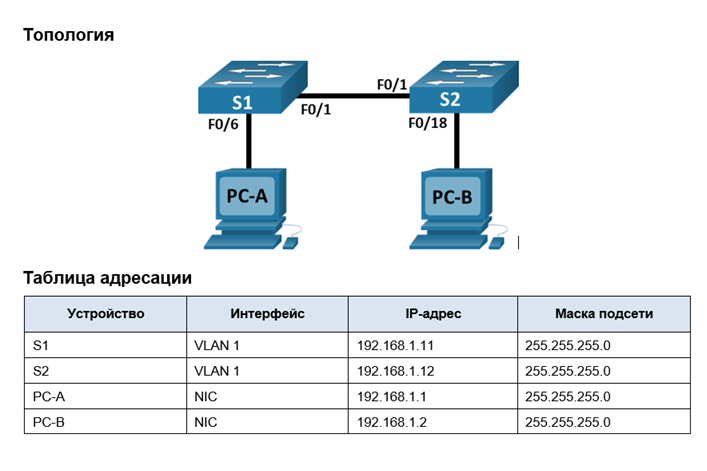
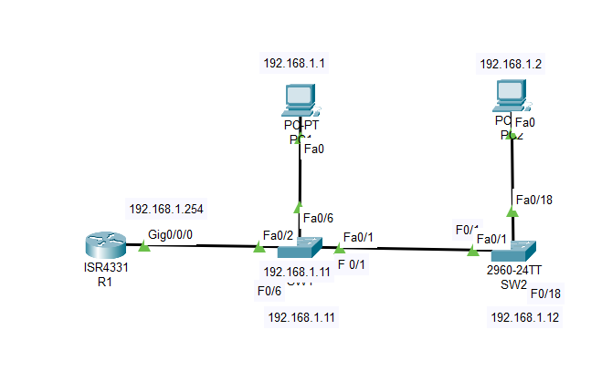

### ДЗ2. Просмотр таблицы MAC-адресов коммутатора

## Задачи.
1. Создание и настройка сети.
2. Изучение таблицы МАС-адресов коммутатора.

## Решение
### Часть 1. Создание и настройка сети

1. Построим сеть заданной топологии.

2.  Настроим узлы ПК.

    *  Настроим сетевые интерфейсы на PC1  и PC2  в соответствии с заданием.
    *  Укажем IP  адрес, маску подсети и шлюз по умолчанию.
    *  проверим работу стека протокола TCP/IP на каждом сетевом интерфейсе ПК с помощью команды **ping**

3. Выполним инициализацию и перезагрузку коммутаторов.
   *   Проверяем наличие старых конфигураций
   *   Если необходимо, удаляем файл загрузочной конфигурации и очищаем настройку VLAN
   *   Перезагружаем коммутаторы.
   *   Настроим базовые параметры каждого коммутатора.

### Часть 2. Изучение таблицы МАС-адресов коммутатора.

> Коммутаторы используются для соединения компьютеров в локальных сетях (LAN) и передачи данных между ними. Коммутаторы отправляют кадры Ethernet на узловые устройства, которые идентифицируются по МАС-адресам сетевых плат. Как только между сетевыми устройствами начинается передача данных, коммутатор выясняет МАС-адреса и строит таблицу.

1. Составим таблицу MAC- адресов.

|Устройство|MAC-адрес|
|:------:|:-------|
|ПК PC1|00:0C:CF:1C:93:86|
|ПК PC2|00:0D:BD:30:DA:17|
|Коммутатор SW1  Fa 0/1|00:0c:85:b7:d8:01|
|Коммутатор SW2 Fa 0/1|00:60:47:9b:0b:01|
|Маршрутизатор R1 Gig0/0/0|00:01:63:45:9d:01|

2. Просмотрим таблицу MAC-адресов коммутатора SW2.
   
Для этого введем команду **show mac address-table**
 ~~~
 SW2# show mac address-table 
          Mac Address Table
-------------------------------------------

Vlan    Mac Address       Type        Ports
----    -----------       --------    -----

   1    000c.85b7.d801    DYNAMIC     Fa0/1
   ~~~

>В таблице указан только 1 MAC-адрес интерфейса Fa 0/1 коммутатора SW1 (соседа).
Если очистить таблицу коммутации командой **clear mac address-table dynamic**, то таблица MAC- адресов окажется пустой, но уже через некоторое короткое время снова появляется запись МАС-адреса интерфейса Fa 0/1 коммутатора SW1 (соседа).  

3. С компьютера PC2 отправим эхо-запросы устройствам в сети и просмотрим таблицу МАС-адресов коммутатора SW2.

~~~

Cisco Packet Tracer PC Command Line 1.0
C:\>ping 192.168.1.12

Pinging 192.168.1.12 with 32 bytes of data:

Request timed out.
Reply from 192.168.1.12: bytes=32 time<1ms TTL=255
Reply from 192.168.1.12: bytes=32 time<1ms TTL=255
Reply from 192.168.1.12: bytes=32 time=6ms TTL=255

Ping statistics for 192.168.1.12:
    Packets: Sent = 4, Received = 3, Lost = 1 (25% loss),
Approximate round trip times in milli-seconds:
    Minimum = 0ms, Maximum = 6ms, Average = 2ms

C:\>ping 192.168.1.11

Pinging 192.168.1.11 with 32 bytes of data:

Request timed out.
Reply from 192.168.1.11: bytes=32 time<1ms TTL=255
Reply from 192.168.1.11: bytes=32 time<1ms TTL=255
Reply from 192.168.1.11: bytes=32 time<1ms TTL=255

Ping statistics for 192.168.1.11:
    Packets: Sent = 4, Received = 3, Lost = 1 (25% loss),
Approximate round trip times in milli-seconds:
    Minimum = 0ms, Maximum = 0ms, Average = 0ms

C:\>ping 192.168.1.1

Pinging 192.168.1.1 with 32 bytes of data:

Reply from 192.168.1.1: bytes=32 time<1ms TTL=128
Reply from 192.168.1.1: bytes=32 time<1ms TTL=128
Reply from 192.168.1.1: bytes=32 time<1ms TTL=128
Reply from 192.168.1.1: bytes=32 time<1ms TTL=128

Ping statistics for 192.168.1.1:
    Packets: Sent = 4, Received = 4, Lost = 0 (0% loss),
Approximate round trip times in milli-seconds:
    Minimum = 0ms, Maximum = 0ms, Average = 0ms

C:\>ping 192.168.1.254

Pinging 192.168.1.254 with 32 bytes of data:

Reply from 192.168.1.254: bytes=32 time<1ms TTL=255
Reply from 192.168.1.254: bytes=32 time<1ms TTL=255
Reply from 192.168.1.254: bytes=32 time<1ms TTL=255
Reply from 192.168.1.254: bytes=32 time=3ms TTL=255

Ping statistics for 192.168.1.254:
    Packets: Sent = 4, Received = 4, Lost = 0 (0% loss),
Approximate round trip times in milli-seconds:
    Minimum = 0ms, Maximum = 3ms, Average = 0ms

C:\>
~~~

Новая таблица МАС-адресов коммутатора SW2
~~~
SW2#sh mac address-table 
          Mac Address Table
-------------------------------------------

Vlan    Mac Address       Type        Ports
----    -----------       --------    -----

   1    000c.85b7.d801    DYNAMIC     Fa0/1
SW2#
SW2#
SW2#sh mac address-table 
          Mac Address Table
-------------------------------------------

Vlan    Mac Address       Type        Ports
----    -----------       --------    -----

   1    0001.6345.9d01    DYNAMIC     Fa0/1
   1    000c.85b7.d801    DYNAMIC     Fa0/1
   1    000c.cf1c.9386    DYNAMIC     Fa0/1
   1    000d.bd30.da17    DYNAMIC     Fa0/18
   1    0040.0b5a.58b3    DYNAMIC     Fa0/1
SW2#
~~~
>Как видно, появились новые записи МАС адресов устройств в таблице коммутации  с привязкой к соответствующему порту коммутатора, через который осуществляется сетевое взаимодействие с запрошенными устройствами.

Если на ПК PC2, с которого осуществлялся ping  на устройства, ввести команду **arp -a** то в выводе команды можно увидеть МАС-адреса запрашиваемых устройств. Таким образом в ARP-кэше компьютера PC2 появились дополнительные записи для всех сетевых устройств, которым были отправлены эхо-запросы.

>В сетях Ethernet данные передаются на устройства по соответствующим МАС-адресам. Для этого коммутаторы и компьютеры динамически создают ARP-кэш и таблицы МАС-адресов. Если компьютеров в сети немного, эта процедура выглядит достаточно простой.  Если же компьютеров в сети большое количество, то возможны большие задержки в работе сети. Поэтому большие сети желательно делить на более мелкие подсети.