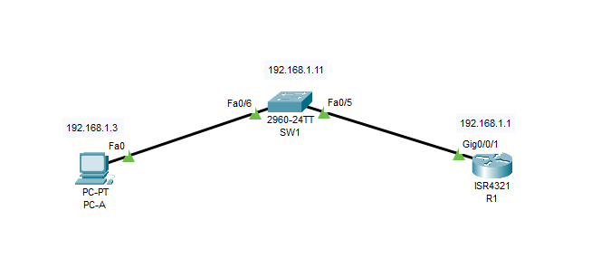

## ДЗ5. Доступ к сетевым устройствам по протоколу SSH.


## Задачи
[1. Настройка основных параметров устройства.](README.md#1-Настройка-основных-параметров-устройств) 

[2. Настройка маршрутизатора для доступа по протоколу SSH.](README.md#2-настройка-маршрутизатора-для-доступа-по-протоколу-ssh)

[3. Настройка коммутатора для доступа по протоколу SSH.](README.md#3-настройка-коммутатора-для-доступа-по-протоколу-ssh)

4. SSH через интерфейс командной строки (CLI) коммутатора.

## Решение.
#### 1. Настройка основных параметров устройств.
-----------------------------------
1. 1  Построим сеть заданной топологии.




1. 2 Проведем настройку базовых параметров сетевых устройств.

* присваиваем имя;
* Устанавливаем пароли на консольную и виртуальные линии, на вход в привелегированный режим;
* шифруем пароли, устанавливаем минимально допустимую длину пароля, настраиваем предотвращение атаки с использованием пароля грубой силы;
* настраиваем баннер;
* настраиваем на PC-A IP-адрес, маску подсети, шлюз по умолчанию.

1. 3 Проверяем сетевое подключение. 

Посылаем с PC-A команду **ping** на маршрутизатор R1.

```Cisco Packet Tracer PC Command Line 1.0
C:\>ping 192.168.1.1

Pinging 192.168.1.1 with 32 bytes of data:

Reply from 192.168.1.1: bytes=32 time<1ms TTL=255
Reply from 192.168.1.1: bytes=32 time<1ms TTL=255
Reply from 192.168.1.1: bytes=32 time<1ms TTL=255
Reply from 192.168.1.1: bytes=32 time=4ms TTL=255

Ping statistics for 192.168.1.1:
    Packets: Sent = 4, Received = 4, Lost = 0 (0% loss),
Approximate round trip times in milli-seconds:
    Minimum = 0ms, Maximum = 4ms, Average = 1ms

C:\>
```
Эхо ответ получен.

#### 2. Настройка маршрутизатора для доступа по протоколу SSH

> Ранее для удаленной настройки сетевых устройств в основном применялся протокол Telnet. Однако он не обеспечивает шифрование информации, передаваемой между клиентом и сервером, что позволяет анализаторам сетевых пакетов перехватывать пароли и данные конфигурации.  
Secure Shell (SSH) — это сетевой протокол, устанавливающий безопасное подключение с эмуляцией терминала к маршрутизатору или иному сетевому устройству. 
Протокол SSH шифрует данные сеанса и обеспечивает аутентификацию устройств, поэтому для удаленных подключений рекомендуется использовать именно этот протокол.  
Чтобы протокол SSH мог работать, на сетевых устройствах, взаимодействующих между собой, должна быть настроена поддержка SSH. Нужно настроить маршрутизатор для приема соединений SSH по линиям VTY.

2. 1  Настроим аутентификацию устройств. Создаим ключ шифрования с указанием его длины и укажем актуальную версию SSH.
```
R1#
R1#conf t
Enter configuration commands, one per line.  End with CNTL/Z.
R1(config)#
!
! Задаем доменное имя.
!
R1(config)#ip domain name mydomain.ru 
R1(config)#
R1(config)#
!
! Генерируем ключи шифрования
! 
R1(config)#crypto key generate rsa 
Генерируем ключи шифрования 
The name for the keys will be: R1.mydomain.ru
Choose the size of the key modulus in the range of 360 to 2048 for your
  General Purpose Keys. Choosing a key modulus greater than 512 may take
  a few minutes.
!
! Указываем длину ключа.
!
How many bits in the modulus [512]: 2048  
% Generating 2048 bit RSA keys, keys will be non-exportable...[OK]

R1(config)#
*Mar 1 1:0:50.647: %SSH-5-ENABLED: SSH 1.99 has been enabled
R1(config)#
!
! Указываем актуальную версию SSH
!
R1(config)#ip ssh version 2
R1(config)#
R1(config)#^Z
R1#
R1#sh ip ssh
SSH Enabled - version 2.0
Authentication timeout: 120 secs; Authentication retries: 3
R1#
```

2. 2 Создадим имя пользователя в локальной базе учетных записей и укажем уровень привелегий и пароль для него.
```
R1#conf t
Enter configuration commands, one per line.  End with CNTL/Z.
R1(config)#
R1(config)#
R1(config)#username sshadmin privilege 15 secret cisco
R1(config)#
R1(config)#
```
2. 3  Активируем протокол SSH на линиях VTY.

Активируем протокол SSH на входящих линиях VTY с помощью команды **transport input** и изменим способ входа в систему таким образом, чтобы использовалась проверка пользователей по локальной базе учетных записей.
```
R1#conf t
Enter configuration commands, one per line.  End with CNTL/Z.
R1(config)#line vty 0 4
R1(config-line)#
R1(config-line)#login local
R1(config-line)#
R1(config-line)#transport input ssh
R1(config-line)#
```
2. 4  С PC-A установим соединение с маршрутизатором по протоколу SSH.
```
C:\>
C:\>SSH -l sshadmin 192.168.1.1

Password: 


***********************************************
*****************ATTENTION*********************
***********************************************

R1#
```
Соединение установлено. Настройка выполнена верно.

#### 3. Настройка коммутатора для доступа по протоколу SSH.


