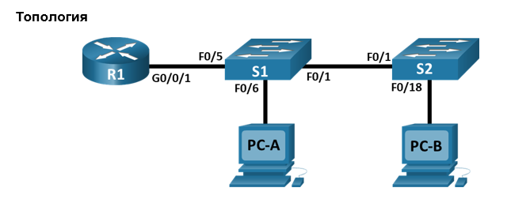
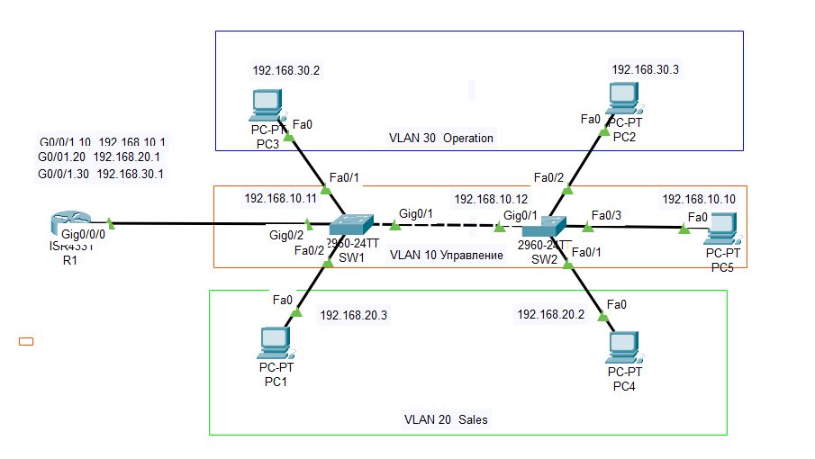

##  ДЗ 6. Внедрение маршрутизации между виртуальными локальными сетями.

Немного изменим заданную топологию с целью лучшего анализа работы сети с использованием технологии виртуальных локальных сетей.

Добавим по одному хосту на коммутатор таким образом, чтобы на каждои коммутаторе присутствовали хосты разных VLAN-ов.  
 Кроме того добавим один хост в VLAN Управления. Это позволит иметь доступ к управлению коммутаторами в случае аварии с внутресетевой маршрутизацией.

Твблица адресации.

| Устройство | Интерфейс    | IP-адрес    |Маска подсети | Шлюз по умолчанию|
|:----------:|:------------:|:-----------:|:------------:|:----------------:|
|  R1        | G0/0/1.10    | 192.168.10.1 |255.255.255.0|  -----           |
|  R1        | G0/0/1.20    | 192.168.20.1 |255.255.255.0|  -----           |
|  R1        | G0/0/1.30    | 192.168.10.1 |255.255.255. |  -----           |
|  R1        | G0/0/1.1000  | -----        |  -----      |  -----           |
|  SW1       | VLAN 10      | 192.168.10.11|255.255.255.0|192.168.10.1      |
|  SW2       | VLAN 10      | 192.168.20.12|255.255.255.0|192.168.10.1      |
|  PC1       | NIC          | 192.168.20.3 |255.255.255.0|192.168.20.1      |
|  PC2       | NIC          | 192.168.30.3 |255.255.255.0|192.168.30.1      |
|  PC3       | NIC          | 192.168.30.2 |255.255.255.0|192.168.30.1      |
|  PC4       | NIC          | 192.168.20.2 |255.255.255.0|192.168.20.1      |
|  PC5       | NIC          | 192.168.10.10 |255.255.255.0|192.168.10.1     |

Таблица VLAN

| VLAN | Имя   | Назначенный интерфейс    |
|:----------:|:------------:|:-----------:|
|  10        |Управление    | SW1: VLAN 10 , SW2: VLAN 10 , SW2: Fa0/3|
|  20        | Sales        | SW1: Fa0/2, SW2: Fa0/1|
|  30        | Operations   | SW1: Fa0/1, SW2: Fa0/2 |
|  999       | Parking_Lot  | -----        |
|  1000      | Собственная  | -----        |