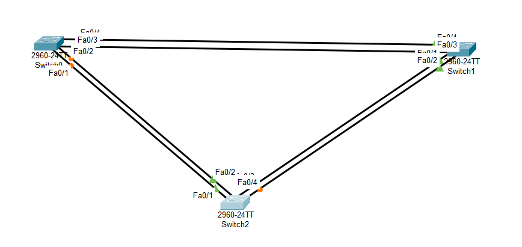

## ДЗ7. Развертывание коммутируемой сети с резервными каналами

### Задание.
-------------
1. Создание сети и настройка основных параметров устройства
2. Выбор корневого моста
3. Наблюдение за процессом выбора протоколом STP порта, исходя из стоимости портов
4. Наблюдение за процессом выбора протоколом STP порта, исходя из приоритета портов.

### Решение.
-------------
#### 1. Создание сети и настройка основных параметров устройства

Шаг 1:	Создаём сеть согласно топологии.

Подключаем устройства, как показано в топологии.

