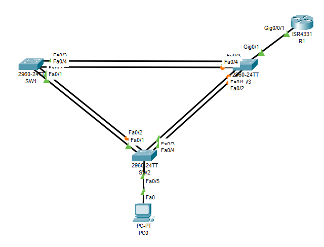
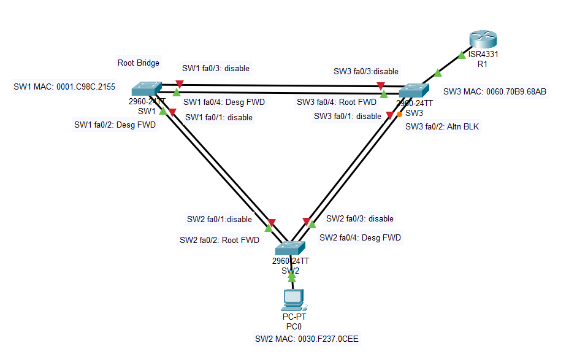

## ДЗ7. Развертывание коммутируемой сети с резервными каналами


### Задание.
-------------
1. Создание сети и настройка основных параметров устройства
2. Выбор корневого моста
3. Наблюдение за процессом выбора протоколом STP порта, исходя из стоимости портов
4. Наблюдение за процессом выбора протоколом STP порта, исходя из приоритета портов.

### Решение.
-------------
#### 1. Создание сети и настройка основных параметров устройства.
----------------

Шаг 1:	Создаём сеть согласно топологии.

Подключаем устройства, как показано в топологии.



>   Избыточность позволяет увеличить доступность устройств в топологии сети за счёт устранения единой точки отказа. Избыточность в коммутируемой сети обеспечивается посредством использования нескольких коммутаторов или нескольких каналов между коммутаторами.  
Когда в проекте сети используется физическая избыточность, возможно возникновение петель и дублирование кадров.
Протокол spanning-tree (STP) был разработан как механизм предотвращения возникновения петель на 2-м уровне для избыточных каналов коммутируемой сети.  
Протокол STP обеспечивает наличие только одного логического пути между всеми узлами назначения в сети путем намеренного блокирования резервных путей, которые могли бы вызвать петлю.

Шаг 2:	Выполните инициализацию и перезагрузку коммутаторов.
```
Switch#erase startup-config
Erasing the nvram filesystem will remove all configuration files! Continue? [confirm]
[OK]
Erase of nvram: complete
%SYS-7-NV_BLOCK_INIT: Initialized the geometry of nvram
Switch#
Switch#sh flash
Directory of flash:/

    1  -rw-     4670455          <no date>  2960-lanbasek9-mz.150-2.SE4.bin

64016384 bytes total (59345929 bytes free)
Switch#
Switch#reload

```

Шаг 3. Проведем настройку базовых параметров коммутаторов.

* присваиваем имя;
* присваиваем доменное имя и создаем локального пользователя.
* Устанавливаем пароли на вход по консольной линии, вход на виртуальные линиии по протоколу SSH;
* шифруем пароли, настраиваем предотвращение атаки с использованием пароля грубой силы;
* настраиваем баннер;
* настраиваем время на коммутаторах кмандой **clock set**.

Шаг 4:	Проверьте связь.

Проверьте способность хостов обмениваться эхо-запросами.  

* Успешно ли выполняется эхо-запрос от коммутатора S1 на коммутатор S2?
```
SW1#
SW1#ping 192.168.1.2

Type escape sequence to abort.
Sending 5, 100-byte ICMP Echos to 192.168.1.2, timeout is 2 seconds:
..!!!
Success rate is 60 percent (3/5), round-trip min/avg/max = 0/1/3 ms

SW1#
```  
Эхо ответ получен.
* Успешно ли выполняется эхо-запрос от коммутатора S1 на коммутатор S3?
```
SW1#
SW1#ping 192.168.1.3

Type escape sequence to abort.
Sending 5, 100-byte ICMP Echos to 192.168.1.3, timeout is 2 seconds:
..!!!
Success rate is 60 percent (3/5), round-trip min/avg/max = 0/0/0 ms

SW1#
```
Эхо ответ получен.
* Успешно ли выполняется эхо-запрос от коммутатора S2 на коммутатор S3?
```
SW2#
SW2#ping 192.168.1.3

Type escape sequence to abort.
Sending 5, 100-byte ICMP Echos to 192.168.1.3, timeout is 2 seconds:
..!!!
Success rate is 60 percent (3/5), round-trip min/avg/max = 0/0/0 ms

SW2#
```
Эхо ответ получен.
* Успешно ли выполняется эхо-запрос от ПК PC0 на маршрутизатор R1?
```
C:\>
C:\>ping 192.168.1.254

Pinging 192.168.1.254 with 32 bytes of data:

Reply from 192.168.1.254: bytes=32 time=17ms TTL=255
Reply from 192.168.1.254: bytes=32 time<1ms TTL=255
Reply from 192.168.1.254: bytes=32 time<1ms TTL=255
Reply from 192.168.1.254: bytes=32 time<1ms TTL=255

Ping statistics for 192.168.1.254:
    Packets: Sent = 4, Received = 4, Lost = 0 (0% loss),
Approximate round trip times in milli-seconds:
    Minimum = 0ms, Maximum = 17ms, Average = 4ms

C:\>
```
Эхо ответ получен.

#### 2. Определение корневого моста.
--------------
> Для каждого экземпляра протокола spanning-tree (коммутируемая сеть LAN или широковещательный домен) существует коммутатор, выделенный в качестве корневого моста. Корневой мост служит точкой привязки для всех расчётов протокола spanning-tree, позволяя определить избыточные пути, которые следует заблокировать.  
Процесс выбора определяет, какой из коммутаторов станет корневым мостом. Коммутатор с наименьшим значением идентификатора моста (BID) становится корневым мостом. Идентификатор BID состоит из значения приоритета моста, расширенного идентификатора системы и MAC-адреса коммутатора. Значение приоритета может находиться в диапазоне от 0 до 65535 с шагом 4096. По умолчанию используется значение 32768.

Шаг 1:	Отключим все порты на коммутаторах.
```
SW2(config)# 
SW2(config)#int range fa0/1-24,gig0/1-2
SW2(config-if-range)#
SW2(config-if-range)#
SW2(config-if-range)#switchport mode access
SW2(config-if-range)#
SW2(config-if-range)#shutdown 

SW2#sh ip int br
Interface              IP-Address      OK? Method Status                Protocol 
FastEthernet0/1        unassigned      YES manual administratively down down 
FastEthernet0/2        unassigned      YES manual administratively down down 
FastEthernet0/3        unassigned      YES manual administratively down down 
FastEthernet0/4        unassigned      YES manual administratively down down 
FastEthernet0/5        unassigned      YES manual administratively down down 
FastEthernet0/6        unassigned      YES manual administratively down down 
FastEthernet0/7        unassigned      YES manual administratively down down 
FastEthernet0/8        unassigned      YES manual administratively down down 
FastEthernet0/9        unassigned      YES manual administratively down down 
FastEthernet0/10       unassigned      YES manual administratively down down 
FastEthernet0/11       unassigned      YES manual administratively down down 
FastEthernet0/12       unassigned      YES manual administratively down down 
FastEthernet0/13       unassigned      YES manual administratively down down 
FastEthernet0/14       unassigned      YES manual administratively down down 
FastEthernet0/15       unassigned      YES manual administratively down down 
FastEthernet0/16       unassigned      YES manual administratively down down 
FastEthernet0/17       unassigned      YES manual administratively down down 
FastEthernet0/18       unassigned      YES manual administratively down down 
FastEthernet0/19       unassigned      YES manual administratively down down 
FastEthernet0/20       unassigned      YES manual administratively down down 
FastEthernet0/21       unassigned      YES manual administratively down down 
FastEthernet0/22       unassigned      YES manual administratively down down 
FastEthernet0/23       unassigned      YES manual administratively down down 
FastEthernet0/24       unassigned      YES manual administratively down down 
GigabitEthernet0/1     unassigned      YES manual administratively down down 
GigabitEthernet0/2     unassigned      YES manual administratively down down 
Vlan1                  192.168.1.2     YES manual up                    down
SW2#
```
Аналогично отключим порты на коммутаторах SW1, SW3.

Шаг 2:	Настроим  на коммутаторе SW2 подключенные порты fa0/1-fa0/4 в качестве транковых.

```
SW2(config)#
SW2(config)#
SW2(config)#int range fa0/1-4
SW2(config-if-range)#
SW2(config-if-range)#switchport mode trunk 
SW2(config-if-range)#
SW2(config-if-range)#switchport trunk native vlan 1
SW2(config-if-range)#
SW2(config-if-range)#switchport  nonegotiate 
SW2(config-if-range)#exit
SW2(config)#
```


Аналогично настроим подключенные порты fa0/1-fa0/4 в качестве транковых на коммутаторах SW1, SW3.

Шаг 3:	Включим порты F0/2 и F0/4 на всех коммутаторах.
```
SW2(config)#
SW2(config)#int range fa0/2,fa0/4,fa0/5
SW2(config-if-range)#
SW2(config-if-range)#
SW2(config-if-range)#no shut


SW2(config-if-range)#
%LINK-5-CHANGED: Interface FastEthernet0/2, changed state to up

%LINEPROTO-5-UPDOWN: Line protocol on Interface FastEthernet0/2, changed state to up

%LINEPROTO-5-UPDOWN: Line protocol on Interface Vlan1, changed state to up

%LINK-5-CHANGED: Interface FastEthernet0/4, changed state to up

%LINEPROTO-5-UPDOWN: Line protocol on Interface FastEthernet0/4, changed state to up

%LINK-5-CHANGED: Interface FastEthernet0/5, changed state to up

%LINEPROTO-5-UPDOWN: Line protocol on Interface FastEthernet0/5, changed state to up

SW2(config-if-range)#exit
SW2(config)#


SW2#
SW2#sh int trunk
Port        Mode         Encapsulation  Status        Native vlan
Fa0/2       on           802.1q         trunking      1
Fa0/4       on           802.1q         trunking      1

Port        Vlans allowed on trunk
Fa0/2       1-1005
Fa0/4       1-1005

Port        Vlans allowed and active in management domain
Fa0/2       1
Fa0/4       1

Port        Vlans in spanning tree forwarding state and not pruned
Fa0/2       1
Fa0/4       1

SW2#

```

Проверим связанность сети после включения портов на всех коммутаторах.
```
C:\>
C:\>ping 192.168.1.254

Pinging 192.168.1.254 with 32 bytes of data:

Reply from 192.168.1.254: bytes=32 time=17ms TTL=255
Reply from 192.168.1.254: bytes=32 time<1ms TTL=255
Reply from 192.168.1.254: bytes=32 time<1ms TTL=255
Reply from 192.168.1.254: bytes=32 time<1ms TTL=255

Ping statistics for 192.168.1.254:
    Packets: Sent = 4, Received = 4, Lost = 0 (0% loss),
Approximate round trip times in milli-seconds:
    Minimum = 0ms, Maximum = 17ms, Average = 4ms

C:\>
```
Маршрутизатор R1 доступен с ПК PC0. Связанность сети имеется.

+ Топология сети будет иметь следующий вид.


Шаг 4:	Отобразите данные протокола spanning-tree.

> Введите команду **show spanning-tree** на всех трех коммутаторах. Приоритет идентификатора моста рассчитывается путем сложения значений приоритета и расширенного идентификатора системы. Расширенным идентификатором системы всегда является номер сети VLAN.  
 В примере ниже все три коммутатора имеют равные значения приоритета идентификатора моста (32769 = 32768 + 1, где приоритет по умолчанию = 32768, номер сети VLAN = 1); следовательно, коммутатор с самым низким значением MAC-адреса становится корневым мостом (в примере — SW1).

 * Введем команду **show spanning-tree** на коммутаторе SW1
 ```
 SW1#
SW1#show spanning-tree
VLAN0001
  Spanning tree enabled protocol ieee
  Root ID    Priority    32769
             Address     0001.C98C.2155
             This bridge is the root
             Hello Time  2 sec  Max Age 20 sec  Forward Delay 15 sec

  Bridge ID  Priority    32769  (priority 32768 sys-id-ext 1)
             Address     0001.C98C.2155
             Hello Time  2 sec  Max Age 20 sec  Forward Delay 15 sec
             Aging Time  20

Interface        Role Sts Cost      Prio.Nbr Type
---------------- ---- --- --------- -------- --------------------------------
Fa0/2            Desg FWD 19        128.2    P2p
Fa0/4            Desg FWD 19        128.4    P2p
SW1#
```

* Введем команду **show spanning-tree** на коммутаторе SW2.
```
SW2#
SW2#show spanning-tree
VLAN0001
  Spanning tree enabled protocol ieee
  Root ID    Priority    32769
             Address     0001.C98C.2155
             Cost        19
             Port        2(FastEthernet0/2)
             Hello Time  2 sec  Max Age 20 sec  Forward Delay 15 sec

  Bridge ID  Priority    32769  (priority 32768 sys-id-ext 1)
             Address     0030.F237.0CEE
             Hello Time  2 sec  Max Age 20 sec  Forward Delay 15 sec
             Aging Time  20

Interface        Role Sts Cost      Prio.Nbr Type
---------------- ---- --- --------- -------- --------------------------------
Fa0/2            Root FWD 19        128.2    P2p
Fa0/4            Desg FWD 19        128.4    P2p
Fa0/5            Desg FWD 19        128.5    P2p

SW2#
```
* Введем команду **show spanning-tree** на коммутаторе SW3

```
SW3#
SW3#
SW3#show spanning-tree
VLAN0001
  Spanning tree enabled protocol ieee
  Root ID    Priority    32769
             Address     0001.C98C.2155
             Cost        19
             Port        4(FastEthernet0/4)
             Hello Time  2 sec  Max Age 20 sec  Forward Delay 15 sec

  Bridge ID  Priority    32769  (priority 32768 sys-id-ext 1)
             Address     0060.70B9.68AB
             Hello Time  2 sec  Max Age 20 sec  Forward Delay 15 sec
             Aging Time  20

Interface        Role Sts Cost      Prio.Nbr Type
---------------- ---- --- --------- -------- --------------------------------
Fa0/2            Altn BLK 19        128.2    P2p
Fa0/4            Root FWD 19        128.4    P2p
Gi0/1            Desg FWD 4         128.25   P2p

SW3#
```
Из приведенного выше листинга команды  **show spanning-tree** видно, что самый меньший MAC-адрес имеет коммутатор SW1 при равных приоритетах. 

|Коммутатор|MAC-адрес|Приоритет|
|:-------:|:---------:|:--------:|
|SW1| 0001.C98C.2155|32769|
|SW2| 0030.F237.0CEE|32769|
|SW3| 0060.70B9.68AB|32769|

Поэтому коммутатор SW1 был выбран корневым мостом.

Различают роли портов и состояния портов.  
Роли портов:
 *   Корневой порт (Root port) — один порт на коммутаторе 
с наименьшей стоимостью для достижения 
корневого моста.
*   Назначенный порт (Designated) — выбирается для каждого 
сегмента (каждого канала), исходя из стоимости 
возврата к корневому мосту для любой стороны канала.
*   Альтернативный порт (Altn) — резервный порт (только RSTP) для назначенного порта, если 
другая сторона не является корневым портом.
*   Резервный порт — запасной порт (только RSTP) для корневого порта.

Состояния портов:


 * Блокировка (blocking) - блокированный порт не шлет ничего. Это состояние предназначено, как говорилось выше, для предотвращения петель в сети. Блокированный порт, тем не менее, слушает BPDU (чтобы быть в курсе событий, это позволяет ему, когда надо, разблокироваться и начать работать)
* Прослушивание (listening) - порт слушает и начинает сам отправлять BPDU, кадры с данными не отправляет.
* Обучение (learning) - порт слушает и отправляет BPDU, а также вносит изменения в CAM- таблицу, но данные не перенаправляет.
* Пересылка (forwarding) - этот может все: и посылает\принимает BPDU, и с данными оперирует, и участвует в поддержании таблицы mac-адресов. То есть это обычное состояние рабочего порта.
* Отключен (disabled) - состояние administratively down, отключен командой shutdown. Понятное дело, ничего делать не может вообще, пока вручную не включат.


В схему ниже запишем роль и состояние (Sts) активных портов на каждом коммутаторе в топологии.



С учетом выходных данных, поступающих с коммутаторов, проведем анализ работы топологии.

1. Коммутатор SW1 был выбран протоколом spanning-tree  корневым мостом, потому что у него наименьшее значение Bridge ID (МАС-адреса при равных значениях приоритетов).

2. На каждом некорневом коммутаторе назначаются корневые порты. Корневые порты имеют нименьшую стоимость (кротчайшее расстояние) до корневого коммутатора и смотрят в его сторону.  
Эта стоимость определяется суммой стоимостей всех линков, которые нужно пройти кадру, чтобы дойти до корневого свича. В свою очередь, стоимость линка определяется просто- по его скорости (чем выше скорость, тем меньше стоимость). 


|Скорость порта |	Стоимость STP (802.1d)|
|---------------|---------------|
|10 Mbps |	100 |
|100 Mbps |	19  |
|1 Gbps |	4 |
|10 Gbps | 	2 |

Если имеют место одинаковые стоимости - выбирается меньший порт.

В нашем случае стоимость всех портов - 19. При отключенных портах fa0/1 и fa0/3, корневым портом на SW2 выбран порт fa0/2, а на SW3 - fa0/4. Эти порты имеют наименьшую стоимость -19.

3. Из каждого конкретного сегмента сети должен существовать только один путь по направлению к корневому свичу. В данном случае имеем в виду физический сегмент. Назначенным портом выбирается тот, который имеет лучшую стоимость в данном сегменте.  
Так же как и корневой порт выбирается на основе:

    * Меньшего Root Path Cost.
    * Меньшего Bridge ID.
    * Меньшего Port ID. 

    У корневого свича все порты — назначенные, поскольку их стоимость минимальна и равна 0. 

4. Порт коммутатора SW3 fa0/2 отображается в качестве альтернативного и в настоящее время заблокирован.  
  Сегмент сети между коммутаторами SW2 и SW3 является избыточным и может привести к образованию петли. Поэтому он должен быть блокирован.  
  Мас адрес коммутатора SW2 меньше чем МАС-адрес коммутатора SW3 при одинаковых стоимостях портов и Bridge ID будет меньше.  
  Таким образом в этом сегменте порт fa0/4 со стороны SW2 будет назначенным, а порт fa0/2 со стороны SW3 - альтернативным (заблокированным).
   
   ### 3.	Наблюдение за процессом выбора протоколом STP порта, исходя из стоимости портов
----------------
> Алгоритм протокола spanning-tree (STA) использует корневой мост как точку привязки, после чего определяет, какие порты будут заблокированы, исходя из стоимости пути. Порт с более низкой стоимостью пути является предпочтительным. Если стоимости портов равны, процесс сравнивает BID. Если BID равны, для определения корневого моста используются приоритеты портов. Наиболее низкие значения являются предпочтительными.

Изменим стоимость порта fa0/4 на коммутаторе SW3.

Помимо заблокированного порта, единственным активным портом на этом коммутаторе является порт, выделенный в качестве порта корневого моста.  
Уменьшим стоимость этого порта корневого моста до 18, выполнив команду **spanning-tree vlan 1 cost 18** режима конфигурации интерфейса.


```
SW3(config)#
SW3(config)#
SW3(config)#int fa0/4
SW3(config-if)#
SW3(config-if)#
SW3(config-if)#spanning-tree vlan 1 cost 18 
SW3(config-if)#
SW3(config-if)#
SW3(config-if)#do sh spanning-tree
VLAN0001
  Spanning tree enabled protocol ieee
  Root ID    Priority    32769
             Address     0001.C98C.2155
             Cost        18
             Port        4(FastEthernet0/4)
             Hello Time  2 sec  Max Age 20 sec  Forward Delay 15 sec

  Bridge ID  Priority    32769  (priority 32768 sys-id-ext 1)
             Address     0060.70B9.68AB
             Hello Time  2 sec  Max Age 20 sec  Forward Delay 15 sec
             Aging Time  20

Interface        Role Sts Cost      Prio.Nbr Type
---------------- ---- --- --------- -------- --------------------------------
Fa0/2            Desg LSN 19        128.2    P2p
Fa0/4            Root FWD 18        128.4    P2p
Gi0/1            Desg FWD 4         128.25   P2p

SW3(config-if)#

```
Изменились роль и состояние порта fa0/2 SW3. Порт fa0/2 стал назначенным. Так же изменились роль и состояние порта fa0/4 коммутатора SW2. Порт fa0/4 стал альтернативным (заблокированным).

```
SW2#
SW2#sh spa
SW2#sh spanning-tree 
VLAN0001
  Spanning tree enabled protocol ieee
  Root ID    Priority    32769
             Address     0001.C98C.2155
             Cost        19
             Port        2(FastEthernet0/2)
             Hello Time  2 sec  Max Age 20 sec  Forward Delay 15 sec

  Bridge ID  Priority    32769  (priority 32768 sys-id-ext 1)
             Address     0030.F237.0CEE
             Hello Time  2 sec  Max Age 20 sec  Forward Delay 15 sec
             Aging Time  20

Interface        Role Sts Cost      Prio.Nbr Type
---------------- ---- --- --------- -------- --------------------------------
Fa0/5            Desg FWD 19        128.5    P2p
Fa0/2            Root FWD 19        128.2    P2p
Fa0/4            Altn BLK 19        128.4    P2p
```

Таким образом , изменяя стоимость корневого порта на коммутаторе (изменяется стоимость пути до корневого коммутатора) можно изменять выбор заблокированного порта в некорневом сегменте.
