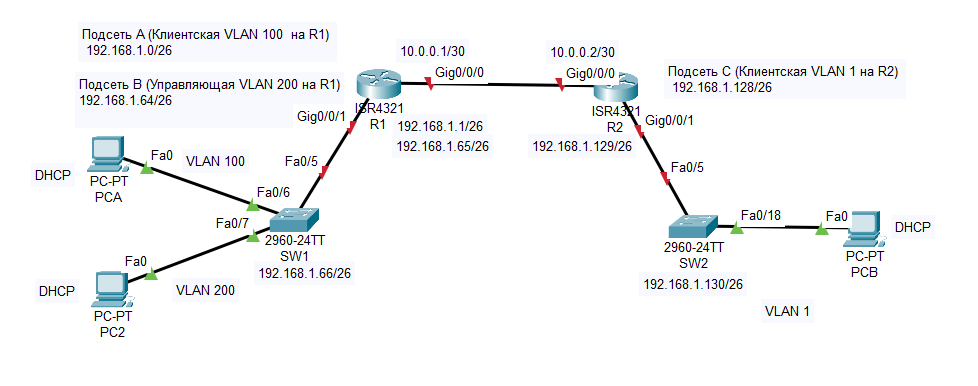

## ДЗ8_1. Настройка DHCPv6.


### Задание.
-------------

[1. Создание сети и настройка основных параметров устройства](README.md#1-создание-сети-и-настройка-основных-параметров-устройства)

[2. Настройка и проверка двух серверов DHCPv4 на R1](README.md#2настройка-и-проверка-двух-серверов-dhcpv4-на-r1)

[3. Настройка и проверка DHCP-ретрансляции на R2](README.md#3настройка-и-проверка-dhcp-ретрансляции-на-r2)

### Решение.
----------------

### 1. Создание сети и настройка основных параметров устройства.
------------------

  >В первой части лабораторной работы необходимо создать топологию сети и настроить базовые параметры для узлов ПК, коммутаторов и маршрутизаторов.

  #### Шаг 1.	Создание схемы адресации.
  
  -----------------------

  Задана сеть 192.168.1.0 /24.

 Необходимо создать подсеть сети 192.168.1.0/24 в соответствии со следующими требованиями:  

* Одна подсеть «Подсеть A», поддерживающая 58 хостов (клиентская VLAN на R1). 
  Подсеть А: 192.168.1.0/26


| | |
|----------------------------|:-----------:|
| IP- адрес сети             | 192.168.1.0 |
| IP- адрес первого узла     | 192.168.1.1 |
| IP- адрес последнего узла  | 192.168.1.62|
|Широковещательный адрес     | 192.168.1.63|

Запишите первый IP-адрес в таблице адресации для R1 G0/0/1.100 .  

* Одна подсеть «Подсеть B», поддерживающая 28 хостов (управляющая VLAN на R1). 
  Подсеть B: 192.168.1.64/26

| | |
|----------------------------|:------------:|
| IP- адрес сети             | 192.168.1.64 |
| IP- адрес первого узла     | 192.168.1.65 |
| IP- адрес последнего узла  | 192.168.1.126|
|Широковещательный адрес     | 192.168.1.127|

Запишите первый IP-адрес в таблице адресации для R1 G0/0/1.200. Запишите второй IP-адрес в таблице адресов для S1 VLAN 200 и введите соответствующий шлюз по умолчанию.

* Одна подсеть «Подсеть C», поддерживающая 12 узлов (клиентская сеть на R2).
Подсеть C: 192.168.1.128/26

| | |
|----------------------------|:------------:|
| IP- адрес сети             | 192.168.1.128 |
| IP- адрес первого узла     | 192.168.1.129 |
| IP- адрес последнего узла  | 192.168.1.190|
|Широковещательный адрес     | 192.168.1.191|

Запишите первый IP-адрес в таблице адресации для R2 G0/0/1.

-------------
#### Шаг 2.	Создайте сеть согласно топологии.
Подключите устройства, как показано в топологии, и подсоедините необходимые кабели.




-------------

#### Шаг 3.	Произведите базовую настройку маршрутизаторов  и коммутаторов.

-------------------

1.	Назначьте имя устройства.
Откройте окно конфигурации
2.	Отключите поиск DNS, чтобы предотвратить попытки маршрутизатора неверно преобразовывать введенные команды таким образом, как будто они являются именами узлов.
3. Назначьте class в качестве зашифрованного пароля привилегированного режима EXEC.
4. Назначьте cisco в качестве пароля консоли и включите вход в систему по паролю.
5. Назначьте cisco в качестве пароля VTY и включите вход в систему по паролю.
6. Зашифруйте открытые пароли.
7. Создайте баннер с предупреждением о запрете несанкционированного доступа к устройству.
8. Сохраните текущую конфигурацию в файл загрузочной конфигурации.
9. Установите часы на маршрутизаторе на сегодняшнее время и дату.
    
-------------------------

#### Шаг 4.	Настройка маршрутизации между сетями VLAN на маршрутизаторе R1.

-------------------------


a.	Настройте подинтерфейсы для каждой VLAN в соответствии с требованиями таблицы IP-адресации. Все субинтерфейсы используют инкапсуляцию 802.1Q и назначаются первый полезный адрес из вычисленного пула IP-адресов. Убедитесь, что подинтерфейсу для native VLAN не назначен IP-адрес. 

```
R1#
R1#conf t
Enter configuration commands, one per line.  End with CNTL/Z.
R1(config)#
R1(config)#int gig0/0/1.100
R1(config-subif)#
R1(config-subif)#encapsulation dot1Q 100
R1(config-subif)#
R1(config-subif)#ip address 192.168.1.1 255.255.255.192
R1(config-subif)#
R1(config-subif)#int gig0/0/1.200
R1(config-subif)#encapsulation dot1Q 200
R1(config-subif)#
R1(config-subif)#ip address 192.168.1.65 255.255.255.192
R1(config)#int gig0/0/1.1000
R1(config-subif)#
R1(config-subif)#encapsulation dot1Q 1000 native 
R1(config-subif)#exit
```

b.	Активируйте интерфейс G0/0/1 на маршрутизаторе.

```
R1(config)#
R1(config)#int gig0/0/1
R1(config-if)#
R1(config-if)#no shut

R1(config-if)#
%LINK-5-CHANGED: Interface GigabitEthernet0/0/1, changed state to up

%LINEPROTO-5-UPDOWN: Line protocol on Interface GigabitEthernet0/0/1, changed state to up

%LINK-5-CHANGED: Interface GigabitEthernet0/0/1.100, changed state to up

%LINEPROTO-5-UPDOWN: Line protocol on Interface GigabitEthernet0/0/1.100, changed state to up

%LINK-5-CHANGED: Interface GigabitEthernet0/0/1.200, changed state to up

%LINEPROTO-5-UPDOWN: Line protocol on Interface GigabitEthernet0/0/1.200, changed state to up

%LINK-5-CHANGED: Interface GigabitEthernet0/0/1.1000, changed state to up

%LINEPROTO-5-UPDOWN: Line protocol on Interface GigabitEthernet0/0/1.1000, changed state to up

R1(config-if)#

```
c.	Убедитесь, что вспомогательные интерфейсы работают.

```
R1#sh ip int br
Interface              IP-Address      OK? Method Status                Protocol 
GigabitEthernet0/0/0   unassigned      YES NVRAM  administratively down down 
GigabitEthernet0/0/1   unassigned      YES NVRAM  up                    up 
GigabitEthernet0/0/1.100192.168.1.1     YES manual up                    up 
GigabitEthernet0/0/1.200192.168.1.65    YES manual up                    up 
GigabitEthernet0/0/1.1000unassigned      YES unset  up                    up 
Vlan1                  unassigned      YES unset  administratively down down
R1#
```
--------------
#### Шаг 5.	Настройте G0/0/1 на R2, затем G0/0/0 и статическую маршрутизацию для обоих маршрутизаторов.

--------------

a.	Настройте G0/0/1 на R2 с первым IP-адресом подсети C, рассчитанным ранее.

```
R2(config)#
R2(config)#int gig0/0/1
R2(config-if)#
R2(config-if)#
R2(config-if)#ip address 192.168.1.129 255.255.255.192
R2(config-if)#
R2(config-if)#no shut
```

b.	Настройте интерфейс G0/0/0 для каждого маршрутизатора на основе приведенной выше таблицы IP-адресации.

```
R2(config-if)#
R2(config-if)#ip address 10.0.0.2 255.255.255.252
R2(config-if)#
R2(config-if)#
R2(config-if)#
R2(config-if)#no shut

R2(config-if)#
%LINK-5-CHANGED: Interface GigabitEthernet0/0/0, changed state to up

R2(config-if)#
```

```
R1(config)#
R1(config)#int gig0/0/0
R1(config-if)#
R1(config-if)#
R1(config-if)#ip addr 10.0.0.1 255.255.255.252
R1(config-if)#
R1(config-if)#no shut
R1(config-if)#
%LINK-5-CHANGED: Interface GigabitEthernet0/0/0, changed state to up

R1(config-if)#

```
c.	Настройте маршрут по умолчанию на каждом маршрутизаторе, указываемом на IP-адрес G0/0/0 на другом маршрутизаторе.

```
R1(config)#
R1(config)#ip route 192.168.1.128 255.255.255.192 10.0.0.2
R1(config)#
```


```
R2(config)#
R2(config)#ip route 192.168.1.0 255.255.255.192 10.0.0.1
R2(config)#
R2(config)#
R2(config)#ip route 192.168.1.64 255.255.255.192 10.0.0.1
R2(config)#
R2(config)#
```

d.	Убедитесь, что статическая маршрутизация работает с помощью пинга до адреса G0/0/1 R2 от R1.

```
R1#
R1#ping 192.168.1.129

Type escape sequence to abort.
Sending 5, 100-byte ICMP Echos to 192.168.1.129, timeout is 2 seconds:
.!!!!
Success rate is 80 percent (4/5), round-trip min/avg/max = 0/0/0 ms
R1#
```

e.	Сохраните текущую конфигурацию в файл загрузочной конфигурации.

---------------
#### Шаг 6.	Создайте сети VLAN на коммутаторе S1.
--------------------

a.	Создайте необходимые VLAN на коммутаторе 1 и присвойте им имена из приведенной выше таблицы.
```
SW1(config)#
SW1(config)#
SW1(config)#vlan 100
SW1(config-vlan)#
SW1(config-vlan)#name Clients
SW1(config-vlan)#
SW1(config-vlan)#
SW1(config-vlan)#exit
SW1(config)#vlan 200
SW1(config-vlan)#
SW1(config-vlan)#name Control
SW1(config-vlan)#
SW1(config-vlan)#exit
SW1(config)#vlan 999
SW1(config-vlan)#
SW1(config-vlan)#
SW1(config-vlan)#name Parking_Lot
SW1(config-vlan)#
SW1(config-vlan)#
SW1(config-vlan)#exit
SW1(config)#vlan 1000
SW1(config-vlan)#
SW1(config-vlan)#name Native
SW1(config-vlan)#
SW1(config-vlan)#exit
SW1(config)#
```
b.	Настройте и активируйте интерфейс управления на S1 (VLAN 200), используя второй IP-адрес из подсети, рассчитанный ранее. Кроме того установите шлюз по умолчанию на S1.

```
SW1(config)#
SW1(config)#int vlan 200
SW1(config-if)#
%LINK-5-CHANGED: Interface Vlan200, changed state to up

%LINEPROTO-5-UPDOWN: Line protocol on Interface Vlan200, changed state to up

SW1(config-if)#
SW1(config-if)#
SW1(config-if)#ip address 192.168.1.66 255.255.255.192
SW1(config-if)#
```


c.	Настройте и активируйте интерфейс управления на S2 (VLAN 1), используя второй IP-адрес из подсети, рассчитанный ранее. Кроме того, установите шлюз по умолчанию на S2

```
SW2(config-if)#ip address 192.168.1.130 255.255.255.192
SW2(config-if)#
SW2(config-if)#
SW2(config-if)#no shut

SW2(config-if)#
%LINK-5-CHANGED: Interface Vlan1, changed state to up

%LINEPROTO-5-UPDOWN: Line protocol on Interface Vlan1, changed state to up

SW2(config-if)#
SW2(config-if)#
SW2(config-if)#
SW2(config-if)#exit
SW2(config)#
SW2(config)#ip default-gateway 192.168.1.129
SW2(config)#
```


d.	Назначьте все неиспользуемые порты S1 VLAN Parking_Lot, настройте их для статического режима доступа и административно деактивируйте их. На S2 административно деактивируйте все неиспользуемые порты.

```
SW1(config)#int range fa0/1-4,fa0/8-24,gig0/1-2
SW1(config-if-range)#
SW1(config-if-range)#switchport mode access 
SW1(config-if-range)#
SW1(config-if-range)#switchport access vlan 999
SW1(config-if-range)#switchport nonegotiate 
SW1(config-if-range)#
SW1(config-if-range)#
SW1(config-if-range)#shut
```

```
SW2#
SW2#conf t 
Enter configuration commands, one per line.  End with CNTL/Z.
SW2(config)#int range fa0/1-4,fa0/6-17,fa0/19-24,gig0/1-2
SW2(config-if-range)#swit
SW2(config-if-range)#switchport mode acc
SW2(config-if-range)#switchport mode access 
SW2(config-if-range)#
SW2(config-if-range)#
SW2(config-if-range)#shut
```

-------
Шаг 8.	Назначьте сети VLAN соответствующим интерфейсам коммутатора.

-------
```

SW1(config)#
SW1(config)#int range fa0/6
SW1(config-if-range)#
SW1(config-if-range)#switchport mode access 
SW1(config-if-range)#swi
SW1(config-if-range)#switchport access vlan 100
SW1(config-if-range)#
SW1(config-if-range)#
SW1(config-if-range)#exit
SW1(config)#int range fa0/7
SW1(config-if-range)#switchport mode access 
SW1(config-if-range)#switchport access vlan 200
SW1(config-if-range)#
SW1(config-if-range)#
```
----------
Шаг 9.	Вручную настройте интерфейс S1 F0/5 в качестве транка 802.1Q.

----------------


a.	Измените режим порта коммутатора, чтобы принудительно создать магистральный канал.

```
SW1(config)#int fa0/5
SW1(config-if)#
SW1(config-if)#switchport mode trunk

SW1(config-if)#
%LINEPROTO-5-UPDOWN: Line protocol on Interface FastEthernet0/5, changed state to down

%LINEPROTO-5-UPDOWN: Line protocol on Interface FastEthernet0/5, changed state to up

SW1(config-if)#no shut


```

b.	В рамках конфигурации транка  установите для native  VLAN значение 1000.

```
SW1(config-if)#
SW1(config-if)#switchport trunk native vlan 1000
SW1(config-if)#
SW1(config-if)#
SW1(config-if)#switchport  nonegotiate
SW1(config-if)#
SW1(config-if)#
SW1(config-if)#exit
SW1(config)#
```

c.	В качестве другой части конфигурации магистрали укажите, что VLAN 100, 200 и 1000 могут проходить по транку.

```
SW1(config)#int fa0/5
SW1(config-if)#
SW1(config-if)#
SW1(config-if)#switchport trunk allowed vlan 100,200,1000
SW1(config-if)#
SW1(config-if)#
SW1(config-if)#
```

e.	Проверьте состояние транка и VLAN.

Состояние транка

```
SW1#
SW1#sh trunk
        ^
% Invalid input detected at '^' marker.
	
SW1#sh ip trunk
          ^
% Invalid input detected at '^' marker.
	
SW1#sh int trunk
Port        Mode         Encapsulation  Status        Native vlan
Fa0/5       on           802.1q         trunking      1000

Port        Vlans allowed on trunk
Fa0/5       100,200,1000

Port        Vlans allowed and active in management domain
Fa0/5       100,200,1000

Port        Vlans in spanning tree forwarding state and not pruned
Fa0/5       100,200,1000

SW1#
```

Состояние VLAN

```
SW1#sh vlan

VLAN Name                             Status    Ports
---- -------------------------------- --------- -------------------------------
1    default                          active    
100  Clients                          active    Fa0/6
200  Control                          active    Fa0/7
999  Parking_Lot                      active    Fa0/1, Fa0/2, Fa0/3, Fa0/4
                                                Fa0/8, Fa0/9, Fa0/10, Fa0/11
                                                Fa0/12, Fa0/13, Fa0/14, Fa0/15
                                                Fa0/16, Fa0/17, Fa0/18, Fa0/19
                                                Fa0/20, Fa0/21, Fa0/22, Fa0/23
                                                Fa0/24, Gig0/1, Gig0/2
1000 Native                           active    
1002 fddi-default                     active    
1003 token-ring-default               active    
1004 fddinet-default                  active    
1005 trnet-default                    active    
```


Вопрос:
Какой IP-адрес был бы у ПК, если бы он был подключен к сети с помощью DHCP?

В данном случае в сети нет сервера DHCP, поэтому ПК получил бы адрес из диапазона 169.254.0.0-169.254.255.255.

-----
### 2.	Настройка и проверка двух серверов DHCPv4 на R1

------

#### Шаг 1.	Настройте R1 с пулами DHCPv4 для двух поддерживаемых подсетей. Ниже приведен только пул DHCP для подсети A.

-------------
>Необходимо настроить и проверить сервер DHCPv4 на R1. Сервер DHCPv4 будет обслуживать две подсети, подсеть A и подсеть C.

* Настройка пула DHCP для подсети A.

a.	Исключите первые пять используемых адресов из каждого пула адресов.
```
R1(config)#
R1(config)#
R1(config)#ip dhcp excluded-address 192.168.1.1 192.168.1.5
R1(config)#
```
b.	Создайте пул DHCP (используйте уникальное имя для каждого пула).

c.	Укажите сеть, поддерживающую этот DHCP-сервер.

d. Укажите имя домена.

e.	Настройте соответствующий шлюз по умолчанию для каждого пула DHCP.

f.	Настройте время аренды на 2 дня 12 часов и 30 минут. (в данной версии CPT не реализовано)

```
R1(config)#
R1(config)#ip dhcp pool CLIENTS
R1(dhcp-config)#
R1(dhcp-config)#
R1(dhcp-config)#network 192.168.1.0 255.255.255.192
R1(dhcp-config)#
R1(dhcp-config)#
R1(dhcp-config)#default-router 192.168.1.1
R1(dhcp-config)#
R1(dhcp-config)#domain-name mydomain.ru
R1(dhcp-config)#
R1(dhcp-config)#lease 2 12 30
```
* Настройка пула DHCP для подсети С.

a.	Исключите первые пять используемых адресов из каждого пула адресов.
```
R1(config)#
R1(config)#ip dhcp excluded-address 192.168.1.129 192.168.1.133
R1(config)#

```
b.	Создайте пул DHCP (используйте уникальное имя для каждого пула).

c.	Укажите сеть, поддерживающую этот DHCP-сервер.

d. Укажите имя домена.

e.	Настройте соответствующий шлюз по умолчанию для каждого пула DHCP.

f.	Настройте время аренды на 2 дня 12 часов и 30 минут. (в данной версии CPT не реализовано)

```
R1(config)#
R1(config)#ip dhcp pool CLIENNTS_1
R1(dhcp-config)#
R1(dhcp-config)#
R1(dhcp-config)#network 192.168.1.128 255.255.255.192
R1(dhcp-config)#
R1(dhcp-config)#
R1(dhcp-config)#default-router 192.168.1.129
R1(dhcp-config)#
R1(dhcp-config)#
R1(dhcp-config)#domain-name mydomain.ru
R1(dhcp-config)#
R1(dhcp-config)#
R1(dhcp-config)#lease 2 12 30
```
-----
#### Шаг 2.	Проверка конфигурации сервера DHCPv4

------
a.	Чтобы просмотреть сведения о пуле, выполните команду **show ip dhcp pool**.

```
R1#
R1#show ip dhcp pool

Pool CLIENTS :
 Utilization mark (high/low)    : 100 / 0
 Subnet size (first/next)       : 0 / 0 
 Total addresses                : 62
 Leased addresses               : 1
 Excluded addresses             : 2
 Pending event                  : none

 1 subnet is currently in the pool
 Current index        IP address range                    Leased/Excluded/Total
 192.168.1.1          192.168.1.1      - 192.168.1.62      1    / 2     / 62

Pool CLIENNTS_1 :
 Utilization mark (high/low)    : 100 / 0
 Subnet size (first/next)       : 0 / 0 
 Total addresses                : 62
 Leased addresses               : 0
 Excluded addresses             : 2
 Pending event                  : none

 1 subnet is currently in the pool
 Current index        IP address range                    Leased/Excluded/Total
 192.168.1.129        192.168.1.129    - 192.168.1.190     0    / 2     / 62
R1#
```

b.	Выполните команду **show ip dhcp binding** для проверки установленных назначений адресов DHCP.
```

R1#show ip dhcp binding
IP address       Client-ID/              Lease expiration        Type
                 Hardware address
192.168.1.6      00D0.971A.4162           --                     Automatic
R1#
```
-------
#### Шаг 4.	Попытка получить IP-адрес от DHCP на PC-A.

------
a.	Из командной строки компьютера PC-A выполните команду ipconfig /all.

```
C:\>ipconfig /all

FastEthernet0 Connection:(default port)

   Connection-specific DNS Suffix..: mydomain.ru
   Physical Address................: 00D0.971A.4162
   Link-local IPv6 Address.........: FE80::2D0:97FF:FE1A:4162
   IPv6 Address....................: ::
   IPv4 Address....................: 192.168.1.6
   Subnet Mask.....................: 255.255.255.192
   Default Gateway.................: ::
                                     192.168.1.1
   DHCP Servers....................: 192.168.1.1
   DHCPv6 IAID.....................: 
   DHCPv6 Client DUID..............: 00-01-00-01-8D-7D-A0-07-00-D0-97-1A-41-62
   DNS Servers.....................: ::
                                     0.0.0.0

Bluetooth Connection:

   Connection-specific DNS Suffix..: mydomain.ru
   Physical Address................: 0000.0C17.2807
   Link-local IPv6 Address.........: ::
   IPv6 Address....................: ::
   IPv4 Address....................: 0.0.0.0
   Subnet Mask.....................: 0.0.0.0
   Default Gateway.................: ::
                                     0.0.0.0
   DHCP Servers....................: 0.0.0.0
   DHCPv6 IAID.....................: 
   DHCPv6 Client DUID..............: 00-01-00-01-8D-7D-A0-07-00-D0-97-1A-41-62
   DNS Servers.....................: ::
                                     0.0.0.0

C:\>
```

b.	Проверьте подключение с помощью пинга IP-адреса интерфейса R0 G0/0/1.
```
C:\>
C:\>ping 192.168.1.1

Pinging 192.168.1.1 with 32 bytes of data:

Reply from 192.168.1.1: bytes=32 time<1ms TTL=255
Reply from 192.168.1.1: bytes=32 time<1ms TTL=255
Reply from 192.168.1.1: bytes=32 time<1ms TTL=255
Reply from 192.168.1.1: bytes=32 time<1ms TTL=255

Ping statistics for 192.168.1.1:
    Packets: Sent = 4, Received = 4, Lost = 0 (0% loss),
Approximate round trip times in milli-seconds:
    Minimum = 0ms, Maximum = 0ms, Average = 0ms

C:\>
```
----
### 3.	Настройка и проверка DHCP-ретрансляции на R2.

--------
>В части 3 настраивается R2 для ретрансляции DHCP-запросов из локальной сети на интерфейсе G0/0/1 на DHCP-сервер (R1). 

#### Шаг 1.	Настройка R2 в качестве агента DHCP-ретрансляции для локальной сети на G0/0/1


a.	Настройте команду **ip helper-address** на G0/0/1, указав IP-адрес G0/0/0 R1.

```
R2(config)#
R2(config)#int gig0/0/1
R2(config-if)#
R2(config-if)#
R2(config-if)# ip helper-address 10.0.0.1
R2(config-if)#
R2(config-if)#^Z
R2#
```

#### Шаг 2.	Попытка получить IP-адрес от DHCP на PC-B
a.	Из командной строки компьютера PC-B выполните команду ipconfig /all.

```
Cisco Packet Tracer PC Command Line 1.0
C:\>ipconfig /all

FastEthernet0 Connection:(default port)

   Connection-specific DNS Suffix..: 
   Physical Address................: 0001.4340.55E1
   Link-local IPv6 Address.........: FE80::201:43FF:FE40:55E1
   IPv6 Address....................: ::
   Autoconfiguration IP Address....: 169.254.85.225
   Subnet Mask.....................: 255.255.0.0
   Default Gateway.................: ::
                                     0.0.0.0
   DHCP Servers....................: 0.0.0.0
   DHCPv6 IAID.....................: 
   DHCPv6 Client DUID..............: 00-01-00-01-66-43-CE-24-00-01-43-40-55-E1
   DNS Servers.....................: ::
                                     0.0.0.0

Bluetooth Connection:

   Connection-specific DNS Suffix..: 
   Physical Address................: 0060.70C5.8524
   Link-local IPv6 Address.........: ::
   IPv6 Address....................: ::
   IPv4 Address....................: 0.0.0.0
   Subnet Mask.....................: 0.0.0.0
   Default Gateway.................: ::
                                     0.0.0.0
   DHCP Servers....................: 0.0.0.0
   DHCPv6 IAID.....................: 
   DHCPv6 Client DUID..............: 00-01-00-01-66-43-CE-24-00-01-43-40-55-E1
   DNS Servers.....................: ::
                                     0.0.0.0


C:\>
```
IP  адрес не получен от DHCP сервера поскольку не настроена трансляция.


b.	После завершения процесса обновления выполните команду ipconfig для просмотра новой информации об IP-адресе.
```
C:\>ipconfig /all

FastEthernet0 Connection:(default port)

   Connection-specific DNS Suffix..: mydomain.ru
   Physical Address................: 0001.4340.55E1
   Link-local IPv6 Address.........: FE80::201:43FF:FE40:55E1
   IPv6 Address....................: ::
   IPv4 Address....................: 192.168.1.134
   Subnet Mask.....................: 255.255.255.192
   Default Gateway.................: ::
                                     192.168.1.129
   DHCP Servers....................: 10.0.0.1
   DHCPv6 IAID.....................: 
   DHCPv6 Client DUID..............: 00-01-00-01-66-43-CE-24-00-01-43-40-55-E1
   DNS Servers.....................: ::
                                     0.0.0.0

Bluetooth Connection:

   Connection-specific DNS Suffix..: mydomain.ru
   Physical Address................: 0060.70C5.8524
   Link-local IPv6 Address.........: ::
   IPv6 Address....................: ::
   IPv4 Address....................: 0.0.0.0
   Subnet Mask.....................: 0.0.0.0
   Default Gateway.................: ::
                                     0.0.0.0
   DHCP Servers....................: 0.0.0.0
   DHCPv6 IAID.....................: 
   DHCPv6 Client DUID..............: 00-01-00-01-66-43-CE-24-00-01-43-40-55-E1
   DNS Servers.....................: ::
                                     0.0.0.0


C:\>
```
Получен IP адрес, маска сети, шлюз по умолчанию от DHCP  сервера.

c.	Проверьте подключение с помощью пинга IP-адреса интерфейса R1 G0/0/1.

```
C:\>ping 10.0.0.1

Pinging 10.0.0.1 with 32 bytes of data:

Reply from 10.0.0.1: bytes=32 time<1ms TTL=254
Reply from 10.0.0.1: bytes=32 time<1ms TTL=254
Reply from 10.0.0.1: bytes=32 time<1ms TTL=254
Reply from 10.0.0.1: bytes=32 time<1ms TTL=254

Ping statistics for 10.0.0.1:
    Packets: Sent = 4, Received = 4, Lost = 0 (0% loss),
Approximate round trip times in milli-seconds:
    Minimum = 0ms, Maximum = 0ms, Average = 0ms

C:\>
```


d.	Выполните show ip dhcp binding для R1 для проверки назначений адресов в DHCP.

```
R1#
R1#show ip dhcp binding
IP address       Client-ID/              Lease expiration        Type
                 Hardware address
192.168.1.6      00D0.971A.4162           --                     Automatic
192.168.1.134    0001.4340.55E1           --                     Automatic
R1#
```
Сервером DHCP выдано в аренду 2 IP адреса (PC-A и  PC-B).

Проверим связанность сети. C PC-A (192.168.1.6) выполним команду ping на адрес PC-B (192.168.1.134) полученный от DHCP сервера.

```
C:\>ping 192.168.1.134

Pinging 192.168.1.134 with 32 bytes of data:

Reply from 192.168.1.134: bytes=32 time<1ms TTL=126
Reply from 192.168.1.134: bytes=32 time<1ms TTL=126
Reply from 192.168.1.134: bytes=32 time<1ms TTL=126
Reply from 192.168.1.134: bytes=32 time<1ms TTL=126

Ping statistics for 192.168.1.134:
    Packets: Sent = 4, Received = 4, Lost = 0 (0% loss),
Approximate round trip times in milli-seconds:
    Minimum = 0ms, Maximum = 0ms, Average = 0ms

C:\>
```
Сеть настроена правильно, Хосты корректно получают IP  адреса и другие параметры сети от DHCP сервера.


Пример рабочей конфигурации коммутатора SW1 приведен [здесь](/labs/lab08/Configs/SW1_8.txt)

Пример рабочей конфигурации коммутатора SW2 приведен [здесь](/labs/lab08/Configs/SW2_8.txt)

Пример рабочей конфигурации маршрутизатора R1 приведен [здесь](/labs/lab08/Configs/R1_8.txt)

Пример рабочей конфигурации маршрутизатора R2 приведен [здесь](/labs/lab08/Configs/R2_8.txt)