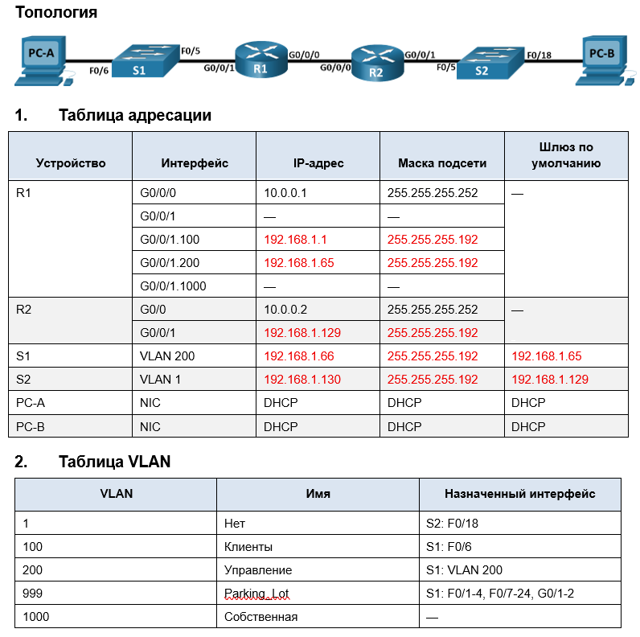

## ДЗ8. Реализация DHCPv4.

### Задание.
-------------

1. Создание сети и настройка основных параметров устройства
2. Настройка и проверка двух серверов DHCPv4 на R1
3. Настройка и проверка DHCP-ретрансляции на R2

### Решение.
----------------

### 1. Создание сети и настройка основных параметров устройства.
------------------

  >В первой части лабораторной работы необходимо создать топологию сети и настроить базовые параметры для узлов ПК, коммутаторов и маршрутизаторов.

  #### Шаг 1.	Создание схемы адресации.
  
  -----------------------

  Задана сеть 192.168.1.0 /24.

 Необходимо создать подсеть сети 192.168.1.0/24 в соответствии со следующими требованиями:  

* Одна подсеть «Подсеть A», поддерживающая 58 хостов (клиентская VLAN на R1). 
  Подсеть А: 192.168.1.0/26

| | |
|----------------------------|:-----------:|
| IP- адрес сети             | 192.168.1.0 |
| IP- адрес первого узла     | 192.168.1.1 |
| IP- адрес последнего узла  | 192.168.1.62|
|Широковещательный адрес     | 192.168.1.63|

Запишите первый IP-адрес в таблице адресации для R1 G0/0/1.100 .  

* Одна подсеть «Подсеть B», поддерживающая 28 хостов (управляющая VLAN на R1). 
  Подсеть B: 192.168.1.64/26

| | |
|----------------------------|:------------:|
| IP- адрес сети             | 192.168.1.64 |
| IP- адрес первого узла     | 192.168.1.65 |
| IP- адрес последнего узла  | 192.168.1.126|
|Широковещательный адрес     | 192.168.1.127|

Запишите первый IP-адрес в таблице адресации для R1 G0/0/1.200. Запишите второй IP-адрес в таблице адресов для S1 VLAN 200 и введите соответствующий шлюз по умолчанию.

* Одна подсеть «Подсеть C», поддерживающая 12 узлов (клиентская сеть на R2).
Подсеть C: 192.168.1.128/26

| | |
|----------------------------|:------------:|
| IP- адрес сети             | 192.168.1.128 |
| IP- адрес первого узла     | 192.168.1.129 |
| IP- адрес последнего узла  | 192.168.1.190|
|Широковещательный адрес     | 192.168.1.191|

Запишите первый IP-адрес в таблице адресации для R2 G0/0/1.

-------------
#### Шаг 2.	Создайте сеть согласно топологии.
Подключите устройства, как показано в топологии, и подсоедините необходимые кабели.

-------------

#### Шаг 3.	Произведите базовую настройку маршрутизаторов  и коммутаторов.

-------------------

1.	Назначьте имя устройства.
Откройте окно конфигурации
2.	Отключите поиск DNS, чтобы предотвратить попытки маршрутизатора неверно преобразовывать введенные команды таким образом, как будто они являются именами узлов.
3. Назначьте class в качестве зашифрованного пароля привилегированного режима EXEC.
4. Назначьте cisco в качестве пароля консоли и включите вход в систему по паролю.
5. Назначьте cisco в качестве пароля VTY и включите вход в систему по паролю.
6. Зашифруйте открытые пароли.
7. Создайте баннер с предупреждением о запрете несанкционированного доступа к устройству.
8. Сохраните текущую конфигурацию в файл загрузочной конфигурации.
9. Установите часы на маршрутизаторе на сегодняшнее время и дату.
    
-------------------------

#### Шаг 4.	Настройка маршрутизации между сетями VLAN на маршрутизаторе R1.

-------------------------

a.	Активируйте интерфейс G0/0/1 на маршрутизаторе.

b.	Настройте подинтерфейсы для каждой VLAN в соответствии с требованиями таблицы IP-адресации. Все субинтерфейсы используют инкапсуляцию 802.1Q и назначаются первый полезный адрес из вычисленного пула IP-адресов. Убедитесь, что подинтерфейсу для native VLAN не назначен IP-адрес. Включите описание для каждого подинтерфейса.

c.	Убедитесь, что вспомогательные интерфейсы работают.

