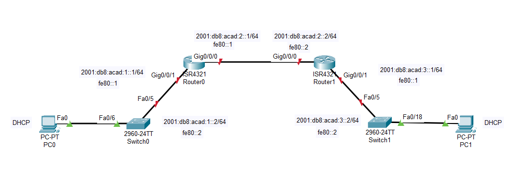

### ДЗ8_1. Настройка DHCPv6
___________________


### Задание
-----------

1. Создание сети и настройка основных параметров устройства
2. Проверка назначения адреса SLAAC от R1
3. Настройка и проверка сервера DHCPv6 без гражданства на R1
4. Настройка и проверка состояния DHCPv6 сервера на R1
5. Настройка и проверка DHCPv6 Relay на R2

### Решение
-------------

#### Общие сведения и сценарий.
------------------

Динамическое назначение глобальных индивидуальных IPv6-адресов можно настроить тремя способами:
* Автоматическая конфигурация адреса без сохранения состояния (Stateless Address Autoc>onfiguration, SLAAC).
    
При использовании SLACC для назначения адресов IPv6 хостам сервер DHCPv6 не используется. Поскольку DHCPv6 сервер не используется при реализации SLACC, хосты не могут получать дополнительную важную сетевую информацию, включая адрес сервера доменных имен (DNS), а также имя домена.  
* DHCPv6 без отслеживания состояния.

При использовании Stateless DHCPv6 для назначения адресов IPv6 хосту сервер DHCPv6 используется для назначения дополнительной важной информации о сети, однако адрес IPv6 назначается с помощью SLACC.
* Адресация DHCPv6 с учетом состояний.

При использовании DHCPv6 с отслеживанием состояния, сервер DHCP назначает всю информацию, включая IPv6-адрес узла.
Определение способа получения динамической IPv6-адресации зависит от установленных значений флагов, содержащихся в объявлениях маршрутизатора (сообщениях RA).

------------
#### 1. Создание сети и настройка основных параметров устройства.

--------------
 Шаг 1. Создайте сеть согласно топологии.

-----------------
Подключите устройства, как показано в топологии, и подсоедините необходимые кабели.



-----------------

Шаг 2. Настройте базовые параметры каждого коммутатора. 

-----------------

a.	Присвойте коммутатору имя устройства.  
b. Изменим шаблон по умолчанию на dual-ipv4-and-ipv6 для поддержки IP v6 адресов.  
c.	Отключите поиск DNS, чтобы предотвратить попытки маршрутизатора неверно преобразовывать введенные команды таким образом, как будто они являются именами узлов.  
d.	Назначьте class в качестве зашифрованного пароля привилегированного режима EXEC.  
e.	Назначьте cisco в качестве пароля консоли и включите вход в систему по паролю.  
f.	Назначьте cisco в качестве пароля VTY и включите вход в систему по паролю.  
g.	Зашифруйте открытые пароли.  
h.	Создайте баннер с предупреждением о запрете несанкционированного доступа к устройству.  
i.	Отключите все неиспользуемые порты.  
k.	Назначте шлюз по умолчанию.

------
Шаг 3. Произведите базовую настройку маршрутизаторов.

-----------
a.	Назначьте маршрутизатору имя устройства.  
b.	Отключите поиск DNS, чтобы предотвратить попытки маршрутизатора неверно преобразовывать введенные команды таким образом, как будто они являются именами узлов.  
c.	Назначьте class в качестве зашифрованного пароля привилегированного режима EXEC.  
d.	Назначьте cisco в качестве пароля консоли и включите вход в систему по паролю.  
e.	Назначьте cisco в качестве пароля VTY и включите вход в систему по паролю.  
f.	Зашифруйте открытые пароли.  
g.	Создайте баннер с предупреждением о запрете несанкционированного доступа к устройству.  
h.	Активация IPv6-маршрутизации  
i.	Сохраните текущую конфигурацию в файл загрузочной конфигурации.

------------
#### Шаг 4. Настройка интерфейсов и маршрутизации для обоих маршрутизаторов.

------------------
a.	Настройте интерфейсы G0/0/0 и G0/1 на R1 и R2 с адресами IPv6, указанными в таблице выше.

Маршрутизатор R1
```
R1# conf t
Enter configuration commands, one per line.  End with CNTL/Z.
R1(config)#int gig0/0/0
R1(config-if)#
R1(config-if)#ipv6 address 2001:DB8:ACAD:2::1/64
R1(config-if)#
R1(config-if)#ipv6 address FE80::1 link-local
R1(config-if)#
R1(config-if)#
R1(config-if)#no shut
R1(config-if)#
R1(config-if)#
R1(config-if)#int gig0/0/1
R1(config-if)#
R1(config-if)#ipv6 address 2001:DB8:ACAD:1::1/64
R1(config-if)#
R1(config-if)#ipv6 address FE80::1 link-local
R1(config-if)#
R1(config-if)#
R1(config-if)#no shut
R1(config-if)#
R1(config-if)#
R1(config-if)#^Z
R1#
%SYS-5-CONFIG_I: Configured from console by console

R1#sh ipv6 int br
GigabitEthernet0/0/0       [up/up]
    FE80::1
    2001:DB8:ACAD:2::1
GigabitEthernet0/0/1       [up/up]
    FE80::1
    2001:DB8:ACAD:1::1
Vlan1                      [administratively down/down]
    unassigned
R1#
```
Маршрутизатор R2

```
R2#
R2# conf t
Enter configuration commands, one per line.  End with CNTL/Z.
R2(config)#int gig0/0/0
R2(config-if)#
R2(config-if)#ipv6 address 2001:DB8:ACAD:2::2/64
R2(config-if)#
R2(config-if)#ipv6 address FE80::2 link-local
R2(config-if)#
R2(config-if)#no shut
R2(config-if)#
R2(config-if)#int gig0/0/1
R2(config-if)#
R2(config-if)#ipv6 address 2001:DB8:ACAD:3::1/64
R2(config-if)#
R2(config-if)#ipv6 address FE80::1 link-local
R2(config-if)#
R2(config-if)#no shut
R2(config-if)#
R2(config-if)#exit
R2(config)#exit
R2#
%SYS-5-CONFIG_I: Configured from console by console

R2#sh ipv6 int br
GigabitEthernet0/0/0       [up/up]
    FE80::2
    2001:DB8:ACAD:2::2
GigabitEthernet0/0/1       [up/up]
    FE80::1
    2001:DB8:ACAD:3::1
Vlan1                      [administratively down/down]
    unassigned
R2#
```


b.	Настройте маршрут по умолчанию на каждом маршрутизаторе, который указывает на IP-адрес G0/0/0 на другом маршрутизаторе.
```
R1(config)#
R1(config)#
R1(config)#ipv6 rou
R1(config)#ipv6 route 2001:db8:acad:3::0/64 2001:db8:acad:2::2
R1(config)#
R1(config)#
R1(config)#do sh ipv6 route
IPv6 Routing Table - 6 entries
Codes: C - Connected, L - Local, S - Static, R - RIP, B - BGP
       U - Per-user Static route, M - MIPv6
       I1 - ISIS L1, I2 - ISIS L2, IA - ISIS interarea, IS - ISIS summary
       ND - ND Default, NDp - ND Prefix, DCE - Destination, NDr - Redirect
       O - OSPF intra, OI - OSPF inter, OE1 - OSPF ext 1, OE2 - OSPF ext 2
       ON1 - OSPF NSSA ext 1, ON2 - OSPF NSSA ext 2
       D - EIGRP, EX - EIGRP external
C   2001:DB8:ACAD:1::/64 [0/0]
     via GigabitEthernet0/0/1, directly connected
L   2001:DB8:ACAD:1::1/128 [0/0]
     via GigabitEthernet0/0/1, receive
C   2001:DB8:ACAD:2::/64 [0/0]
     via GigabitEthernet0/0/0, directly connected
L   2001:DB8:ACAD:2::1/128 [0/0]
     via GigabitEthernet0/0/0, receive
S   2001:DB8:ACAD:3::/64 [1/0]
     via 2001:DB8:ACAD:2::2
L   FF00::/8 [0/0]
     via Null0, receive
R1(config)#
```

```
R2#
R2#conf t
Enter configuration commands, one per line.  End with CNTL/Z.
R2(config)#
R2(config)#
R2(config)#ipv6 route 2001:db8:acad:1::/64 2001:db8:acad:2::1
R2(config)#
R2(config)#do sh ipv6 route
IPv6 Routing Table - 6 entries
Codes: C - Connected, L - Local, S - Static, R - RIP, B - BGP
       U - Per-user Static route, M - MIPv6
       I1 - ISIS L1, I2 - ISIS L2, IA - ISIS interarea, IS - ISIS summary
       ND - ND Default, NDp - ND Prefix, DCE - Destination, NDr - Redirect
       O - OSPF intra, OI - OSPF inter, OE1 - OSPF ext 1, OE2 - OSPF ext 2
       ON1 - OSPF NSSA ext 1, ON2 - OSPF NSSA ext 2
       D - EIGRP, EX - EIGRP external
S   2001:DB8:ACAD:1::/64 [1/0]
     via 2001:DB8:ACAD:2::1
C   2001:DB8:ACAD:2::/64 [0/0]
     via GigabitEthernet0/0/0, directly connected
L   2001:DB8:ACAD:2::2/128 [0/0]
     via GigabitEthernet0/0/0, receive
C   2001:DB8:ACAD:3::/64 [0/0]
     via GigabitEthernet0/0/1, directly connected
L   2001:DB8:ACAD:3::1/128 [0/0]
     via GigabitEthernet0/0/1, receive
L   FF00::/8 [0/0]
     via Null0, receive
R2(config)#
```

c.	Убедитесь, что маршрутизация работает с помощью пинга адреса G0/0/1 R2 из R1

```
R1#
R1#ping 2001:db8:acad:3::1

Type escape sequence to abort.
Sending 5, 100-byte ICMP Echos to 2001:db8:acad:3::1, timeout is 2 seconds:
!!!!!
Success rate is 100 percent (5/5), round-trip min/avg/max = 0/0/0 ms

R1#
```
```
R2#
R2#ping 2001:db8:acad:1::1

Type escape sequence to abort.
Sending 5, 100-byte ICMP Echos to 2001:db8:acad:1::1, timeout is 2 seconds:
!!!!!
Success rate is 100 percent (5/5), round-trip min/avg/max = 0/0/1 ms

R2#
```

Статическая маршрутизация настроена корректно.

d.	Сохраните текущую конфигурацию в файл загрузочной конфигурации.

-----------------
### 2. Проверка назначения адреса SLAAC от R1

-----------------
В части 2 вы убедитесь, что узел PC-A получает адрес IPv6 с помощью метода SLAAC.
Включите PC-A и убедитесь, что сетевой адаптер настроен для автоматической настройки IPv6.

```
C:\>ipconfig /all

FastEthernet0 Connection:(default port)

   Connection-specific DNS Suffix..: 
   Physical Address................: 00D0.BA48.4398
   Link-local IPv6 Address.........: FE80::2D0:BAFF:FE48:4398
   IPv6 Address....................: 2001:DB8:ACAD:1:2D0:BAFF:FE48:4398
   IPv4 Address....................: 0.0.0.0
   Subnet Mask.....................: 0.0.0.0
   Default Gateway.................: FE80::1
                                     0.0.0.0
   DHCP Servers....................: 0.0.0.0
   DHCPv6 IAID.....................: 
   DHCPv6 Client DUID..............: 00-01-00-01-C6-D6-CB-B0-00-D0-BA-48-43-98
   DNS Servers.....................: ::
                                     0.0.0.0

C:\>
```
PC-A присвоил себе адрес из сети 2001:db8:1::/64.  
Часть адреса с идентификатором хоста **2D0:BAFF:FE48:4398** сгенерировалась в результате работы протокола ICMPv6 (процедура EUI-64).  
64 бита для идентификатора интерфейса формируются на основании MAC адреса устройства. MAC адрес состоит из 48 бит.  
Для получения из него 64-битного идентификатора, выполняется следующий алгоритм:

* MAC адрес делится на две части по 24 бита каждая.
*  Между этими частями вставляются шестнадцатеричные цифры FFFE.
* Седьмой по порядку бит полученного адреса меняется на противоположный (1 – на 0, 0 – на единицу)

--------------
### 3. Настройка и проверка сервера DHCPv6 на R1

-----------------
В части 3 выполняется настройка и проверка состояния DHCP-сервера на R1. Цель состоит в том, чтобы предоставить PC-A информацию о DNS-сервере и домене.

-------
#### Шаг 1. Более подробно изучите конфигурацию PC-A.

----------------
a.	Выполните команду ipconfig /all на PC-A и посмотрите на результат.
```
C:\>ipconfig /all

FastEthernet0 Connection:(default port)

   Connection-specific DNS Suffix..: 
   Physical Address................: 00D0.BA48.4398
   Link-local IPv6 Address.........: FE80::2D0:BAFF:FE48:4398
   IPv6 Address....................: 2001:DB8:ACAD:1:2D0:BAFF:FE48:4398
   IPv4 Address....................: 0.0.0.0
   Subnet Mask.....................: 0.0.0.0
   Default Gateway.................: FE80::1
                                     0.0.0.0
   DHCP Servers....................: 0.0.0.0
   DHCPv6 IAID.....................: 
   DHCPv6 Client DUID..............: 00-01-00-01-C6-D6-CB-B0-00-D0-BA-48-43-98
   DNS Servers.....................: ::
                                     0.0.0.0

C:\>
```
b.	Обратите внимание, что основной DNS-суффикс отсутствует. 

--------
#### Шаг 2. Настройте R1 для предоставления DHCPv6 без состояния для PC-A.

----------------
a.	Создайте пул DHCP IPv6 на R1 с именем R1-STATELESS. В составе этого пула назначьте адрес DNS-сервера как 2001:db8:acad::254, а имя домена — как stateless.com.
```
R1#
R1#conf t
Enter configuration commands, one per line.  End with CNTL/Z.
R1(config)#
R1(config)#ipv6 dhcp pool R1-STATELESS
R1(config-dhcpv6)#
R1(config-dhcpv6)#dns-server 2001:db8:acad::254
R1(config-dhcpv6)#
R1(config-dhcpv6)#domain-name STATELESS.com
R1(config-dhcpv6)#^Z
R1#
%SYS-5-CONFIG_I: Configured from console by console

R1#
```
b.	Настройте интерфейс G0/0/1 на R1, чтобы предоставить флаг конфигурации OTHER для локальной сети R1 и укажите только что созданный пул DHCP в качестве ресурса DHCP для этого интерфейса.
```
R1(config)# interface g0/0/1
R1(config-if)# ipv6 nd other-config-flag 
R1(config-if)# ipv6 dhcp server R1-STATELESS
```

c.	Сохраните текущую конфигурацию в файл загрузочной конфигурации.
d.	Перезапустите PC-A.  
e.	Проверьте вывод ipconfig /all и обратите внимание на изменения.  
```
C:\>
C:\>ipconfig /all

FastEthernet0 Connection:(default port)

   Connection-specific DNS Suffix..: STATELESS.com 
   Physical Address................: 00D0.BA48.4398
   Link-local IPv6 Address.........: FE80::2D0:BAFF:FE48:4398
   IPv6 Address....................: 2001:DB8:ACAD:1:2D0:BAFF:FE48:4398
   IPv4 Address....................: 0.0.0.0
   Subnet Mask.....................: 0.0.0.0
   Default Gateway.................: FE80::1
                                     0.0.0.0
   DHCP Servers....................: 0.0.0.0
   DHCPv6 IAID.....................: 516992748
   DHCPv6 Client DUID..............: 00-01-00-01-C6-D6-CB-B0-00-D0-BA-48-43-98
   DNS Servers.....................: 2001:DB8:ACAD::254
                                     0.0.0.0
```
Появился DNS суффикс, IP адрес DNS сервера.

f.	Тестирование подключения с помощью пинга IP-адреса интерфейса G0/1 R2.

```
C:\>
C:\>ping 2001:db8:acad:3::1

Pinging 2001:db8:acad:3::1 with 32 bytes of data:

Reply from 2001:DB8:ACAD:3::1: bytes=32 time<1ms TTL=254
Reply from 2001:DB8:ACAD:3::1: bytes=32 time=15ms TTL=254
Reply from 2001:DB8:ACAD:3::1: bytes=32 time<1ms TTL=254
Reply from 2001:DB8:ACAD:3::1: bytes=32 time<1ms TTL=254

Ping statistics for 2001:DB8:ACAD:3::1:
    Packets: Sent = 4, Received = 4, Lost = 0 (0% loss),
Approximate round trip times in milli-seconds:
    Minimum = 0ms, Maximum = 15ms, Average = 3ms

C:\>
```
IP связанность присутствует.  
Таким образом  маршрутизатор R1 был настроен как сервер DHCP без отслеживания состояния. IPv6 адрес хоста формируется при помощи SLAAC, а дополнительные параметры предоставляются сервером DHCP.

--------------
### 4. Настройка сервера DHCPv6 с сохранением состояния на R1

---------------
В части 4 настраивается R1 для ответа на запросы DHCPv6 от локальной сети на R2.


a.	Создайте пул DHCPv6 на R1 для сети 2001:db8:acad:3:aaa::/80. Это предоставит адреса локальной сети, подключенной к интерфейсу G0/0/1 на R2.  


В составе пула задайте DNS-сервер 2001:db8:acad: :254 и задайте доменное имя STATEFUL.com.

```
R1#conf t
Enter configuration commands, one per line.  End with CNTL/Z.
R1(config)#
R1(config)#
R1(config)#ipv6 dhcp pool R2-STATEFUL
R1(config-dhcpv6)#
R1(config-dhcpv6)#
R1(config-dhcpv6)#address prefix 2001:db8:acad:3:aaa::/80
R1(config-dhcpv6)#
R1(config-dhcpv6)#dns-server 2001:db8:acad::254
R1(config-dhcpv6)#
R1(config-dhcpv6)#
R1(config-dhcpv6)#domain-name STATEFUL.com
R1(config-dhcpv6)#
R1(config-dhcpv6)#
R1(config-dhcpv6)#exit
R1(config)#exit
R1#
%SYS-5-CONFIG_I: Configured from console by console

R1#sh ipv6 dhcp pool
DHCPv6 pool: R1-STATELESS
  DNS server: 2001:DB8:ACAD::254
  Domain name: STATELESS.com
  Active clients: 0
DHCPv6 pool: R2-STATEFUL
  Address allocation prefix: 2001:db8:acad:3:aaa::/80 valid 172800 preferred 86400 (0 in use, 0 conflicts)
  DNS server: 2001:DB8:ACAD::254
  Domain name: STATEFUL.com
  Active clients: 0
R1#
```
b.	Назначьте только что созданный пул DHCPv6 интерфейсу g0/0/0 на R1.
```
R1(config)#
R1(config)#int gig0/0/0
R1(config-if)#
R1(config-if)#
R1(config-if)#ipv6 dhcp server R2-STATEFUL
R1(config-if)#
R1(config-if)#
R1(config-if)#exit
R1(config)#
```
-----------------
### 5. Настройка и проверка ретрансляции DHCPv6 на R2.

---------------
>В части 5 необходимо настроить и проверить ретрансляцию DHCPv6 на R2, позволяя PC-B получать адрес IPv6.

#### Шаг 1. Включите PC-B и проверьте адрес SLAAC, который он генерирует.

```
C:\>ipconfig /all

FastEthernet0 Connection:(default port)

   Connection-specific DNS Suffix..: 
   Physical Address................: 0001.4325.BEE8
   Link-local IPv6 Address.........: FE80::201:43FF:FE25:BEE8
   IPv6 Address....................: 2001:DB8:ACAD:3:201:43FF:FE25:BEE8
   IPv4 Address....................: 0.0.0.0
   Subnet Mask.....................: 0.0.0.0
   Default Gateway.................: FE80::1
                                     0.0.0.0
   DHCP Servers....................: 0.0.0.0
   DHCPv6 IAID.....................: 
   DHCPv6 Client DUID..............: 00-01-00-01-88-A8-DD-BB-00-01-43-25-BE-E8
   DNS Servers.....................: ::
                                     0.0.0.0
```

В адресе SLAAC используется префикс 2001:db8:acad:3::


#### Шаг 2. Настройте R2 в качестве агента DHCP-ретрансляции для локальной сети на G0/0/1.
a.	Настройте команду **ipv6 dhcp relay** на интерфейсе R2 G0/0/1, указав адрес назначения интерфейса G0/0/0 на R1. Также настройте команду **managed-config-flag**.


R2 (конфигурация) # интерфейс g0/0/1
R2(config-if)# ipv6 nd managed-config-flag
R2(config-if)# ipv6 dhcp relay destination 2001:db8:acad:2::1 g0/0/0


