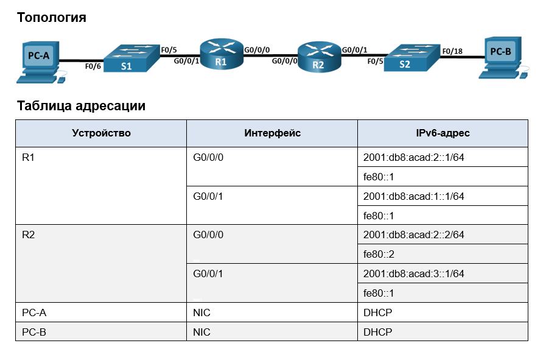

### ДЗ8_1. Настройка DHCPv6
___________________

### Задание
-----------

1. Создание сети и настройка основных параметров устройства
2. Проверка назначения адреса SLAAC от R1
3. Настройка и проверка сервера DHCPv6 без гражданства на R1
4. Настройка и проверка состояния DHCPv6 сервера на R1
5. Настройка и проверка DHCPv6 Relay на R2

### Решение
-------------

#### Общие сведения и сценарий.
------------------

Динамическое назначение глобальных индивидуальных IPv6-адресов можно настроить тремя способами:
* Автоматическая конфигурация адреса без сохранения состояния (Stateless Address Autoc>onfiguration, SLAAC).
    
При использовании SLACC для назначения адресов IPv6 хостам сервер DHCPv6 не используется. Поскольку DHCPv6 сервер не используется при реализации SLACC, хосты не могут получать дополнительную важную сетевую информацию, включая адрес сервера доменных имен (DNS), а также имя домена.  
* DHCPv6 без отслеживания состояния.

При использовании Stateless DHCPv6 для назначения адресов IPv6 хосту сервер DHCPv6 используется для назначения дополнительной важной информации о сети, однако адрес IPv6 назначается с помощью SLACC.
* Адресация DHCPv6 с учетом состояний.

При использовании DHCPv6 с отслеживанием состояния, сервер DHCP назначает всю информацию, включая IPv6-адрес узла.
Определение способа получения динамической IPv6-адресации зависит от установленных значений флагов, содержащихся в объявлениях маршрутизатора (сообщениях RA).

------------
#### 1. Создание сети и настройка основных параметров устройства.

--------------
 Шаг 1. Создайте сеть согласно топологии.

-----------------
Подключите устройства, как показано в топологии, и подсоедините необходимые кабели.

-----------------

Шаг 2. Настройте базовые параметры каждого коммутатора. 

-----------------

a.	Присвойте коммутатору имя устройства.  
b. Изменим шаблон по умолчанию на dual-ipv4-and-ipv6 для поддержки IP v6 адресов.  
c.	Отключите поиск DNS, чтобы предотвратить попытки маршрутизатора неверно преобразовывать введенные команды таким образом, как будто они являются именами узлов.  
d.	Назначьте class в качестве зашифрованного пароля привилегированного режима EXEC.  
e.	Назначьте cisco в качестве пароля консоли и включите вход в систему по паролю.  
f.	Назначьте cisco в качестве пароля VTY и включите вход в систему по паролю.  
g.	Зашифруйте открытые пароли.  
h.	Создайте баннер с предупреждением о запрете несанкционированного доступа к устройству.  
i.	Отключите все неиспользуемые порты.  
k.	Назначте шлюз по умолчанию.

------
Шаг 3. Произведите базовую настройку маршрутизаторов.

-----------
a.	Назначьте маршрутизатору имя устройства.  
b.	Отключите поиск DNS, чтобы предотвратить попытки маршрутизатора неверно преобразовывать введенные команды таким образом, как будто они являются именами узлов.  
c.	Назначьте class в качестве зашифрованного пароля привилегированного режима EXEC.  
d.	Назначьте cisco в качестве пароля консоли и включите вход в систему по паролю.  
e.	Назначьте cisco в качестве пароля VTY и включите вход в систему по паролю.  
f.	Зашифруйте открытые пароли.  
g.	Создайте баннер с предупреждением о запрете несанкционированного доступа к устройству.  
h.	Активация IPv6-маршрутизации  
i.	Сохраните текущую конфигурацию в файл загрузочной конфигурации.

