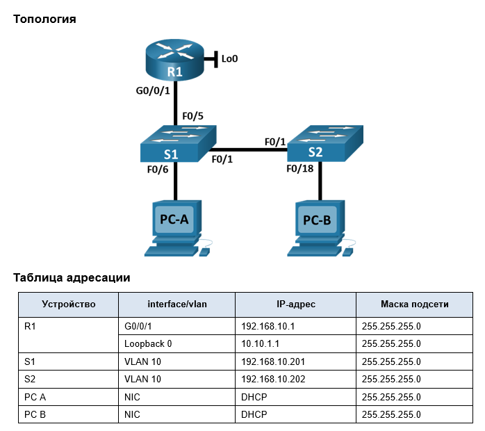
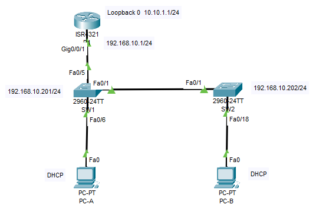

### ДЗ9. Конфигурация безопасности коммутатора.
--------------------



--------------
### Задание.

-------

### Часть 1. Настройка основного сетевого устройства.

* Создайте сеть.
* Настройте маршрутизатор R1.
* Настройка и проверка основных параметров коммутатора.

### Часть 2. Настройка сетей VLAN
* Сконфигруриуйте VLAN 10.
* Сконфигруриуйте SVI для VLAN 10.
* Настройте VLAN 333 с именем Native на S1 и S2.
* Настройте VLAN 999 с именем ParkingLot на S1 и S2.

### Часть 3: Настройки безопасности коммутатора.
* Реализация магистральных соединений 802.1Q.
* Настройка портов доступа
* Безопасность неиспользуемых портов коммутатора
* Документирование и реализация функций безопасности порта.
* Реализовать безопасность DHCP snooping .
* Реализация PortFast и BPDU Guard
* Проверка сквозной связанности.

-----------------------
### Решение.
-----------------------

### Часть 1. Настройка основного сетевого устройства/

#### Шаг 1. Создайте сеть.
a.	Создайте сеть согласно топологии.



b.	Инициализация устройств

-------
#### Шаг 2. Настройте маршрутизатор R1.

--------------
Проведем базовую настройку маршрутизатора R1


```
Router(config)#hostname R1
R1(config)#no ip domain lookup
R1(config)#ip dhcp excluded-address 192.168.10.1 192.168.10.9
R1(config)#ip dhcp excluded-address 192.168.10.201 192.168.10.202
R1(config)#
R1(config)#
R1(config)#ip dhcp pool Students
R1(dhcp-config)# network 192.168.10.0 255.255.255.0
R1(dhcp-config)# default-router 192.168.10.1
R1(dhcp-config)# domain-name CCNA2.Lab-11.6.1
R1(dhcp-config)#exit
R1(config)#
R1(config)#
R1(config)#interface Loopback0

R1(config-if)# ip address 10.10.1.1 255.255.255.0
R1(config-if)#
%LINK-5-CHANGED: Interface Loopback0, changed state to up

%LINEPROTO-5-UPDOWN: Line protocol on Interface Loopback0, changed state to up

R1(config-if)#exit
R1(config)#int gig0/0/1
R1(config-if)#
R1(config-if)#description Link to S1
R1(config-if)#
R1(config-if)#ip address 192.168.10.1 255.255.255.0
R1(config-if)#no sh
R1(config-if)#
%LINK-5-CHANGED: Interface GigabitEthernet0/0/1, changed state to up

%LINEPROTO-5-UPDOWN: Line protocol on Interface GigabitEthernet0/0/1, changed state to up

R1(config-if)#exit
R1(config)#
R1(config)#line con 0
R1(config-line)#
R1(config-line)#logging synchronous 
R1(config-line)#
R1(config-line)#exec-timeout 5 0
R1(config-line)#
R1(config-line)#exit
R1(config)#exit
R1#

```

Проверьте текущую конфигурацию на R1.

```
R1#sh ip int br
Interface              IP-Address      OK? Method Status                Protocol 
GigabitEthernet0/0/0   unassigned      YES NVRAM  administratively down down 
GigabitEthernet0/0/1   192.168.10.1    YES manual up                    up 
Loopback0              10.10.1.1       YES manual up                    up 
Vlan1                  unassigned      YES NVRAM  administratively down down
R1#
```
IP-адресация и интерфейсы находятся в состоянии up / up.

Проверим работу DHCP сервера

```
R1(config)#do show ip dhcp pool

Pool Students :
 Utilization mark (high/low)    : 100 / 0
 Subnet size (first/next)       : 0 / 0 
 Total addresses                : 254
 Leased addresses               : 2
 Excluded addresses             : 2
 Pending event                  : none

 1 subnet is currently in the pool
 Current index        IP address range                    Leased/Excluded/Total
 192.168.10.1         192.168.10.1     - 192.168.10.254    2    / 2     / 254
R1(config)#
R1#show ip dhcp bin
IP address       Client-ID/              Lease expiration        Type
                 Hardware address
192.168.10.10    00D0.BCA4.121B           --                     Automatic
192.168.10.11    0007.EC07.8CA9           --                     Automatic
R1#
```
ПК PC-A и PC-B получили адреса DHCP.

-----------------------
#### Шаг 3. Настройка и проверка основных параметров коммутатора


a.	Настройте имя хоста для коммутаторов S1 и S2.  

b.	Запретите нежелательный поиск в DNS.
c.	Настройте описания интерфейса для портов, которые используются в S1 и S2.

d.	Установите для шлюза по умолчанию для VLAN управления значение 192.168.10.1 на обоих коммутаторах.

-----------
### 2. Настройка сетей VLAN на коммутаторах.

------------

Шаг 1. Сконфигруриуйте VLAN 10.


Добавьте VLAN 10 на S1 и S2 и назовите VLAN - Management.

Шаг 2. Сконфигруриуйте SVI для VLAN 10.  

Настройте IP-адрес в соответствии с таблицей адресации для SVI для VLAN 10 на S1 
и S2. Включите интерфейсы SVI и предоставьте описание для интерфейса.

Шаг 3. Настройте VLAN 333 с именем Native на S1 и S2.

Шаг 4. Настройте VLAN 999 с именем ParkingLot на S1 и S2.

```
SW1#
SW1#conf t
Enter configuration commands, one per line.  End with CNTL/Z.
SW1(config)#
SW1(config)#vlan 10
SW1(config-vlan)#
SW1(config-vlan)#name Management
SW1(config-vlan)#
SW1(config-vlan)#vlan 333
SW1(config-vlan)#
SW1(config-vlan)#name Native
SW1(config-vlan)#
SW1(config-vlan)#vlan 999
SW1(config-vlan)#
SW1(config-vlan)#name ParkingLot 
SW1(config-vlan)#
SW1(config-vlan)#exit
SW1(config)#
SW1(config)#
SW1(config)#int vlan 10
SW1(config-if)#
%LINK-5-CHANGED: Interface Vlan10, changed state to up

SW1(config-if)#
SW1(config-if)#ip address 192.168.10.201 255.255.255.0
SW1(config-if)#
SW1(config-if)#exit
SW1(config)#exit
SW1#

SW1#sh vlan

VLAN Name                             Status    Ports
---- -------------------------------- --------- -------------------------------
1    default                          active    Fa0/1, Fa0/2, Fa0/3, Fa0/4
                                                Fa0/5, Fa0/6, Fa0/7, Fa0/8
                                                Fa0/9, Fa0/10, Fa0/11, Fa0/12
                                                Fa0/13, Fa0/14, Fa0/15, Fa0/16
                                                Fa0/17, Fa0/18, Fa0/19, Fa0/20
                                                Fa0/21, Fa0/22, Fa0/23, Fa0/24
                                                Gig0/1, Gig0/2
10   Management                       active    
333  Native                           active    
999  ParkingLot                       active    
1002 fddi-default                     active    
1003 token-ring-default               active    
1004 fddinet-default                  active    
1005 trnet-default                    active  

SW1#
```
Аналогичные настройки проведем на коммутаторе SW2.

--------------
### 3. Настройки безопасности коммутатора.

--------------

#### Шаг 1. Релизация магистральных соединений 802.1Q.

a.	Настройте все магистральные порты Fa0/1 на обоих коммутаторах для использования VLAN 333 в качестве native VLAN.
```
SW1(config)#
SW1(config)#int fa0/1
SW1(config-if)#
SW1(config-if)#switch
SW1(config-if)#switchport mode trunk

SW1(config-if)#
%LINEPROTO-5-UPDOWN: Line protocol on Interface FastEthernet0/1, changed state to down

%LINEPROTO-5-UPDOWN: Line protocol on Interface FastEthernet0/1, changed state to up

%LINEPROTO-5-UPDOWN: Line protocol on Interface Vlan10, changed state to up

SW1(config-if)#
SW1(config-if)#switchport trunk native vlan 333
SW1(config-if)#
SW1(config-if)#
```


b.	Убедитесь, что режим транкинга успешно настроен на всех коммутаторах.

Коммутатор SW1
```
SW1#
SW1#sh int trunk
Port        Mode         Encapsulation  Status        Native vlan
Fa0/1       on           802.1q         trunking      333

Port        Vlans allowed on trunk
Fa0/1       1-1005

Port        Vlans allowed and active in management domain
Fa0/1       1,10,333,999

Port        Vlans in spanning tree forwarding state and not pruned
Fa0/1       1,10,333,999
```

Коммутатор SW2

```
SW2#sh int trunk
Port        Mode         Encapsulation  Status        Native vlan
Fa0/1       on           802.1q         trunking      333

Port        Vlans allowed on trunk
Fa0/1       1-1005

Port        Vlans allowed and active in management domain
Fa0/1       1,10,333,999

Port        Vlans in spanning tree forwarding state and not pruned
Fa0/1       1,10,333,999

SW2#
```

c. Указываем, что VLAN 10  может проходить по транку, запрещаем прохождение VLAN 1 и отключаем Протокол динамического транкинга (DTP).
```
SW1(config)#
SW1(config)#int fa0/1
SW1(config-if)#
SW1(config-if)#switchport trunk allowed vlan 10
SW1(config-if)#
SW1(config-if)#switchport nonegotiate
SW1(config-if)#exit
SW1(config)#exit
SW1#
```

```

SW1#sh int trunk
Port        Mode         Encapsulation  Status        Native vlan
Fa0/1       on           802.1q         trunking      333

Port        Vlans allowed on trunk
Fa0/1       10

Port        Vlans allowed and active in management domain
Fa0/1       10

Port        Vlans in spanning tree forwarding state and not pruned
Fa0/1       10

SW1#
SW1#show interfaces f0/1 switchport | include Negotiation
Negotiation of Trunking: Off
SW1#

```
-----

#### Шаг 2. Настройка портов доступа и неиспользуемых портов.

--------------
a.	На S1 настройте F0/5 и F0/6 в качестве портов доступа и свяжите их с VLAN 10.

b.	На S2 настройте порт доступа Fa0/18 и свяжите его с VLAN 10.

c.	На S1 и S2 переместите неиспользуемые порты из VLAN 1 в VLAN 999 и отключите неиспользуемые порты.

d.	Убедитесь, что неиспользуемые порты отключены и связаны с VLAN 999


Коммутатор SW1

```
SW1(config)#int range fa0/2-24,gig0/1-2
SW1(config-if-range)#
SW1(config-if-range)#switchport mode access 
SW1(config-if-range)#
SW1(config-if-range)#exit
SW1(config)#int range fa0/2-4,fa0/7-24,gig0/1-2
SW1(config-if-range)#
SW1(config-if-range)#switchport access vlan 999
SW1(config-if-range)#
SW1(config-if-range)#shut

%LINK-5-CHANGED: Interface FastEthernet0/2, changed state to administratively down

%LINK-5-CHANGED: Interface FastEthernet0/3, changed state to administratively down

%LINK-5-CHANGED: Interface FastEthernet0/4, changed state to administratively down

%LINK-5-CHANGED: Interface FastEthernet0/7, changed state to administratively down

%LINK-5-CHANGED: Interface FastEthernet0/8, changed state to administratively down

%LINK-5-CHANGED: Interface FastEthernet0/9, changed state to administratively down

%LINK-5-CHANGED: Interface FastEthernet0/10, changed state to administratively down

%LINK-5-CHANGED: Interface FastEthernet0/11, changed state to administratively down

%LINK-5-CHANGED: Interface FastEthernet0/12, changed state to administratively down

%LINK-5-CHANGED: Interface FastEthernet0/13, changed state to administratively down

%LINK-5-CHANGED: Interface FastEthernet0/14, changed state to administratively down

%LINK-5-CHANGED: Interface FastEthernet0/15, changed state to administratively down

%LINK-5-CHANGED: Interface FastEthernet0/16, changed state to administratively down

%LINK-5-CHANGED: Interface FastEthernet0/17, changed state to administratively down

%LINK-5-CHANGED: Interface FastEthernet0/18, changed state to administratively down

%LINK-5-CHANGED: Interface FastEthernet0/19, changed state to administratively down

%LINK-5-CHANGED: Interface FastEthernet0/20, changed state to administratively down

%LINK-5-CHANGED: Interface FastEthernet0/21, changed state to administratively down

%LINK-5-CHANGED: Interface FastEthernet0/22, changed state to administratively down

%LINK-5-CHANGED: Interface FastEthernet0/23, changed state to administratively down

%LINK-5-CHANGED: Interface FastEthernet0/24, changed state to administratively down

%LINK-5-CHANGED: Interface GigabitEthernet0/1, changed state to administratively down

%LINK-5-CHANGED: Interface GigabitEthernet0/2, changed state to administratively down
SW1(config-if-range)#exit
SW1(config)#int range fa0/5-6
SW1(config-if-range)#
SW1(config-if-range)#switchport access vlan 10
SW1(config-if-range)#
SW1(config-if-range)#exit
SW1(config)#exit
SW1#
%SYS-5-CONFIG_I: Configured from console by console

SW1#
SW1#sh vlan

VLAN Name                             Status    Ports
---- -------------------------------- --------- -------------------------------
1    default                          active    
10   Management                       active    Fa0/5, Fa0/6
333  Native                           active    
999  ParkingLot                       active    Fa0/2, Fa0/3, Fa0/4, Fa0/7
                                                Fa0/8, Fa0/9, Fa0/10, Fa0/11
                                                Fa0/12, Fa0/13, Fa0/14, Fa0/15
                                                Fa0/16, Fa0/17, Fa0/18, Fa0/19
                                                Fa0/20, Fa0/21, Fa0/22, Fa0/23
                                                Fa0/24, Gig0/1, Gig0/2
1002 fddi-default                     active    
1003 token-ring-default               active    
1004 fddinet-default                  active    
1005 trnet-default                    active    

SW1#sh int status 
Port      Name               Status       Vlan       Duplex  Speed Type
Fa0/1                        connected    trunk      auto    auto  10/100BaseTX
Fa0/2                        disabled 999        auto    auto  10/100BaseTX
Fa0/3                        disabled 999        auto    auto  10/100BaseTX
Fa0/4                        disabled 999        auto    auto  10/100BaseTX
Fa0/5                        connected    10         auto    auto  10/100BaseTX
Fa0/6                        connected    10         auto    auto  10/100BaseTX
Fa0/7                        disabled 999        auto    auto  10/100BaseTX
Fa0/8                        disabled 999        auto    auto  10/100BaseTX
Fa0/9                        disabled 999        auto    auto  10/100BaseTX
Fa0/10                       disabled 999        auto    auto  10/100BaseTX
Fa0/11                       disabled 999        auto    auto  10/100BaseTX
Fa0/12                       disabled 999        auto    auto  10/100BaseTX
Fa0/13                       disabled 999        auto    auto  10/100BaseTX
Fa0/14                       disabled 999        auto    auto  10/100BaseTX
Fa0/15                       disabled 999        auto    auto  10/100BaseTX
Fa0/16                       disabled 999        auto    auto  10/100BaseTX
Fa0/17                       disabled 999        auto    auto  10/100BaseTX
Fa0/18                       disabled 999        auto    auto  10/100BaseTX
Fa0/19                       disabled 999        auto    auto  10/100BaseTX
Fa0/20                       disabled 999        auto    auto  10/100BaseTX
Fa0/21                       disabled 999        auto    auto  10/100BaseTX
Fa0/22                       disabled 999        auto    auto  10/100BaseTX
Fa0/23                       disabled 999        auto    auto  10/100BaseTX
Fa0/24                       disabled 999        auto    auto  10/100BaseTX
Gig0/1                       disabled 999        auto    auto  10/100BaseTX
Gig0/2                       disabled 999        auto    auto  10/100BaseTX

SW1#
```
Коммутатор SW2

```
SW2(config)#
SW2(config)#int range fa0/2-24,gig0/1-2
SW2(config-if-range)#
SW2(config-if-range)#switchport mode access 
SW2(config-if-range)#
SW2(config-if-range)#exit
SW2(config)#int range fa0/2-17,fa0/19-24,gig0/1-2
SW2(config-if-range)#
SW2(config-if-range)#switchport access vlan 999
SW2(config-if-range)#
SW2(config-if-range)#shut

%LINK-5-CHANGED: Interface FastEthernet0/2, changed state to administratively down

%LINK-5-CHANGED: Interface FastEthernet0/3, changed state to administratively down

%LINK-5-CHANGED: Interface FastEthernet0/4, changed state to administratively down

%LINK-5-CHANGED: Interface FastEthernet0/5, changed state to administratively down

%LINK-5-CHANGED: Interface FastEthernet0/6, changed state to administratively down

%LINK-5-CHANGED: Interface FastEthernet0/7, changed state to administratively down

%LINK-5-CHANGED: Interface FastEthernet0/8, changed state to administratively down

%LINK-5-CHANGED: Interface FastEthernet0/9, changed state to administratively down

%LINK-5-CHANGED: Interface FastEthernet0/10, changed state to administratively down

%LINK-5-CHANGED: Interface FastEthernet0/11, changed state to administratively down

%LINK-5-CHANGED: Interface FastEthernet0/12, changed state to administratively down

%LINK-5-CHANGED: Interface FastEthernet0/13, changed state to administratively down

%LINK-5-CHANGED: Interface FastEthernet0/14, changed state to administratively down

%LINK-5-CHANGED: Interface FastEthernet0/15, changed state to administratively down

%LINK-5-CHANGED: Interface FastEthernet0/16, changed state to administratively down

%LINK-5-CHANGED: Interface FastEthernet0/17, changed state to administratively down

%LINK-5-CHANGED: Interface FastEthernet0/19, changed state to administratively down

%LINK-5-CHANGED: Interface FastEthernet0/20, changed state to administratively down

%LINK-5-CHANGED: Interface FastEthernet0/21, changed state to administratively down

%LINK-5-CHANGED: Interface FastEthernet0/22, changed state to administratively down

%LINK-5-CHANGED: Interface FastEthernet0/23, changed state to administratively down

%LINK-5-CHANGED: Interface FastEthernet0/24, changed state to administratively down

%LINK-5-CHANGED: Interface GigabitEthernet0/1, changed state to administratively down

%LINK-5-CHANGED: Interface GigabitEthernet0/2, changed state to administratively down
SW2(config-if-range)#
SW2(config-if-range)#exit
SW2(config)#int fa0/18
SW2(config-if)#switchport access vlan 10
SW2(config-if)#
SW2(config-if)#exit
SW2(config)#
SW2(config)#exit
SW2#
%SYS-5-CONFIG_I: Configured from console by console

SW2#sh vlan

VLAN Name                             Status    Ports
---- -------------------------------- --------- -------------------------------
1    default                          active    
10   Management                       active    Fa0/18
333  Native                           active    
999  ParkingLot                       active    Fa0/2, Fa0/3, Fa0/4, Fa0/5
                                                Fa0/6, Fa0/7, Fa0/8, Fa0/9
                                                Fa0/10, Fa0/11, Fa0/12, Fa0/13
                                                Fa0/14, Fa0/15, Fa0/16, Fa0/17
                                                Fa0/19, Fa0/20, Fa0/21, Fa0/22
                                                Fa0/23, Fa0/24, Gig0/1, Gig0/2
1002 fddi-default                     active    
1003 token-ring-default               active    
1004 fddinet-default                  active    
1005 trnet-default                    active    


SW2#
SW2#sh int status 
Port      Name               Status       Vlan       Duplex  Speed Type
Fa0/1                        connected    trunk      auto    auto  10/100BaseTX
Fa0/2                        disabled 999        auto    auto  10/100BaseTX
Fa0/3                        disabled 999        auto    auto  10/100BaseTX
Fa0/4                        disabled 999        auto    auto  10/100BaseTX
Fa0/5                        disabled 999        auto    auto  10/100BaseTX
Fa0/6                        disabled 999        auto    auto  10/100BaseTX
Fa0/7                        disabled 999        auto    auto  10/100BaseTX
Fa0/8                        disabled 999        auto    auto  10/100BaseTX
Fa0/9                        disabled 999        auto    auto  10/100BaseTX
Fa0/10                       disabled 999        auto    auto  10/100BaseTX
Fa0/11                       disabled 999        auto    auto  10/100BaseTX
Fa0/12                       disabled 999        auto    auto  10/100BaseTX
Fa0/13                       disabled 999        auto    auto  10/100BaseTX
Fa0/14                       disabled 999        auto    auto  10/100BaseTX
Fa0/15                       disabled 999        auto    auto  10/100BaseTX
Fa0/16                       disabled 999        auto    auto  10/100BaseTX
Fa0/17                       disabled 999        auto    auto  10/100BaseTX
Fa0/18                       connected    10         auto    auto  10/100BaseTX
Fa0/19                       disabled 999        auto    auto  10/100BaseTX
Fa0/20                       disabled 999        auto    auto  10/100BaseTX
Fa0/21                       disabled 999        auto    auto  10/100BaseTX
Fa0/22                       disabled 999        auto    auto  10/100BaseTX
Fa0/23                       disabled 999        auto    auto  10/100BaseTX
Fa0/24                       disabled 999        auto    auto  10/100BaseTX
Gig0/1                       disabled 999        auto    auto  10/100BaseTX
Gig0/2                       disabled 999        auto    auto  10/100BaseTX

SW2#
```
---------
#### Шаг 3. Документирование и реализация функций безопасности порта.

----------
>Интерфейсы F0/6 на S1 и F0/18 на S2 настроены как порты доступа. На этом шаге вы также настроите безопасность портов на этих двух портах доступа.


a.	На S1, введите команду **show port-security interface f0/6**  для отображения настроек по умолчанию безопасности порта для интерфейса F0/6. Запишите свои ответы ниже.

```
SW1#show port-security interface fa0/6
Port Security              : Disabled
Port Status                : Secure-down
Violation Mode             : Shutdown
Aging Time                 : 0 mins
Aging Type                 : Absolute
SecureStatic Address Aging : Disabled
Maximum MAC Addresses      : 1
Total MAC Addresses        : 0
Configured MAC Addresses   : 0
Sticky MAC Addresses       : 0
Last Source Address:Vlan   : 0000.0000.0000:0
Security Violation Count   : 0
SW1#
```
Конфигурация безопасности порта по умолчанию.

|Функция|Настройка|
|:----|:--------:|
|Защита портов|  Disabled   |   
|Макс. кол-во записей MAC адресов| 1 |
| Режим проверки на нарушение безопасности| Shutdown |
| Aging Time|  0 mins |
|Aging Type| Absolute |
|Secure Static Address Aging| Disabled |
|Sticky MAC Address| 0 |

b.	На S1 включите защиту порта на F0 / 6 со следующими настройками:
* Максимальное количество записей MAC-адресов: 3
* Режим безопасности: restrict
* Aging time: 60 мин.
* Aging type: неактивный - настройка недоступна в CPT данной версии.

```
SW1(config)#
SW1(config)#
SW1(config)#int fa0/6
SW1(config-if)#
SW1(config-if)#switchport port-security
SW1(config-if)#
SW1(config-if)#switchport  port-security maximum 3
SW1(config-if)#
SW1(config-if)#switchport  port-security ?
  aging        Port-security aging commands
  mac-address  Secure mac address
  maximum      Max secure addresses
  violation    Security violation mode
  <cr>
SW1(config-if)#switchport  port-security violation restrict 
SW1(config-if)#
SW1(config-if)#switchport  port-security aging time 60
SW1(config-if)#


SW1#
SW1#show port-security interface f0/6
Port Security              : Enabled
Port Status                : Secure-up
Violation Mode             : Restrict
Aging Time                 : 60 mins
Aging Type                 : Absolute
SecureStatic Address Aging : Disabled
Maximum MAC Addresses      : 3
Total MAC Addresses        : 0
Configured MAC Addresses   : 0
Sticky MAC Addresses       : 0
Last Source Address:Vlan   : 0000.0000.0000:0
Security Violation Count   : 0

SW1#

SW1#show port-security address
               Secure Mac Address Table
-----------------------------------------------------------------------------
Vlan    Mac Address       Type                          Ports   Remaining Age
                                                                   (mins)
----    -----------       ----                          -----   -------------
10	00D0.BCA4.121B	DynamicConfigured	FastEthernet0/6		-
-----------------------------------------------------------------------------
Total Addresses in System (excluding one mac per port)     : 0
Max Addresses limit in System (excluding one mac per port) : 1024
SW1#
```
c.	Включите безопасность порта для F0 / 18 на S2. Настройте каждый активный порт доступа таким образом, чтобы он автоматически добавлял адреса МАС, изученные на этом порту, в текущую конфигурацию.


e.	Настройте следующие параметры безопасности порта на S2 F / 18:

* Максимальное количество записей MAC-адресов: 2
* Тип безопасности: Protect
* Aging time: 60 мин.

```
SW2(config)#
SW2(config)#int fa0/18
SW2(config-if)#
SW2(config-if)#switchport port-security
SW2(config-if)#
SW2(config-if)#switchport  port-security maximum 2
SW2(config-if)#
SW2(config-if)#switchport  port-security violation protect 
SW2(config-if)#
SW2(config-if)#switchport  port-security aging time 60
SW2(config-if)#
SW2(config-if)#
SW2(config-if)#do show port-security interface f0/18
Port Security              : Enabled
Port Status                : Secure-up
Violation Mode             : Protect
Aging Time                 : 60 mins
Aging Type                 : Absolute
SecureStatic Address Aging : Disabled
Maximum MAC Addresses      : 2
Total MAC Addresses        : 0
Configured MAC Addresses   : 0
Sticky MAC Addresses       : 0
Last Source Address:Vlan   : 0000.0000.0000:0
Security Violation Count   : 0

SW2(config-if)#exit
SW2(config)#

SW2#show port-security address
               Secure Mac Address Table
-----------------------------------------------------------------------------
Vlan    Mac Address       Type                          Ports   Remaining Age
                                                                   (mins)
----    -----------       ----                          -----   -------------
10	0007.EC07.8CA9	DynamicConfigured	FastEthernet0/18		-
-----------------------------------------------------------------------------
Total Addresses in System (excluding one mac per port)     : 0
Max Addresses limit in System (excluding one mac per port) : 1024
SW2#
```
--------

#### Шаг 5. Реализовать безопасность DHCP snooping.

------------------
a.	На S2 включите DHCP snooping и настройте DHCP snooping во VLAN 10.


b.	Настройте магистральные порты на S2 как доверенные порты.

c.	Ограничьте ненадежный порт Fa0/18 на S2 пятью DHCP-пакетами в секунду.

d.	Проверка DHCP Snooping на S2.


