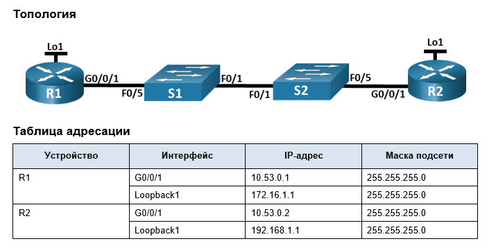
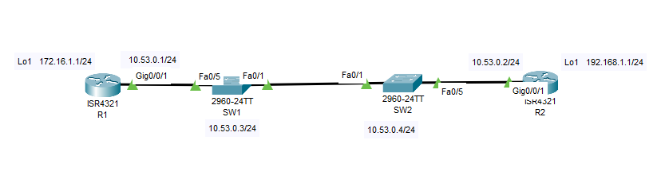

### ДЗ10. Настройка протокола OSPFv2 для одной области.
-----------

### Задание.

Часть 1. Создание сети и настройка основных параметров устройства.

Часть 2. Настройка и проверка базовой работы протокола  OSPFv2 для одной области.

Часть 3. Оптимизация и проверка конфигурации OSPFv2 для одной области.

### Решение.
------

#### Общие сведения и сценарий.

* Необходимо настроить сеть небольшой компании с помощью OSPFv2. R1 будет размещать интернет-соединение (имитируемое интерфейсом Loopback 1) и делиться информацией о маршруте по умолчанию до  R2.  
После первоначальной настройки организация попросила оптимизировать конфигурацию, чтобы уменьшить трафик протокола и гарантировать, что R1 продолжает контролировать маршрутизацию.

> Примечание.  
Статическая маршрутизация, используемая в данной лаборатории, заключается в оценке возможности настройки и настройки OSPFv2 в конфигурации для одной области. Этот подход, используемый в данной лаборатории, может не отражать рекомендации по работе с сетевыми сетями. 

### Часть 1. Создание сети и настройка основных параметров устройства/

-----
#### Шаг 1. Создайте сеть согласно топологии.

-----

Подключите устройства, как показано в топологии, и подсоедините необходимые кабели.

