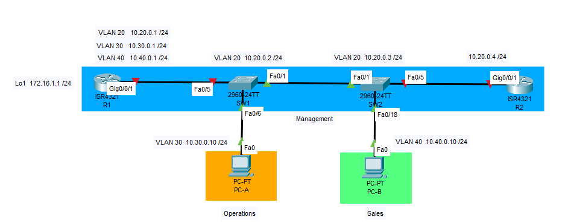

### ДЗ11. Настройка и проверка расширенных списков контроля доступа.

----


### Задание.

-------

[Часть 1. Создание сети и настройка основных параметров устройства.](README.md#часть-1-создание-сети-и-настройка-основных-параметров-устройства)

[Часть 2. Настройка сетей VLAN на коммутаторах.](README.md#часть-2-настройка-сетей-vlan-на-коммутаторах)

[Часть 3. Настройте транки (магистральные каналы).](README.md#часть-3-настройте-транки-магистральные-каналы)

[Часть 4. Настройте маршрутизацию.](README.md#часть-4-настройте-маршрутизацию)

[Часть 5. Настройте удаленный доступ.](README.md#часть-5-настройте-удаленный-доступ)

[Часть 6. Проверка подключения.](README.md#часть-6-проверка-подключения)

[Часть 7. Настройка и проверка списков контроля доступа (ACL).](README.md#часть-7-настройка-и-проверка-списков-контроля-доступа-acl)


### Решение.

------

#### Общие сведения и сценарий.

>Вам было поручено настроить списки контроля доступа в сети небольшой компании.  
ACL являются одним из самых простых и прямых средств управления трафиком уровня L3.  
R1 будет размещать интернет-соединение (смоделированное интерфейсом Loopback 1) и предоставлять информацию о маршруте по умолчанию для R2.  
После завершения первоначальной настройки, компания имеет некоторые конкретные требования к безопасности, которые вы должны реализовать.

### Часть 1. Создание сети и настройка основных параметров устройства.

--------
#### Шаг 1. Создайте сеть согласно топологии.

-----

Подключите устройства, как показано в топологии, и подсоедините необходимые кабели.



#### Шаг 2. Произведите базовую настройку маршрутизаторов.

-----

a.	Назначьте маршрутизатору имя устройства.

b.	Отключите поиск DNS, чтобы предотвратить попытки маршрутизатора неверно преобразовывать введенные команды таким образом, как будто они являются именами узлов.

c.	Назначьте class в качестве зашифрованного пароля привилегированного режима EXEC.

d.	Назначьте cisco в качестве пароля консоли и включите вход в систему по паролю.

e.	Назначьте cisco в качестве пароля VTY и включите вход в систему по паролю.

f.	Зашифруйте открытые пароли.

g.	Создайте баннер с предупреждением о запрете несанкционированного доступа к устройству.

h.	Сохраните текущую конфигурацию в файл загрузочной конфигурации.

#### Шаг 3. Настройте базовые параметры каждого коммутатора.

-----

a.	Присвойте коммутатору имя устройства.

b.	Отключите поиск DNS, чтобы предотвратить попытки маршрутизатора неверно преобразовывать введенные команды таким образом, как будто они являются именами узлов.

c.	Назначьте class в качестве зашифрованного пароля привилегированного режима EXEC.

d.	Назначьте cisco в качестве пароля консоли и включите вход в систему по паролю.

e.	Назначьте cisco в качестве пароля VTY и включите вход в систему по паролю.

f.	Зашифруйте открытые пароли.

g.	Создайте баннер с предупреждением о запрете несанкционированного доступа к устройству.

h.	Сохраните текущую конфигурацию в файл загрузочной конфигурации.

------


### Часть 2. Настройка сетей VLAN на коммутаторах.

------


#### Шаг 1. Создайте сети VLAN на коммутаторах.

a.	Создайте необходимые VLAN и назовите их на каждом коммутаторе из приведенной выше таблицы.
```
SW1#
SW1#conf t
Enter configuration commands, one per line.  End with CNTL/Z.
SW1(config)#vlan 20
SW1(config-vlan)#
SW1(config-vlan)#name Management
SW1(config-vlan)#exit
SW1(config)#vlan 30
SW1(config-vlan)#name Operations
SW1(config-vlan)#
SW1(config-vlan)#exit
SW1(config)#vlan 40
SW1(config-vlan)#
SW1(config-vlan)#name Sales
SW1(config-vlan)#
SW1(config-vlan)#exit
SW1(config)#vlan 999
SW1(config-vlan)#name ParkingLot
SW1(config-vlan)#
SW1(config-vlan)#vlan 1000
SW1(config-vlan)#name Native
SW1(config-vlan)#
SW1(config-vlan)#^Z
SW1#
%SYS-5-CONFIG_I: Configured from console by console

SW1#sh vlan

VLAN Name                             Status    Ports
---- -------------------------------- --------- -------------------------------
1    default                          active    Fa0/1, Fa0/2, Fa0/3, Fa0/4
                                                Fa0/5, Fa0/6, Fa0/7, Fa0/8
                                                Fa0/9, Fa0/10, Fa0/11, Fa0/12
                                                Fa0/13, Fa0/14, Fa0/15, Fa0/16
                                                Fa0/17, Fa0/18, Fa0/19, Fa0/20
                                                Fa0/21, Fa0/22, Fa0/23, Fa0/24
                                                Gig0/1, Gig0/2
20   Management                       active    
30   Operations                       active    
40   Sales                            active    
999  ParkingLot                       active    
1000 Native                           active    
1002 fddi-default                     active    
1003 token-ring-default               active    
1004 fddinet-default                  active    
1005 trnet-default                    active    


SW1#
```
Выполним аналогичные настройки на коммутаторе SW2.


b.	Настройте интерфейс управления и шлюз по умолчанию на каждом коммутаторе, используя информацию об IP-адресе в таблице адресации. 
```
SW1#
SW1#conf t
Enter configuration commands, one per line.  End with CNTL/Z.
SW1(config)#
SW1(config)#int vlan 20
SW1(config-if)#
%LINK-5-CHANGED: Interface Vlan20, changed state to up

SW1(config-if)#
SW1(config-if)#ip address 10.20.0.2 255.255.255.0
SW1(config-if)#
SW1(config-if)#no sh
SW1(config-if)#exit
SW1(config)#exit
SW1#
%SYS-5-CONFIG_I: Configured from console by console

SW1#clock set 09:15:00 24 apr 2025
SW1#
SW1#
```


c.	Назначьте все неиспользуемые порты коммутатора VLAN Parking Lot, настройте их для статического режима доступа и административно деактивируйте их.

```
SW1(config)#
SW1(config)#int rang fa0/2-4, fa0/7-24, gig0/1-2
SW1(config-if-range)#
SW1(config-if-range)#swit
SW1(config-if-range)#switchport mode access
SW1(config-if-range)#swit
SW1(config-if-range)#switchport access vlan 999
SW1(config-if-range)#
SW1(config-if-range)#
SW1(config-if-range)#shut
SW1(config-if-range)#exit
SW1(config)#
SW1(config)#exit
SW1#
```


#### Шаг 2. Назначьте сети VLAN соответствующим интерфейсам коммутатора.

-----

a.	Назначьте используемые порты соответствующей VLAN (указанной в таблице VLAN выше) и настройте их для режима статического доступа.

```
SW1#
SW1#conf t
Enter configuration commands, one per line.  End with CNTL/Z.
SW1(config)#
SW1(config)#int fa0/6
SW1(config-if)#
SW1(config-if)#switchport mode access 
SW1(config-if)#
SW1(config-if)#switchport  access vlan 30
SW1(config-if)#
SW1(config-if)#no shut
SW1(config-if)#
SW1(config-if)#exit
SW1(config)#
SW1(config)#exit
SW1#
%SYS-5-CONFIG_I: Configured from console by console

SW1#
```


b.	Выполните команду show vlan brief, чтобы убедиться, что сети VLAN назначены правильным интерфейсам.
```
SW1#sh vlan br

VLAN Name                             Status    Ports
---- -------------------------------- --------- -------------------------------
1    default                          active    Fa0/1, Fa0/5
20   Management                       active    
30   Operations                       active    Fa0/6
40   Sales                            active    
999  ParkingLot                       active    Fa0/2, Fa0/3, Fa0/4, Fa0/7
                                                Fa0/8, Fa0/9, Fa0/10, Fa0/11
                                                Fa0/12, Fa0/13, Fa0/14, Fa0/15
                                                Fa0/16, Fa0/17, Fa0/18, Fa0/19
                                                Fa0/20, Fa0/21, Fa0/22, Fa0/23
                                                Fa0/24, Gig0/1, Gig0/2
1000 Native                           active    
1002 fddi-default                     active    
1003 token-ring-default               active    
1004 fddinet-default                  active    
1005 trnet-default                    active    
SW1#
```

Выполним аналогичные настройки на коммутаторе SW2.

------

### Часть 3. Настройте транки (магистральные каналы).

------
#### Шаг 1. Вручную настройте магистральный интерфейс F0/1 на коммутаторах SW1 и SW2.

a.	Измените режим порта коммутатора на интерфейсе F0/1, чтобы принудительно создать магистральную связь. Не забудьте сделать это на обоих коммутаторах.

b.	В рамках конфигурации транка установите для native vlan значение 1000 на обоих коммутаторах. При настройке двух интерфейсов для разных собственных VLAN сообщения об ошибках могут отображаться временно.

c.	В качестве другой части конфигурации транка укажите, что VLAN 10, 20, 30 и 1000 разрешены в транке.

d.	Выполните команду show interfaces trunk для проверки портов магистрали, собственной VLAN и разрешенных VLAN через магистраль.

#### Шаг 2. Вручную настройте магистральный интерфейс F0/5 на коммутаторе S1.


a.	Настройте интерфейс S1 F0/5 с теми же параметрами транка, что и F0/1. Это транк до маршрутизатора.

b.	Сохраните текущую конфигурацию в файл загрузочной конфигурации.

c.	Используйте команду show interfaces trunk для проверки настроек транка.

```
SW1(config)#
SW1(config)#int fa0/1
SW1(config-if)#
SW1(config-if)#switchport mode trunk
SW1(config-if)#
%LINEPROTO-5-UPDOWN: Line protocol on Interface FastEthernet0/1, changed state to down

%LINEPROTO-5-UPDOWN: Line protocol on Interface FastEthernet0/1, changed state to up

%LINEPROTO-5-UPDOWN: Line protocol on Interface Vlan20, changed state to up

SW1(config-if)#
SW1(config-if)#
SW1(config-if)#switchport trunk native vlan 1000
SW1(config-if)#
%CDP-4-NATIVE_VLAN_MISMATCH: Native VLAN mismatch discovered on FastEthernet0/1 (1000), with SW2 FastEthernet0/1 (1).
SW1(config-if)#switchport nonegotiate 
SW1(config-if)#
%CDP-4-NATIVE_VLAN_MISMATCH: Native VLAN mismatch discovered on FastEthernet0/1 (1000), with SW2 FastEthernet0/1 (1).

SW1(config-if)#
SW1(config-if)#switchport trunk allowed vlan 20,30,40,1000
SW1(config-if)#
SW1(config-if)#
SW1(config-if)int fa0/5
SW1(config-if)#
SW1(config-if)#switchport mode trunk
SW1(config-if)#
SW1(config-if)#switchport trunk native vlan 1000
SW1(config-if)#
SW1(config-if)#
SW1(config-if)#switchport nonegotiate
SW1(config-if)#
SW1(config-if)#switchport trunk allowed vlan 20,30,40,1000
SW1(config-if)#exit
SW1(config)#exit
SW1#
SW1#
SW1#sh int trunk 
Port        Mode         Encapsulation  Status        Native vlan
Fa0/1       on           802.1q         trunking      1000

Port        Vlans allowed on trunk
Fa0/1       20,30,40,1000

Port        Vlans allowed and active in management domain
Fa0/1       20,30,40,1000

Port        Vlans in spanning tree forwarding state and not pruned
Fa0/1       20,30,40,1000

SW1#
```
Интерфейс fa0/5 не отображается в листинге команды **sh int trunk**. Это связано с отключенным интерфейсом gig0/0/1 со стороны маршрутизатора R1.

Выполним аналогичные настроики на коммутаторе SW2.

----
### Часть 4. Настройте маршрутизацию.

-----
#### Шаг 1. Настройка маршрутизации между сетями VLAN на R1.

a.	Активируйте интерфейс G0/0/1 на маршрутизаторе.

b.	Настройте подинтерфейсы для каждой VLAN, как указано в таблице IP-адресации. Все подинтерфейсы используют инкапсуляцию 802.1Q. Убедитесь, что подинтерфейс для собственной VLAN не имеет назначенного IP-адреса. Включите описание для каждого подинтерфейса.

c.	Настройте интерфейс Loopback 1 на R1 с адресацией из приведенной выше таблицы.

d.	С помощью команды show ip interface brief проверьте конфигурацию подынтерфейса.

```
R1(config)#
R1(config)#int gig0/0/1
R1(config-if)#
R1(config-if)#no shut

R1(config-if)#
%LINK-5-CHANGED: Interface GigabitEthernet0/0/1, changed state to up

%LINEPROTO-5-UPDOWN: Line protocol on Interface GigabitEthernet0/0/1, changed state to up

R1(config-if)#
R1(config-if)#exit
R1(config)#
R1(config)#int gig0/0/1.20
R1(config-subif)#
%LINK-5-CHANGED: Interface GigabitEthernet0/0/1.20, changed state to up

%LINEPROTO-5-UPDOWN: Line protocol on Interface GigabitEthernet0/0/1.20, changed state to up

R1(config-subif)#
R1(config-subif)#description VLAN 20 Management
R1(config-subif)#
R1(config-subif)#encapsulation dot1Q 20
R1(config-subif)#
R1(config-subif)#ip address 10.20.0.1 255.255.255.0
R1(config-subif)#
R1(config-subif)#int gig0/0/1.30
R1(config-subif)#
%LINK-5-CHANGED: Interface GigabitEthernet0/0/1.30, changed state to up

%LINEPROTO-5-UPDOWN: Line protocol on Interface GigabitEthernet0/0/1.30, changed state to up

R1(config-subif)#
R1(config-subif)#description VLAN 30 Operations
R1(config-subif)#
R1(config-subif)#encapsulation dot1Q 30
R1(config-subif)#ip address 10.30.0.1 255.255.255.0
R1(config-subif)#no shut
R1(config-subif)#
R1(config-subif)#int gig0/0/1.40
R1(config-subif)#
%LINK-5-CHANGED: Interface GigabitEthernet0/0/1.40, changed state to up

%LINEPROTO-5-UPDOWN: Line protocol on Interface GigabitEthernet0/0/1.40, changed state to up

R1(config-subif)#
R1(config-subif)#
R1(config-subif)#description VLAN 40 Sales
R1(config-subif)#encapsulation dot1Q 40
R1(config-subif)#ip address 10.40.0.1 255.255.255.0
R1(config-subif)#no shut
R1(config-subif)#
R1(config-subif)#int gig0/0/1.1000
R1(config-subif)#
%LINK-5-CHANGED: Interface GigabitEthernet0/0/1.1000, changed state to up

%LINEPROTO-5-UPDOWN: Line protocol on Interface GigabitEthernet0/0/1.1000, changed state to up

R1(config-subif)#encapsulation dot1Q 1000 native
R1(config-subif)#
R1(config-subif)#exit
R1(config)#
R1(config)#int loo
R1(config)#int loopback 1

R1(config-if)#
%LINK-5-CHANGED: Interface Loopback1, changed state to up

%LINEPROTO-5-UPDOWN: Line protocol on Interface Loopback1, changed state to up

R1(config-if)#
R1(config-if)#ip adrress 172.16.1.1 255.255.255.0
                   ^
% Invalid input detected at '^' marker.
	
R1(config-if)#ip address 172.16.1.1 255.255.255.0
R1(config-if)#
R1(config-if)#
R1(config-if)#
R1(config-if)#exit
R1(config)#exit
R1#
%SYS-5-CONFIG_I: Configured from console by console

R1#sh ip int br
Interface              IP-Address      OK? Method Status                Protocol 
GigabitEthernet0/0/0   unassigned      YES NVRAM  administratively down down 
GigabitEthernet0/0/1   unassigned      YES NVRAM  up                    up 
GigabitEthernet0/0/1.2010.20.0.1       YES manual up                    up 
GigabitEthernet0/0/1.3010.30.0.1       YES manual up                    up 
GigabitEthernet0/0/1.4010.40.0.1       YES manual up                    up 
GigabitEthernet0/0/1.1000unassigned      YES unset  up                    up 
Loopback1              172.16.1.1      YES manual up                    up 
Vlan1                  unassigned      YES unset  administratively down down
R1#
R1#
```
Все интерфейсы поднялись.

#### Шаг 2. Настройка интерфейса R2 g0/0/1 с использованием адреса из таблицы и маршрута по умолчанию с адресом следующего перехода 10.20.0.1

```
R2(config)#
R2(config)# int gig0/0/1
R2(config-if)#
R2(config-if)# ip address 10.20.0.4 255.255.255.0
R2(config-if)#
R2(config-if)#no shut
 %LINK-5-CHANGED: Interface GigabitEthernet0/0/1, changed state to up

%LINEPROTO-5-UPDOWN: Line protocol on Interface GigabitEthernet0/0/1, changed state to up
R2(config-if)#exit
R2(config)
R2(config)#ip route 0.0.0.0 0.0.0.0 10.20.0.1
R2(config)#
R2(config)#exit
R2#
%SYS-5-CONFIG_I: Configured from console by console

R2#sh ip route
Codes: L - local, C - connected, S - static, R - RIP, M - mobile, B - BGP
       D - EIGRP, EX - EIGRP external, O - OSPF, IA - OSPF inter area
       N1 - OSPF NSSA external type 1, N2 - OSPF NSSA external type 2
       E1 - OSPF external type 1, E2 - OSPF external type 2, E - EGP
       i - IS-IS, L1 - IS-IS level-1, L2 - IS-IS level-2, ia - IS-IS inter area
       * - candidate default, U - per-user static route, o - ODR
       P - periodic downloaded static route

Gateway of last resort is 10.20.0.1 to network 0.0.0.0

     10.0.0.0/8 is variably subnetted, 2 subnets, 2 masks
C       10.20.0.0/24 is directly connected, GigabitEthernet0/0/1
L       10.20.0.4/32 is directly connected, GigabitEthernet0/0/1
S*   0.0.0.0/0 [1/0] via 10.20.0.1

R2# ping 10.40.0.10

Type escape sequence to abort.
Sending 5, 100-byte ICMP Echos to 10.40.0.10, timeout is 2 seconds:
!!!!!
Success rate is 100 percent (5/5), round-trip min/avg/max = 0/0/0 ms

R2#
```
Отработал маршрут по умолчанию. Есть IP связанность с ПК PC-A и со всеми узлами сети.

-----
### Часть 5. Настройте удаленный доступ.

------
#### Шаг 1. Настройте все сетевые устройства для базовой поддержки SSH.

a.	Создайте локального пользователя с именем пользователя SSHadmin и зашифрованным паролем cisco .

b.	Используйте ccna-lab.com в качестве доменного имени.

c.	Генерируйте криптоключи с помощью 1024 битного модуля.

d.	Настройте первые пять линий VTY на каждом устройстве, чтобы поддерживать только SSH-соединения и с локальной аутентификацией.

```
R1(config)#ip domain name ccna-lab.com 
R1(config)#
R1(config)#username sshadmin privilege 15 secret cisco
R1(config)#
R1(config)#crypto key generate rsa
The name for the keys will be: R1.ccna-lab.com
Choose the size of the key modulus in the range of 360 to 2048 for your
  General Purpose Keys. Choosing a key modulus greater than 512 may take
  a few minutes.

How many bits in the modulus [512]: 1024
% Generating 1024 bit RSA keys, keys will be non-exportable...[OK]

R1(config)#
*Mar 1 1:1:58.312: %SSH-5-ENABLED: SSH 1.99 has been enabled
R1(config)#ip ssh ver 2
R1(config)#
R1(config)#line vty 0 4
R1(config-line)#
R1(config-line)#login local 
R1(config-line)#
R1(config-line)#transport input ssh
R1(config-line)#
R1(config-line)#exit
R1(config)#exit
R1#
```

Проверим доступ к маршрутизатору R1 по SSH с ПК PC-A
```
C:\>
C:\>ssh -l sshadmin 10.20.0.1

Password: 


***********************************************
**************ATTENTION************************
***********************************************

R1#
R1#exit

[Connection to 10.20.0.1 closed by foreign host]
C:\>
```
Доступ к маршрутизатору R1 по протоколу SSH присутствует.

Проведем аналогичные настройки на всех сетевых устройствах.


#### Шаг 2. Включите защищенные веб-службы с проверкой подлинности на R1.

-------

a.	Включите сервер HTTPS на R1.
R1(config)# ip http secure-server 

b.	Настройте R1 для проверки подлинности пользователей, пытающихся подключиться к веб-серверу.

R1(config)# ip http authentication local

>В используемой версии CPT нет возможности включить на R1 защищенные веб лужбы. 
Для доступа пользователей к устройству по протоколам HTTP и HTTPS дополним схему WEB-сервером. Создадим новый VLAN 10 (Servers), введем WEB-сервер в VLAN 10  и присвоим серверу IP адрес 10.10.0.10 /24.  
Так же добавим в сервер второй интерфейс и включим его в LAN 20 c IP адресом 10.20.0.5 /24  
Изменим настроики коммутаторов и маршрутизатора R1  в соответствии с новым VLAN 10. 


----
### Часть 6. Проверка подключения.

----
#### Шаг 1. Настройте узлы ПК.
Адреса ПК можно посмотреть в таблице адресации.

#### Шаг 2. Выполните следующие тесты. Эхозапрос должен пройти успешно.

Таблица для проверки.


Проверка с ПК PC-A
```
C:\>ping 10.40.0.10

Pinging 10.40.0.10 with 32 bytes of data:

Reply from 10.40.0.10: bytes=32 time<1ms TTL=127
Reply from 10.40.0.10: bytes=32 time<1ms TTL=127
Reply from 10.40.0.10: bytes=32 time<1ms TTL=127
Reply from 10.40.0.10: bytes=32 time<1ms TTL=127

Ping statistics for 10.40.0.10:
    Packets: Sent = 4, Received = 4, Lost = 0 (0% loss),
Approximate round trip times in milli-seconds:
    Minimum = 0ms, Maximum = 0ms, Average = 0ms

C:\>ping 10.20.0.1

Pinging 10.20.0.1 with 32 bytes of data:

Reply from 10.20.0.1: bytes=32 time<1ms TTL=255
Reply from 10.20.0.1: bytes=32 time<1ms TTL=255
Reply from 10.20.0.1: bytes=32 time=6ms TTL=255
Reply from 10.20.0.1: bytes=32 time<1ms TTL=255

Ping statistics for 10.20.0.1:
    Packets: Sent = 4, Received = 4, Lost = 0 (0% loss),
Approximate round trip times in milli-seconds:
    Minimum = 0ms, Maximum = 6ms, Average = 1ms
```

Проверка с ПК PC-B

```
C:\>ping 10.30.0.10

Pinging 10.30.0.10 with 32 bytes of data:

Reply from 10.30.0.10: bytes=32 time<1ms TTL=127
Reply from 10.30.0.10: bytes=32 time<1ms TTL=127
Reply from 10.30.0.10: bytes=32 time<1ms TTL=127
Reply from 10.30.0.10: bytes=32 time<1ms TTL=127

Ping statistics for 10.30.0.10:
    Packets: Sent = 4, Received = 4, Lost = 0 (0% loss),
Approximate round trip times in milli-seconds:
    Minimum = 0ms, Maximum = 0ms, Average = 0ms

C:\>ping 172.16.1.1

Pinging 172.16.1.1 with 32 bytes of data:

Reply from 172.16.1.1: bytes=32 time<1ms TTL=255
Reply from 172.16.1.1: bytes=32 time<1ms TTL=255
Reply from 172.16.1.1: bytes=32 time<1ms TTL=255
Reply from 172.16.1.1: bytes=32 time<1ms TTL=255

Ping statistics for 172.16.1.1:
    Packets: Sent = 4, Received = 4, Lost = 0 (0% loss),
Approximate round trip times in milli-seconds:
    Minimum = 0ms, Maximum = 0ms, Average = 0ms

C:\>ping 10.20.0.1

Pinging 10.20.0.1 with 32 bytes of data:

Reply from 10.20.0.1: bytes=32 time<1ms TTL=255
Reply from 10.20.0.1: bytes=32 time<1ms TTL=255
Reply from 10.20.0.1: bytes=32 time<1ms TTL=255
Reply from 10.20.0.1: bytes=32 time=7ms TTL=255

Ping statistics for 10.20.0.1:
    Packets: Sent = 4, Received = 4, Lost = 0 (0% loss),
Approximate round trip times in milli-seconds:
    Minimum = 0ms, Maximum = 7ms, Average = 1ms

C:\>telnet 10.10.0.10 443
Trying 10.10.0.10 ...Open

[Connection to 10.10.0.10 closed by foreign host]
C:\>
C:\>telnet 10.10.0.10 80
Trying 10.10.0.10 ...Open

[Connection to 10.10.0.10 closed by foreign host]
C:\>telnet 10.20.0.5 443
Trying 10.20.0.5 ...Open

[Connection to 10.20.0.5 closed by foreign host]
C:\>
C:\>telnet 10.20.0.5 80
Trying 10.20.0.5 ...Open

[Connection to 10.20.0.5 closed by foreign host]
C:\>
C:\>ssh -l sshadmin 10.20.0.1

Password: 


***********************************************
**************ATTENTION************************
***********************************************

R1#exit

[Connection to 10.20.0.1 closed by foreign host]
C:\>
C:\>ssh -l sshadmin 172.16.1.1

Password: 


***********************************************
**************ATTENTION************************
***********************************************

R1#exit

[Connection to 172.16.1.1 closed by foreign host]
C:\>
```
Тестовые подключения прошли успешно.

-----
### Часть 7. Настройка и проверка списков контроля доступа (ACL)

-----

При проверке базового подключения компания требует реализации следующих политик безопасности:

* Политика1. Сеть Sales не может использовать SSH в сети Management (но в  другие сети SSH разрешен). 
* Политика 2. Сеть Sales не имеет доступа к IP-адресам в сети Management с помощью любого веб-протокола (HTTP/HTTPS). Сеть Sales также не имеет доступа к интерфейсам R1 с помощью любого веб-протокола. Разрешён весь другой веб-трафик (обратите внимание — Сеть Sales  может получить доступ к интерфейсу Loopback 1 на R1).
* Политика3. Сеть Sales не может отправлять эхо-запросы ICMP в сети Operations или Management. Разрешены эхо-запросы ICMP к другим адресатам. 
* Политика 4: Cеть Operations  не может отправлять ICMP эхозапросы в сеть Sales. Разрешены эхо-запросы ICMP к другим адресатам. 

#### Шаг 1. Проанализируйте требования к сети и политике безопасности для планирования реализации ACL.

В VLAN 40 (Sales) подключен PC-B на порту fa0/18 коммутатора SW2 (IP – 10.40.0.10/24)  
Сеть VLAN 40 – 10.40.0.0 /24  
Субинтерфейс VLAN 40 на маршрутизаторе R1 – gig0/0/1.40 (IP- 10.40.0.1/24).

В VLAN 20 (Management) подключены все коммутаторы и маршрутизаторы, а так же Web-сервер (IP- 10.20.0.5/24) на порту fa0/2 коммутатора SW2.   
Сеть VLAN 20 – 10.20.0.0 /24  
Субинтерфейс VLAN 20 на маршрутизаторе R1 – gig0/0/1.20 (IP- 10.20.0.1/24).

Так же WEB сервер вторым интерфейсом (IP – 10.10.0.10/24) подключен в VLAN 10 (Servers) на порту gig0/1 коммутатора SW1.  
Сеть VLAN 10 – 10.10.0.0 /24  
Субинтерфейс VLAN 10 на маршрутизаторе R1 – gig0/0/1.10 (IP- 10.10.0.1/24).

В VLAN 30 (Operations) подключен PC-A на порту fa0/6 коммутатора SW1 (IP – 10..0.10/24)  
Сеть VLAN 30 – 10.30.0.0 /24  
Субинтерфейс VLAN 30 на маршрутизаторе R1 – gig0/0/1.30 (IP- 10.30.0.1/24).

Политики для сети SALES

Необходимо для сети Sales – 10.40.0.0 /24
1.	 запретить SSH в сети Management (10.20.0.0 /24) , но в  другие сети SSH должен быть разрешен. 
2.	запретить доступ к IP-адресам в сети Management с помощью любого веб-протокола (HTTP/HTTPS). Сеть Sales также не имеет доступа к интерфейсам R1 с помощью любого веб-протокола. Разрешён весь другой веб-трафик (обратите внимание — Сеть Sales  может получить доступ к интерфейсу Loopback 1 на R1).
3.	запретить отправлять эхо-запросы ICMP в сети Operations (10.30.0.0 /24) или Management (10.20.0.0 /24). Разрешены эхо-запросы ICMP к другим адресатам.

Политики для сети OPERATION

Необходимо для сети Operations - 10.30.0.0 /24
1.	Запретить отправлять ICMP эхозапросы в сеть Sales (10.40.0.0/24). Разрешены эхо-запросы ICMP к другим адресатам.

Так как в политиках используются протоколы ICMP, HTTP, HTTPS, SSH, то необходимо применять расширенные ACL, которые позволяют более гибко работать с протоколами и портами. Стандартные ACL позволяют работать только с IP адресами источника.

----- 
#### Шаг 2. Разработка и применение расширенных списков доступа, которые будут соответствовать требованиям политики безопасности.

-----

1. Создадим на маршрутизаторе R1 расширенный ACL SALES в соответствии с политиками для сети SALES.
Распологать ACL будем на интерфейсе ближе к источнику (сети SALES) на интерфейсе gig0/0/1.40 во входном направлении, что бы сразу отбрасывать запрещенные пакеты. В конце списка правил необходимо вставить разрешающее правило для всех разрешенных пакетов.
```
R1(config)#
R1(config)#
R1(config)#ip access-list extended SALES
R1(config-ext-nacl)#
!
! Запрещаем подключение к сети 10.20.0.0/24 по протоколу SSH
R1(config-ext-nacl)#deny tcp 10.40.0.0 0.0.0.255 10.20.0.0 0.0.0.255 eq 22
!
! Запрещаем эхо-запросы  ко всем узлам сети 10.20.0.0/24 
R1(config-ext-nacl)# deny icmp 10.40.0.0 0.0.0.255 10.20.0.0 0.0.0.255
!
! Запрещаем эхо-запросы ко всем узлам  сети 10.30.0.0/24 
R1(config-ext-nacl)# deny icmp 10.40.0.0 0.0.0.255 10.30.0.0 0.0.0.255
!
!Запрещаем подключение к сети 10.20.0.0/24 по протоколу HTTP и HTTPS
R1(config-ext-nacl)# deny tcp 10.40.0.0 0.0.0.255 10.20.0.0 0.0.0.255 range www 443
!
! Разрешаем прохождение всего остального трафика IP 
R1(config-ext-nacl)# permit ip any any
R1(config-ext-nacl)#
R1(config-ext-nacl)#exit
R1(config)#
R1(config)#
!
! Распологаем созданный ACL лист на входной интерфейс сети SALES gig0/0/1.40
R1(config)#int gig0/0/1.40
R1(config-subif)#
R1(config-subif)#
R1(config-subif)#ip access-group SALES in
R1(config-subif)#
R1(config-subif)#
R1(config-subif)#^Z
R1#
%SYS-5-CONFIG_I: Configured from console by console

R1#
R1#sh ip access-lists SALES
Extended IP access list SALES
    deny tcp 10.40.0.0 0.0.0.255 10.20.0.0 0.0.0.255 eq 22
    deny icmp 10.40.0.0 0.0.0.255 10.20.0.0 0.0.0.255
    deny icmp 10.40.0.0 0.0.0.255 10.30.0.0 0.0.0.255
    deny tcp 10.40.0.0 0.0.0.255 10.20.0.0 0.0.0.255 range www 443
    permit ip any any

R1#

```

2. Создадим на маршрутизаторе R1 расширенный ACL OPERATIONS  в соответствии с политиками для сети OPERATIONS. Распологать ACL будем на интерфейсе ближе к источнику (сети OPERATIONS) на интерфейсе gig0/0/1.30 во входном направлении, что бы сразу отбрасывать запрещенные пакеты. В конце списка правил необходимо вставить разрешающее правило для всех разрешенных пакетов.

```
R1(config)#
R1(config)#ip access-list extended OPERATIONS
R1(config-ext-nacl)#
R1(config-ext-nacl)#deny icmp 10.30.0.0 0.0.0.255 10.40.0.0 0.0.0.255
R1(config-ext-nacl)#
R1(config-ext-nacl)#permit ip any any
R1(config-ext-nacl)#
R1(config-ext-nacl)#
R1(config-ext-nacl)#exit
R1(config)#
R1(config)#int gig0/0/1.30
R1(config-subif)#
R1(config-subif)#
R1(config-subif)#ip access-group OPERATIONS in
R1(config-subif)#
R1(config-subif)#
R1(config-subif)#exit
R1(config)#exit
R1#
%SYS-5-CONFIG_I: Configured from console by console

R1#sh ip access-lists OPERATION
R1#sh ip access-lists OPERATIONS
Extended IP access list OPERATIONS
    deny icmp 10.30.0.0 0.0.0.255 10.40.0.0 0.0.0.255
    permit ip any any

R1#
```

#### Шаг 3. Убедитесь, что политики безопасности применяются развернутыми списками доступа.


Выполните следующие тесты. Ожидаемые результаты показаны в таблице:

Выполняем тесты с ПК PC-A.

```
Cisco Packet Tracer PC Command Line 1.0
C:\>ping 10.40.0.10

Pinging 10.40.0.10 with 32 bytes of data:

Reply from 10.30.0.1: Destination host unreachable.
Reply from 10.30.0.1: Destination host unreachable.
Reply from 10.30.0.1: Destination host unreachable.
Reply from 10.30.0.1: Destination host unreachable.

Ping statistics for 10.40.0.10:
    Packets: Sent = 4, Received = 0, Lost = 4 (100% loss),

C:\>ping 10.20.0.1

Pinging 10.20.0.1 with 32 bytes of data:

Reply from 10.20.0.1: bytes=32 time<1ms TTL=255
Reply from 10.20.0.1: bytes=32 time<1ms TTL=255
Reply from 10.20.0.1: bytes=32 time<1ms TTL=255
Reply from 10.20.0.1: bytes=32 time<1ms TTL=255

Ping statistics for 10.20.0.1:
    Packets: Sent = 4, Received = 4, Lost = 0 (0% loss),
Approximate round trip times in milli-seconds:
    Minimum = 0ms, Maximum = 0ms, Average = 0ms

C:\>
C:\>ping 10.10.0.10

Pinging 10.10.0.10 with 32 bytes of data:

Reply from 10.10.0.10: bytes=32 time<1ms TTL=127
Reply from 10.10.0.10: bytes=32 time<1ms TTL=127
Reply from 10.10.0.10: bytes=32 time<1ms TTL=127
Reply from 10.10.0.10: bytes=32 time<1ms TTL=127

Ping statistics for 10.10.0.10:
    Packets: Sent = 4, Received = 4, Lost = 0 (0% loss),
Approximate round trip times in milli-seconds:
    Minimum = 0ms, Maximum = 0ms, Average = 0ms

C:\>
```
Доступ по протоколу ICMP имеется ко всем узлам  кроме узлов сети SALES 10.40.0.0/24
Так же имеется доступ к WEB-серверу  и сети управления по протоколу SSH.

Выполняем тесты с ПК PC-B.

```
Cisco Packet Tracer PC Command Line 1.0
C:\>ping 10.30.0.10

Pinging 10.30.0.10 with 32 bytes of data:

Reply from 10.40.0.1: Destination host unreachable.
Reply from 10.40.0.1: Destination host unreachable.
Reply from 10.40.0.1: Destination host unreachable.
Reply from 10.40.0.1: Destination host unreachable.

Ping statistics for 10.30.0.10:
    Packets: Sent = 4, Received = 0, Lost = 4 (100% loss),

C:\>ping 10.30.0.1

Pinging 10.30.0.1 with 32 bytes of data:

Reply from 10.40.0.1: Destination host unreachable.
Reply from 10.40.0.1: Destination host unreachable.
Reply from 10.40.0.1: Destination host unreachable.
Reply from 10.40.0.1: Destination host unreachable.

Ping statistics for 10.30.0.1:
    Packets: Sent = 4, Received = 0, Lost = 4 (100% loss),

C:\>ping 10.20.0.1

Pinging 10.20.0.1 with 32 bytes of data:

Reply from 10.40.0.1: Destination host unreachable.
Reply from 10.40.0.1: Destination host unreachable.
Reply from 10.40.0.1: Destination host unreachable.
Reply from 10.40.0.1: Destination host unreachable.

Ping statistics for 10.20.0.1:
    Packets: Sent = 4, Received = 0, Lost = 4 (100% loss),

C:\>ping 172.16.1.1

Pinging 172.16.1.1 with 32 bytes of data:

Reply from 172.16.1.1: bytes=32 time<1ms TTL=255
Reply from 172.16.1.1: bytes=32 time<1ms TTL=255
Reply from 172.16.1.1: bytes=32 time<1ms TTL=255
Reply from 172.16.1.1: bytes=32 time<1ms TTL=255

Ping statistics for 172.16.1.1:
    Packets: Sent = 4, Received = 4, Lost = 0 (0% loss),
Approximate round trip times in milli-seconds:
    Minimum = 0ms, Maximum = 0ms, Average = 0ms

C:\>ssh -l sshadmin 10.20.0.4

% Connection timed out; remote host not responding
C:\>ssh -l sshadmin 172.16.1.1

Password: 


***********************************************
**************ATTENTION************************
***********************************************

R1#exit

[Connection to 172.16.1.1 closed by foreign host]
C:\>telnet 10.2.0.5 80
Trying 10.2.0.5 ...
% Connection timed out; remote host not responding
C:\>telnet 10.2.0.5 443
Trying 10.2.0.5 ...
% Connection timed out; remote host not responding
C:\>telnet 10.10.0.10 80
Trying 10.10.0.10 ...Open

[Connection to 10.10.0.10 closed by foreign host]
C:\>telnet 10.10.0.10 443
Trying 10.10.0.10 ...Open

[Connection to 10.10.0.10 closed by foreign host]
C:\>

```

Для сети SALES выполнены все политики безопасности.

Данные тестов сведены в таблицу. Все ожидаемые результаты подтверждены.


Пример рабочей конфигурации маршрутизатора R1 приведен [здесь](/labs/lab11/Configs/Config%20R1_11.txt)

Пример рабочей конфигурации маршрутизатора R2 приведен [здесь](/labs/lab11/Configs/Config%20R2_11.txt)


Пример рабочей конфигурации коммутатора SW1  приведен [здесь](/labs/lab11/Configs/Config%20SW1_11.txt)

Пример рабочей конфигурации коммутатора SW2  приведен [здесь](/labs/lab11/Configs/Config%20SW2_11.txt)