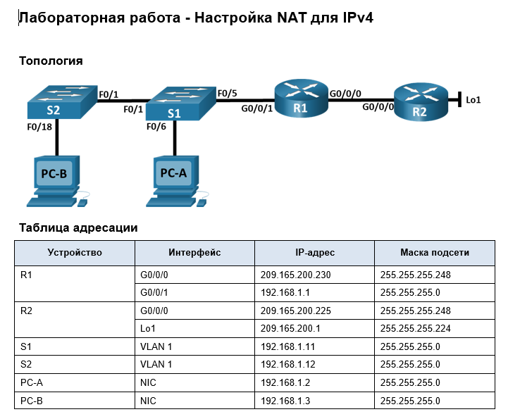

### ДЗ12. Настройка NAT для IPv4
-----



### Задание.
----

Часть 1. Создание сети и настройка основных параметров устройства.

Часть 2. Настройка и проверка NAT для IPv4.

Часть 3. Настройка и проверка PAT для IPv4.

Часть 4. Настройка и проверка статического NAT для IPv4.


#### Общие сведения/сценарий.

>Преобразование (NAT) — это процесс, при котором сетевое устройство, например маршрутизатор Cisco, назначает публичный адрес узлам в пределах частной сети. NAT используют для сокращения количества публичных IP-адресов, используемых организацией, поскольку количество доступных публичных IPv4-адресов ограничено.

* Интернет-провайдер выделил компании общедоступное пространство IP-адресов 209.165.200.224/29. Эта сеть используется для обращения к каналу между маршрутизатором ISP (R2) и шлюзом компании (R1).  
 Первый адрес (209.165.200.225) назначается интерфейсу g0/0 на R2, а последний адрес (209.165.200.230) назначается интерфейсу g0/0/0 на R1. Остальные адреса (209.165.200.226-209.165.200.229) будут использоваться для предоставления доступа в Интернет хостам компании.  
 Маршрут по умолчанию используется от R1 до R2. Подключение интернет-провайдера к Интернету смоделировано loopback-адресом на маршрутизаторе интернет-провайдера.

------ 
### Часть 1. Создание сети и настройка основных параметров устройства.

-----
В первой части лабораторной работы вам предстоит создать топологию сети и настроить базовые параметры для узлов ПК и коммутаторов.

#### Шаг 1. Подключите кабели сети согласно приведенной топологии.

-----
Подключите устройства в соответствии с топологией и подсоедините соответствующие кабели.


#### Шаг 2. Произведите базовую настройку маршрутизаторов.

-----
a.	Назначьте маршрутизатору имя устройства.

b.	Отключите поиск DNS, чтобы предотвратить попытки маршрутизатора неверно преобразовывать введенные команды таким образом, как будто они являются именами узлов.

c.	Назначьте class в качестве зашифрованного пароля привилегированного режима EXEC.

d.	Назначьте cisco в качестве пароля консоли и включите вход в систему по паролю.

e.	Назначьте cisco в качестве пароля VTY и включите вход в систему по паролю.

f.	Зашифруйте открытые пароли.

g.	Создайте баннер с предупреждением о запрете несанкционированного доступа к устройству.

h.	Настройте IP-адресации интерфейса, как указано в таблице выше.

i.	Настройте маршрут по умолчанию. от R2 до  R1.

j.	Сохраните текущую конфигурацию в файл загрузочной конфигурации.

#### Шаг 3. Настройте базовые параметры каждого коммутатора.


a.	Присвойте коммутатору имя устройства.

b.	Отключите поиск DNS, чтобы предотвратить попытки маршрутизатора неверно преобразовывать введенные команды таким образом, как будто они являются именами узлов.

c.	Назначьте class в качестве зашифрованного пароля привилегированного режима EXEC.

d.	Назначьте cisco в качестве пароля консоли и включите вход в систему по паролю.

e.	Назначьте cisco в качестве пароля VTY и включите вход в систему по паролю.

f.	Зашифруйте открытые пароли.

g.	Создайте баннер с предупреждением о запрете несанкционированного доступа к устройству.

h.	Выключите все интерфейсы, которые не будут использоваться.

i.	Настройте IP-адресации интерфейса, как указано в таблице выше.

j.	Сохраните текущую конфигурацию в файл загрузочной конфигурации.

------
### Часть 2. Настройка и проверка NAT для IPv4.

-----


В части 2 необходимо настроить и проверить NAT для IPv4.

#### Шаг 1. Настройте NAT на R1, используя пул из трех адресов 209.165.200.226-209.165.200.228. 

------

a.	Настройте простой список доступа, который определяет, какие хосты будут разрешены для трансляции. В этом случае все устройства в локальной сети R1 имеют право на трансляцию.

b.	Создайте пул NAT и укажите ему имя и диапазон используемых адресов.

>Примечание. Параметр маски сети не является разделителем IP-адресов. Это должна быть правильная маска подсети для назначенных адресов, даже если вы используете не все адреса подсети в пуле. 

c.	Настройте перевод, связывая ACL и пул с процессом преобразования.

>Примечание: Три очень важных момента. Во-первых, слово «inside» имеет решающее значение для работы такого рода NAT. Если вы опустить его, NAT не будет работать. Во-вторых, номер списка — это номер ACL, настроенный на предыдущем шаге. В-третьих, имя пула чувствительно к регистру.

d.	Задайте внутренний (inside) интерфейс. 

e.	Определите внешний (outside) интерфейс.

```
R1#
R1#conf t
Enter configuration commands, one per line.  End with CNTL/Z.
R1(config)#
R1(config)#access-list 1 permit 192.168.1.0 0.0.0.255
R1(config)#
R1(config)#ip nat pool PUBLIC_ACCESS 209.165.200.226 209.165.200.228 netmask 255.255.255.248
R1(config)#
R1(config)#ip nat inside source list 1 pool PUBLIC_ACCESS
R1(config)#
R1(config)#int g0/0/1
R1(config-if)#
R1(config-if)#ip nat inside
R1(config-if)#
R1(config-if)#int g0/0/0
R1(config-if)#
R1(config-if)#ip nat outside
R1(config-if)#
R1(config-if)#^Z
R1#
%SYS-5-CONFIG_I: Configured from console by console

R1#
```

Шаг 2. Проверьте и проверьте конфигурацию. 

-----

a.	С PC-B,  запустите эхо-запрос интерфейса Lo1 (209.165.200.1) на R2.
```
C:\>ping 209.165.200.1

Pinging 209.165.200.1 with 32 bytes of data:

Reply from 209.165.200.1: bytes=32 time<1ms TTL=254
Reply from 209.165.200.1: bytes=32 time=8ms TTL=254
Reply from 209.165.200.1: bytes=32 time<1ms TTL=254
Reply from 209.165.200.1: bytes=32 time<1ms TTL=254

Ping statistics for 209.165.200.1:
    Packets: Sent = 4, Received = 4, Lost = 0 (0% loss),
Approximate round trip times in milli-seconds:
    Minimum = 0ms, Maximum = 8ms, Average = 2ms

C:\>
```
 На R1 отобразите таблицу NAT на R1 с помощью команды show ip nat translations.
```
RR1#
R1#sh ip nat  translation
Pro  Inside global     Inside local       Outside local      Outside global
icmp 209.165.200.226:81192.168.1.3:81     209.165.200.1:81   209.165.200.1:81
icmp 209.165.200.226:82192.168.1.3:82     209.165.200.1:82   209.165.200.1:82
icmp 209.165.200.226:83192.168.1.3:83     209.165.200.1:83   209.165.200.1:83
icmp 209.165.200.226:84192.168.1.3:84     209.165.200.1:84   209.165.200.1:84

R1#

```
Вопросы:  

Во что был транслирован внутренний локальный адрес PC-B?  

* Внутренний локальный адрес PC-B (192.168.1.3), был транслирован во внутренний глобальный адрес 209.165.200.226  из пула выделенных глобальных адресов.

 
Какой тип адреса NAT является переведенным адресом?

* NAT осуществляет перевод IPv4-адреса на основе принципа «один к одному» между приватными и общедоступными IPv4-адресами.  
Таким образом переведенным адресом является внутренний глобальный (общедоступный) адрес.

b.	С PC-A, запустите эхо-запрос интерфейса Lo1 (209.165.200.1) на R2.
```
C:\>ping 209.165.200.1

Pinging 209.165.200.1 with 32 bytes of data:

Reply from 209.165.200.1: bytes=32 time=1ms TTL=254
Reply from 209.165.200.1: bytes=32 time<1ms TTL=254
Reply from 209.165.200.1: bytes=32 time<1ms TTL=254
Reply from 209.165.200.1: bytes=32 time=1ms TTL=254

Ping statistics for 209.165.200.1:
    Packets: Sent = 4, Received = 4, Lost = 0 (0% loss),
Approximate round trip times in milli-seconds:
    Minimum = 0ms, Maximum = 1ms, Average = 0ms

C:\>
```


На R1 отобразите таблицу NAT  с помощью команды show ip nat translations.

```
R1#sh ip nat translations 
Pro  Inside global     Inside local       Outside local      Outside global
icmp 209.165.200.226:81192.168.1.3:81     209.165.200.1:81   209.165.200.1:81
icmp 209.165.200.226:82192.168.1.3:82     209.165.200.1:82   209.165.200.1:82
icmp 209.165.200.226:83192.168.1.3:83     209.165.200.1:83   209.165.200.1:83
icmp 209.165.200.226:84192.168.1.3:84     209.165.200.1:84   209.165.200.1:84
icmp 209.165.200.227:13192.168.1.2:13     209.165.200.1:13   209.165.200.1:13
icmp 209.165.200.227:14192.168.1.2:14     209.165.200.1:14   209.165.200.1:14
icmp 209.165.200.227:15192.168.1.2:15     209.165.200.1:15   209.165.200.1:15
icmp 209.165.200.227:16192.168.1.2:16     209.165.200.1:16   209.165.200.1:16

R1#
```
c.	Обратите внимание, что предыдущая трансляция для PC-B все еще находится в таблице. Через некоторое время таблица трансляции очищается.
Повторим эхо-запросы с PC-B, PC-A и SW1  интерфейса Lo1 (209.165.200.1) на R2.  
На R1 отобразите таблицу NAT на R1 с помощью команды show ip nat translations.

```
R1#
R1#sh ip nat translations 
Pro  Inside global     Inside local       Outside local      Outside global
icmp 209.165.200.226:11192.168.1.11:11    209.165.200.1:11   209.165.200.1:11
icmp 209.165.200.226:12192.168.1.11:12    209.165.200.1:12   209.165.200.1:12
icmp 209.165.200.226:13192.168.1.11:13    209.165.200.1:13   209.165.200.1:13
icmp 209.165.200.226:14192.168.1.11:14    209.165.200.1:14   209.165.200.1:14
icmp 209.165.200.226:15192.168.1.11:15    209.165.200.1:15   209.165.200.1:15
icmp 209.165.200.227:93192.168.1.3:93     209.165.200.1:93   209.165.200.1:93
icmp 209.165.200.227:94192.168.1.3:94     209.165.200.1:94   209.165.200.1:94
icmp 209.165.200.227:95192.168.1.3:95     209.165.200.1:95   209.165.200.1:95
icmp 209.165.200.227:96192.168.1.3:96     209.165.200.1:96   209.165.200.1:96
icmp 209.165.200.228:17192.168.1.2:17     209.165.200.1:17   209.165.200.1:17
icmp 209.165.200.228:18192.168.1.2:18     209.165.200.1:18   209.165.200.1:18
icmp 209.165.200.228:19192.168.1.2:19     209.165.200.1:19   209.165.200.1:19
icmp 209.165.200.228:20192.168.1.2:20     209.165.200.1:20   209.165.200.1:20

R1#

```
Как видно эхо-запросы с 3 разных устройств (3 внутренних локальных адреса) на интерфейс Lo1 (209.165.200.1) транслируются в 3 разных внутренних глобальных адреса из пула выделенных адресов.

d.	Теперь запускаем пинг R2 Lo1 из 4 устройств - PC-B, PC-A и SW2 и SW1.  
3 Хоста (PC-B, PC-A и SW2) удачно пропинговали интерфейс Lo1 (209.165.200.1). А 4 хост SW2 не отработал эхо-запрос. Трансляция завершается неудачей.

```
SW1#ping 209.165.200.1

Type escape sequence to abort.
Sending 5, 100-byte ICMP Echos to 209.165.200.1, timeout is 2 seconds:
.....
Success rate is 0 percent (0/5)

SW1#
```

e.	Это ожидаемый результат, потому что выделено только 3 адреса, и мы попытались ping Lo1 с четырех устройств. Напомним, что NAT — это трансляция «один-в-один». 

```
R1#
R1#sh ip nat translations
Pro  Inside global     Inside local       Outside local      Outside global
icmp 209.165.200.226:100192.168.1.3:100    209.165.200.1:100  209.165.200.1:100
icmp 209.165.200.226:97192.168.1.3:97     209.165.200.1:97   209.165.200.1:97
icmp 209.165.200.226:98192.168.1.3:98     209.165.200.1:98   209.165.200.1:98
icmp 209.165.200.226:99192.168.1.3:99     209.165.200.1:99   209.165.200.1:99
icmp 209.165.200.227:21192.168.1.2:21     209.165.200.1:21   209.165.200.1:21
icmp 209.165.200.227:22192.168.1.2:22     209.165.200.1:22   209.165.200.1:22
icmp 209.165.200.227:23192.168.1.2:23     209.165.200.1:23   209.165.200.1:23
icmp 209.165.200.227:24192.168.1.2:24     209.165.200.1:24   209.165.200.1:24
icmp 209.165.200.228:11192.168.1.12:11    209.165.200.1:11   209.165.200.1:11
icmp 209.165.200.228:12192.168.1.12:12    209.165.200.1:12   209.165.200.1:12
icmp 209.165.200.228:13192.168.1.12:13    209.165.200.1:13   209.165.200.1:13
icmp 209.165.200.228:14192.168.1.12:14    209.165.200.1:14   209.165.200.1:14
icmp 209.165.200.228:15192.168.1.12:15    209.165.200.1:15   209.165.200.1:15

R1#
```
Выделено всего 3 трансляции. Для 4 трансляции необходимо подождать некоторое время, пока освободиться один из трех глобальных адресов.

f.	Учитывая, что пул ограничен тремя адресами, NAT для пула адресов недостаточно для нашего приложения. Очистите преобразование NAT и статистику.

R1# clear ip nat translations *  
R1# clear ip nat statistics 

------

### Часть 3. Настройка и проверка PAT для IPv4.

-----
В части 3 необходимо настроить замену NAT на PAT в пул адресов, а затем на PAT с помощью интерфейса.

#### Шаг 1. Удалите команду преобразования на R1.

----
Компоненты конфигурации преобразования адресов в основном одинаковы:  
* список доступа для идентификации адресов, пригодных для перевода;  
* дополнительно настроенный пул адресов для их преобразования;  
* команды, необходимые для идентификации внутреннего и внешнего интерфейсов.

Из части 1 наш список доступа (список доступа 1) по-прежнему корректен для сетевого сценария, поэтому нет необходимости воссоздавать его. Мы будем использовать один и тот же пул адресов, поэтому нет необходимости воссоздавать эту конфигурацию. Кроме того, внутренний и внешний интерфейсы не меняются. Чтобы начать работу в части 3, удалите команду, связывающую ACL и пул вместе.


R1(config)# no ip nat inside source list 1 pool PUBLIC_ACCESS 

#### Шаг 2. Добавьте команду PAT на R1.

----
Теперь настройте преобразование PAT в пул адресов (помните, что ACL и Pool уже настроены, так что это единственная команда, которую нам нужно изменить с NAT на PAT).

R1(config)# ip nat inside source list 1 pool PUBLIC_ACCESS overload 

#### Шаг 3. Протестируйте и проверьте конфигурацию.

----
a.	Давайте проверим, что PAT работает.  
С PC-B,  запустите эхо-запрос интерфейса Lo1 (209.165.200.1) на R2. Если эхо-запрос не прошел, выполните отладку. На R1 отобразите таблицу NAT на R1 с помощью команды show ip nat translations.
```
1#
R1#sh ip nat translations 
Pro  Inside global     Inside local       Outside local      Outside global
icmp 209.165.200.226:1 192.168.1.3:1      209.165.200.1:1    209.165.200.1:1
icmp 209.165.200.226:2 192.168.1.3:2      209.165.200.1:2    209.165.200.1:2
icmp 209.165.200.226:3 192.168.1.3:3      209.165.200.1:3    209.165.200.1:3
icmp 209.165.200.226:4 192.168.1.3:4      209.165.200.1:4    209.165.200.1:4
icmp 209.165.200.226:5 192.168.1.3:5      209.165.200.1:5    209.165.200.1:5
icmp 209.165.200.226:6 192.168.1.3:6      209.165.200.1:6    209.165.200.1:6
icmp 209.165.200.226:7 192.168.1.3:7      209.165.200.1:7    209.165.200.1:7
icmp 209.165.200.226:8 192.168.1.3:8      209.165.200.1:8    209.165.200.1:8
```

Во что был транслирован внутренний локальный адрес PC-B?  

* Внутренний локальный адрес PC-B (192.168.1.3), был транслирован в первый из пула выделенных глобальных адресов - 209.165.200.226.

 
Какой тип адреса NAT является переведенным адресом?

* NAT осуществляет перевод IPv4-адреса на основе принципа «один к одному» между приватными и общедоступными IPv4-адресами с прямым соответствием портов (1-8 порт).  
Таким образом переведенным адресом является внутренний глобальный (общедоступный) адрес.

Выходные данные команды **show ip nat translations** из упражнения динамический NAT ничем не отличаются от выходных данных упражнения NAT с перегрузкой (PAT) при трансляции одного внутреннего адреса.

b.	Генерируем трафик с нескольких устройств для наблюдения PAT. На PC-A и PC-B используйте параметр -t с командой ping, чтобы отправить безостановочный ping на интерфейс Lo1 R2 (ping -t 209.165.200.1), затем вернитесь к R1 и выполните команду show ip nat translations:
```
R1#sh ip nat translations 
Pro  Inside global     Inside local       Outside local      Outside global
icmp 209.165.200.226:1024192.168.1.3:9      209.165.200.1:9    209.165.200.1:1024
icmp 209.165.200.226:1025192.168.1.3:10     209.165.200.1:10   209.165.200.1:1025
icmp 209.165.200.226:1026192.168.1.3:11     209.165.200.1:11   209.165.200.1:1026
icmp 209.165.200.226:1027192.168.1.3:12     209.165.200.1:12   209.165.200.1:1027
icmp 209.165.200.226:1028192.168.1.3:13     209.165.200.1:13   209.165.200.1:1028
icmp 209.165.200.226:1029192.168.1.3:14     209.165.200.1:14   209.165.200.1:1029
icmp 209.165.200.226:1030192.168.1.3:15     209.165.200.1:15   209.165.200.1:1030
icmp 209.165.200.226:1031192.168.1.3:16     209.165.200.1:16   209.165.200.1:1031
icmp 209.165.200.226:1032192.168.1.3:17     209.165.200.1:17   209.165.200.1:1032
icmp 209.165.200.226:1033192.168.1.3:18     209.165.200.1:18   209.165.200.1:1033
icmp 209.165.200.226:1034192.168.1.3:19     209.165.200.1:19   209.165.200.1:1034
icmp 209.165.200.226:1035192.168.1.3:20     209.165.200.1:20   209.165.200.1:1035
icmp 209.165.200.226:1036192.168.1.3:21     209.165.200.1:21   209.165.200.1:1036
icmp 209.165.200.226:1037192.168.1.3:22     209.165.200.1:22   209.165.200.1:1037
icmp 209.165.200.226:1038192.168.1.3:23     209.165.200.1:23   209.165.200.1:1038
icmp 209.165.200.226:1039192.168.1.3:24     209.165.200.1:24   209.165.200.1:1039
icmp 209.165.200.226:10192.168.1.2:10     209.165.200.1:10   209.165.200.1:10
icmp 209.165.200.226:11192.168.1.2:11     209.165.200.1:11   209.165.200.1:11
icmp 209.165.200.226:12192.168.1.2:12     209.165.200.1:12   209.165.200.1:12
icmp 209.165.200.226:13192.168.1.2:13     209.165.200.1:13   209.165.200.1:13
icmp 209.165.200.226:14192.168.1.2:14     209.165.200.1:14   209.165.200.1:14
icmp 209.165.200.226:15192.168.1.2:15     209.165.200.1:15   209.165.200.1:15
icmp 209.165.200.226:16192.168.1.2:16     209.165.200.1:16   209.165.200.1:16
icmp 209.165.200.226:17192.168.1.2:17     209.165.200.1:17   209.165.200.1:17
icmp 209.165.200.226:18192.168.1.2:18     209.165.200.1:18   209.165.200.1:18
icmp 209.165.200.226:19192.168.1.2:19     209.165.200.1:19   209.165.200.1:19
icmp 209.165.200.226:20192.168.1.2:20     209.165.200.1:20   209.165.200.1:20
icmp 209.165.200.226:21192.168.1.2:21     209.165.200.1:21   209.165.200.1:21
icmp 209.165.200.226:22192.168.1.2:22     209.165.200.1:22   209.165.200.1:22
icmp 209.165.200.226:23192.168.1.2:23     209.165.200.1:23   209.165.200.1:23
icmp 209.165.200.226:24192.168.1.2:24     209.165.200.1:24   209.165.200.1:24
icmp 209.165.200.226:25192.168.1.2:25     209.165.200.1:25   209.165.200.1:25
icmp 209.165.200.226:26192.168.1.2:26     209.165.200.1:26   209.165.200.1:26
icmp 209.165.200.226:9 192.168.1.2:9      209.165.200.1:9    209.165.200.1:9

R1#
```

Обратите внимание, что внутренний глобальный адрес одинаков для обоих сеансов. 


Как маршрутизатор отслеживает, куда идут ответы? 

Маршрутизатор отслеживает путь прохождения ответов по номеру порта. Имеется соответствие портов внутренних и внешних локальных адресов и внутренних и внешних глобальных адресов. В ответе в качестве адреса назначения указывается внутренний глобальный адрес отправителя с номером порта (сокет). В соответствии с таблицей NAT, маршрутизатор заменяет внутренний глобальный адрес на внутренний локальный адрес с указанием соответствующего порта.
```
icmp 209.165.200.226:1039  192.168.1.3:24     209.165.200.1:24   209.165.200.1:1039
icmp 209.165.200.226:10    192.168.1.2:10     209.165.200.1:10   209.165.200.1:10
```


с.	PAT в пул является очень эффективным решением для малых и средних организаций. Тем не менее есть неиспользуемые адреса IPv4, задействованные в этом сценарии. Мы перейдем к PAT с перегрузкой интерфейса, чтобы устранить эту трату IPv4 адресов. Остановите ping на PC-A и PC-B с помощью комбинации клавиш Control-C, затем очистите трансляции и статистику:

R1# clear ip nat translations * 

R1# clear ip nat statistics 

#### Шаг 4. На R1 удалите команды преобразования nat pool.

----------
Опять же, наш список доступа (список доступа 1) по-прежнему корректен для сетевого сценария, поэтому нет необходимости воссоздавать его. Кроме того, внутренний и внешний интерфейсы не меняются. Чтобы начать работу с PAT к интерфейсу, очистите конфигурацию, удалив пул NAT и команду, связывающую ACL и пул вместе.

```
R1#conf t
Enter configuration commands, one per line.  End with CNTL/Z.
R1(config)#
R1(config)#
R1(config)#no ip nat inside source list 1 pool PUBLIC_ACCESS overload
R1(config)#
R1(config)#no ip nat pool PUBLIC_ACCESS 209.165.200.226 209.165.200.228 netmask 255.255.255.248
R1(config)#
R1(config)#
R1(config)#exit
R1#

```

#### Шаг 5. Добавьте команду PAT overload, указав внешний интерфейс.

-------
Добавьте команду PAT, которая вызовет перегрузку внешнего интерфейса.  
**R1(config)# ip nat inside source list 1 interface g0/0/0 overload** 

#### Шаг 6. Протестируйте и проверьте конфигурацию.

----
a.	Давайте проверим PAT, чтобы интерфейс работал. С PC-B,  запустите эхо-запрос интерфейса Lo1 (209.165.200.1) на R2. Если эхо-запрос не прошел, выполните отладку. На R1 отобразите таблицу NAT на R1 с помощью команды **show ip nat translations**.
```
C:\>ping 209.165.200.1

Pinging 209.165.200.1 with 32 bytes of data:

Reply from 209.165.200.1: bytes=32 time=2ms TTL=254
Reply from 209.165.200.1: bytes=32 time<1ms TTL=254
Reply from 209.165.200.1: bytes=32 time=8ms TTL=254
Reply from 209.165.200.1: bytes=32 time<1ms TTL=254

Ping statistics for 209.165.200.1:
    Packets: Sent = 4, Received = 4, Lost = 0 (0% loss),
Approximate round trip times in milli-seconds:
    Minimum = 0ms, Maximum = 8ms, Average = 2ms

C:\>
```
```
R1#sh ip nat translations 
Pro  Inside global     Inside local       Outside local      Outside global
icmp 209.165.200.230:79 192.168.1.3:79     209.165.200.1:79   209.165.200.1:79
icmp 209.165.200.230:80 192.168.1.3:80     209.165.200.1:80   209.165.200.1:80
icmp 209.165.200.230:81 192.168.1.3:81     209.165.200.1:81   209.165.200.1:81
icmp 209.165.200.230:82 192.168.1.3:82     209.165.200.1:82   209.165.200.1:82

R1#

```
Таким образом глобальный внутренний адрес NAT изменился и сейчас использется глобальный IP адрес внешнего интерфейса g0/0/0 маршрутизатора R1 - 209.165.200.230. 


b.	Сделайте трафик с нескольких устройств для наблюдения PAT.  
На PC-A и PC-B используйте параметр -t с командой ping для отправки безостановочного ping на интерфейс Lo1 R2 (ping -t 209.165.200.1). На S1 и S2 выполните команду ping 209.165.200.1 повторить 2000. Затем вернитесь к R1 и выполните команду show ip nat translations.
```
R1#sh ip nat translations 
Pro  Inside global     Inside local       Outside local      Outside global
icmp 209.165.200.230:1024192.168.1.12:6     209.165.200.1:6    209.165.200.1:1024
icmp 209.165.200.230:1025192.168.1.12:7     209.165.200.1:7    209.165.200.1:1025
icmp 209.165.200.230:1026192.168.1.12:8     209.165.200.1:8    209.165.200.1:1026
icmp 209.165.200.230:1027192.168.1.12:9     209.165.200.1:9    209.165.200.1:1027
icmp 209.165.200.230:1028192.168.1.12:10    209.165.200.1:10   209.165.200.1:1028
icmp 209.165.200.230:102192.168.1.2:102    209.165.200.1:102  209.165.200.1:102
icmp 209.165.200.230:103192.168.1.2:103    209.165.200.1:103  209.165.200.1:103
icmp 209.165.200.230:104192.168.1.2:104    209.165.200.1:104  209.165.200.1:104
icmp 209.165.200.230:105192.168.1.2:105    209.165.200.1:105  209.165.200.1:105
icmp 209.165.200.230:106192.168.1.2:106    209.165.200.1:106  209.165.200.1:106
icmp 209.165.200.230:107192.168.1.2:107    209.165.200.1:107  209.165.200.1:107
icmp 209.165.200.230:108192.168.1.2:108    209.165.200.1:108  209.165.200.1:108
icmp 209.165.200.230:109192.168.1.2:109    209.165.200.1:109  209.165.200.1:109
icmp 209.165.200.230:10192.168.1.11:10    209.165.200.1:10   209.165.200.1:10
icmp 209.165.200.230:110192.168.1.2:110    209.165.200.1:110  209.165.200.1:110
icmp 209.165.200.230:111192.168.1.2:111    209.165.200.1:111  209.165.200.1:111
icmp 209.165.200.230:112192.168.1.2:112    209.165.200.1:112  209.165.200.1:112
icmp 209.165.200.230:113192.168.1.2:113    209.165.200.1:113  209.165.200.1:113
icmp 209.165.200.230:114192.168.1.2:114    209.165.200.1:114  209.165.200.1:114
icmp 209.165.200.230:115192.168.1.2:115    209.165.200.1:115  209.165.200.1:115
icmp 209.165.200.230:6 192.168.1.11:6     209.165.200.1:6    209.165.200.1:6
icmp 209.165.200.230:7 192.168.1.11:7     209.165.200.1:7    209.165.200.1:7
icmp 209.165.200.230:83192.168.1.3:83     209.165.200.1:83   209.165.200.1:83
icmp 209.165.200.230:84192.168.1.3:84     209.165.200.1:84   209.165.200.1:84
icmp 209.165.200.230:85192.168.1.3:85     209.165.200.1:85   209.165.200.1:85
icmp 209.165.200.230:86192.168.1.3:86     209.165.200.1:86   209.165.200.1:86
icmp 209.165.200.230:87192.168.1.3:87     209.165.200.1:87   209.165.200.1:87
icmp 209.165.200.230:88192.168.1.3:88     209.165.200.1:88   209.165.200.1:88
icmp 209.165.200.230:89192.168.1.3:89     209.165.200.1:89   209.165.200.1:89
icmp 209.165.200.230:8 192.168.1.11:8     209.165.200.1:8    209.165.200.1:8
icmp 209.165.200.230:90192.168.1.3:90     209.165.200.1:90   209.165.200.1:90
icmp 209.165.200.230:91192.168.1.3:91     209.165.200.1:91   209.165.200.1:91
icmp 209.165.200.230:92192.168.1.3:92     209.165.200.1:92   209.165.200.1:92
icmp 209.165.200.230:93192.168.1.3:93     209.165.200.1:93   209.165.200.1:93
icmp 209.165.200.230:9 192.168.1.11:9     209.165.200.1:9    209.165.200.1:9

R1# 

```


Теперь все внутренние глобальные адреса сопоставляются с IP-адресом интерфейса g0/0/0. Нет ограничений по количеству внутренних и внешних IP адресов. Все хосты внутренней сети имеют доступ к 

----
### Часть 4. Настройка и проверка статического NAT для IPv4.

----
В части 4 будет настроена статическая NAT таким образом, чтобы PC-A был доступен напрямую из Интернета. PC-A будет доступен из R2 по адресу 209.165.200.229.

Примечание.  
> Конфигурация, которую вы собираетесь завершить, не соответствует рекомендуемым практикам для шлюзов, подключенных к Интернету. Эта лаборатория полностью опускает стандартные методы безопасности, чтобы сосредоточиться на успешной конфигурации статического NAT. В производственной среде решающее значение для удовлетворения этого требования будет иметь тщательная координация между сетевой инфраструктурой и группами безопасности.

#### Шаг 1. На R1 очистите текущие трансляции и статистику.

----

R1# clear ip nat translations *  
R1# clear ip nat statistics 

#### Шаг 2. На R1 настройте команду NAT, необходимую для статического сопоставления внутреннего адреса с внешним адресом.

----
Для этого шага настройте статическое сопоставление между 192.168.1.11 и 209.165.200.1 с помощью следующей команды:

R1(config)# ip nat inside source static 192.168.1.2 209.165.200.229


#### Шаг 3. Протестируйте и проверьте конфигурацию.

----
a.	Проверим, что статический NAT работает. На R1 отобразите таблицу NAT на R1 с помощью команды show ip nat translations, и вы увидите статическое сопоставление.

```
R1#sh ip nat translations 
Pro  Inside global     Inside local       Outside local      Outside global
---  209.165.200.229   192.168.1.2        ---                ---

```
b.	Таблица перевода показывает, что статическое преобразование действует. Проверьте это, запустив ping  с R2 на 209.165.200.229. Плинги должны работать.

```
C:\>ping 209.165.200.1

Pinging 209.165.200.1 with 32 bytes of data:

Reply from 209.165.200.1: bytes=32 time<1ms TTL=254
Reply from 209.165.200.1: bytes=32 time<1ms TTL=254
Reply from 209.165.200.1: bytes=32 time<1ms TTL=254
Reply from 209.165.200.1: bytes=32 time<1ms TTL=254

Ping statistics for 209.165.200.1:
    Packets: Sent = 4, Received = 4, Lost = 0 (0% loss),
Approximate round trip times in milli-seconds:
    Minimum = 0ms, Maximum = 0ms, Average = 0ms

C:\>
```

c.	На R1 отобразите таблицу NAT на R1 с помощью команды show ip nat translations, и вы увидите статическое сопоставление и преобразование на уровне порта для входящих pings.
R1# show ip nat translations
Pro Inside global Inside local Outside local Outside global
--- 209.165.200.229 192.168.1.2 --- ---
229:3 192.168.1. 2:3 209.165.200. 225:3 209.165.200. 225:3 209.165.200. 
Total number of translations: 2
Это подтверждает, что статический NAT работает.


