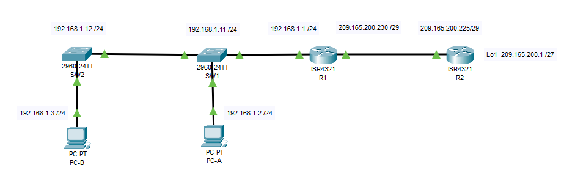

### ДЗ12. Настройка NAT для IPv4
-----


### Задание.
----

Часть 1. Создание сети и настройка основных параметров устройства.

Часть 2. Настройка и проверка NAT для IPv4.

Часть 3. Настройка и проверка PAT для IPv4.

Часть 4. Настройка и проверка статического NAT для IPv4.


#### Общие сведения/сценарий.

>Преобразование (NAT) — это процесс, при котором сетевое устройство, например маршрутизатор Cisco, назначает публичный адрес узлам в пределах частной сети. NAT используют для сокращения количества публичных IP-адресов, используемых организацией, поскольку количество доступных публичных IPv4-адресов ограничено.

* Интернет-провайдер выделил компании общедоступное пространство IP-адресов 209.165.200.224/29. Эта сеть используется для обращения к каналу между маршрутизатором ISP (R2) и шлюзом компании (R1).  
 Первый адрес (209.165.200.225) назначается интерфейсу g0/0 на R2, а последний адрес (209.165.200.230) назначается интерфейсу g0/0/0 на R1. Остальные адреса (209.165.200.226-209.165.200.229) будут использоваться для предоставления доступа в Интернет хостам компании.  
 Маршрут по умолчанию используется от R1 до R2. Подключение интернет-провайдера к Интернету смоделировано loopback-адресом на маршрутизаторе интернет-провайдера.

------ 
### Часть 1. Создание сети и настройка основных параметров устройства.

-----
В первой части лабораторной работы вам предстоит создать топологию сети и настроить базовые параметры для узлов ПК и коммутаторов.

#### Шаг 1. Подключите кабели сети согласно приведенной топологии.

-----
Подключите устройства в соответствии с топологией и подсоедините соответствующие кабели.



#### Шаг 2. Произведите базовую настройку маршрутизаторов.

-----
a.	Назначьте маршрутизатору имя устройства.

b.	Отключите поиск DNS, чтобы предотвратить попытки маршрутизатора неверно преобразовывать введенные команды таким образом, как будто они являются именами узлов.

c.	Назначьте class в качестве зашифрованного пароля привилегированного режима EXEC.

d.	Назначьте cisco в качестве пароля консоли и включите вход в систему по паролю.

e.	Назначьте cisco в качестве пароля VTY и включите вход в систему по паролю.

f.	Зашифруйте открытые пароли.

g.	Создайте баннер с предупреждением о запрете несанкционированного доступа к устройству.

h.	Настройте IP-адресации интерфейса, как указано в таблице выше.

i.	Настройте маршрут по умолчанию. от R2 до  R1.

j.	Сохраните текущую конфигурацию в файл загрузочной конфигурации.

#### Шаг 3. Настройте базовые параметры каждого коммутатора.


a.	Присвойте коммутатору имя устройства.

b.	Отключите поиск DNS, чтобы предотвратить попытки маршрутизатора неверно преобразовывать введенные команды таким образом, как будто они являются именами узлов.

c.	Назначьте class в качестве зашифрованного пароля привилегированного режима EXEC.

d.	Назначьте cisco в качестве пароля консоли и включите вход в систему по паролю.

e.	Назначьте cisco в качестве пароля VTY и включите вход в систему по паролю.

f.	Зашифруйте открытые пароли.

g.	Создайте баннер с предупреждением о запрете несанкционированного доступа к устройству.

h.	Выключите все интерфейсы, которые не будут использоваться.

i.	Настройте IP-адресации интерфейса, как указано в таблице выше.

j.	Сохраните текущую конфигурацию в файл загрузочной конфигурации.

------
### Часть 2. Настройка и проверка NAT для IPv4.

-----


В части 2 необходимо настроить и проверить NAT для IPv4.

#### Шаг 1. Настройте NAT на R1, используя пул из трех адресов 209.165.200.226-209.165.200.228. 

------

a.	Настройте простой список доступа, который определяет, какие хосты будут разрешены для трансляции. В этом случае все устройства в локальной сети R1 имеют право на трансляцию.

b.	Создайте пул NAT и укажите ему имя и диапазон используемых адресов.

>Примечание. Параметр маски сети не является разделителем IP-адресов. Это должна быть правильная маска подсети для назначенных адресов, даже если вы используете не все адреса подсети в пуле. 

c.	Настройте перевод, связывая ACL и пул с процессом преобразования.

>Примечание: Три очень важных момента. Во-первых, слово «inside» имеет решающее значение для работы такого рода NAT. Если вы опустить его, NAT не будет работать. Во-вторых, номер списка — это номер ACL, настроенный на предыдущем шаге. В-третьих, имя пула чувствительно к регистру.

d.	Задайте внутренний (inside) интерфейс. 

e.	Определите внешний (outside) интерфейс.

```
R1#
R1#conf t
Enter configuration commands, one per line.  End with CNTL/Z.
R1(config)#
R1(config)#access-list 1 permit 192.168.1.0 0.0.0.255
R1(config)#
R1(config)#ip nat pool PUBLIC_ACCESS 209.165.200.226 209.165.200.228 netmask 255.255.255.248
R1(config)#
R1(config)#ip nat inside source list 1 pool PUBLIC_ACCESS
R1(config)#
R1(config)#int g0/0/1
R1(config-if)#
R1(config-if)#ip nat inside
R1(config-if)#
R1(config-if)#int g0/0/0
R1(config-if)#
R1(config-if)#ip nat outside
R1(config-if)#
R1(config-if)#^Z
R1#
%SYS-5-CONFIG_I: Configured from console by console

R1#
```

Шаг 2. Проверьте и проверьте конфигурацию. 

-----

a.	С PC-B,  запустите эхо-запрос интерфейса Lo1 (209.165.200.1) на R2.

Если эхо-запрос не прошел, выполните процес поиска и устранения неполадок. На R1 отобразите таблицу NAT на R1 с помощью команды show ip nat translations.

R1# show ip nat translations
Pro Inside global Inside local Outside local Outside global
--- 209.165.200.226 192.168.1.3 --- --- 
226:1 192.168.1. 3:1 209.165.200. 1:1 209.165.200. 1:1 
Total number of translations: 2
Вопросы:
Во что был транслирован внутренний локальный адрес PC-B?
Введите ваш ответ здесь.
 
Какой тип адреса NAT является переведенным адресом?


