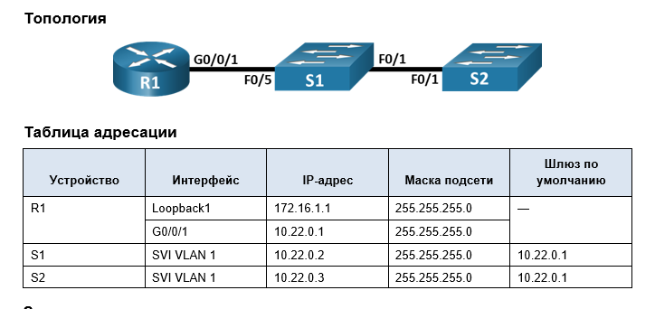
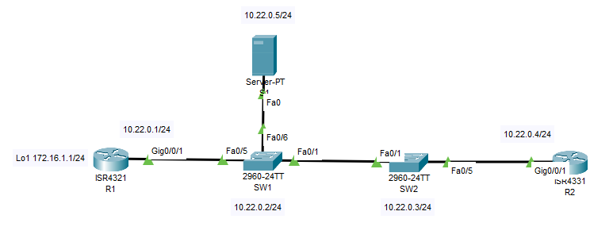

### ДЗ13. Настройка протоколов CDP, LLDP, NTP и SYSLOG.
------



### Задание.
----

Часть 1. Создание сети и настройка основных параметров устройства.

Часть 2. Обнаружение сетевых ресурсов с помощью протокола CDP.

Часть 3. Обнаружение сетевых ресурсов с помощью протокола LLDP.

Часть 4. Настройка и проверка NTP.

Часть 5. Системный журнал. Настройка SYSLOG сервера.

### Общие сведения/сценарий.

-----


Протокол Cisco Discovery Protocol (CDP) — собственный протокол Cisco для обнаружения сетевых ресурсов, функционирующий на канальном уровне. Он служит для обмена информацией, например именами устройств и версиями ПО IOS, с другими физически подключенными устройствами Cisco.  

Протокол Link Layer Discovery Protocol (LLDP) — это не зависящий от производителя протокол для обнаружения сетевых ресурсов, функционирующий на канальном уровне. В основном он используется сетевыми устройствами в локальной сети (LAN). Сетевые устройства сообщают соседям такие данные о себе, как идентификаторы и сведения о функциональных возможностях.  

Протокол сетевого времени (NTP) служит для синхронизации времени между распределенными серверами времени и клиентами. В качестве транспортного протокола NTP использует протокол UDP. Все операции обмена данными по протоколу NTP выполняются по времени в формате UTC.

Сервер NTP обычно получает данные о времени из достоверного источника, такого как атомные часы, к которым подключен сервер. Затем он распределяет это время по сети. Протокол NTP чрезвычайно эффективен; для синхронизации времени на двух компьютерах с временной разницей в пределах миллисекунды требуется отправлять не более одного пакета в минуту.

----

### Часть 1. Создание сети и настройка основных параметров устройства.

----



#### Шаг 1. Создайте сеть согласно топологии.
Для выполнения работы изменим топологию. Добавим маршрутизатор R2 - IP  10.22.0.4/24 и S1 - сервер SYSLOG - IP 10.22.0.5/24


#### Шаг 2. Настройте базовые параметры для маршрутизаторов.

----
a.	Назначьте маршрутизатору имя устройства.  
b.	Отключите поиск DNS, чтобы предотвратить попытки маршрутизатора неверно преобразовывать введенные команды таким образом, как будто они являются именами узлов.  
c.	Назначьте class в качестве зашифрованного пароля привилегированного режима EXEC.  
d.	Назначьте cisco в качестве пароля консоли и включите вход в систему по паролю.  
e.	Назначьте cisco в качестве пароля VTY и включите вход в систему по паролю.
f.	Зашифруйте открытые пароли.  
g.	Создайте баннер с предупреждением о запрете несанкционированного доступа к устройству.  
h.	Настройка интерфейсов, перечисленных в таблице выше.  
i.	Сохраните текущую конфигурацию в файл загрузочной конфигурации.

#### Шаг 3. Настройте базовые параметры каждого коммутатора.

----

a.	Присвойте коммутатору имя устройства.  
b.	Отключите поиск DNS, чтобы предотвратить попытки маршрутизатора неверно преобразовывать введенные команды таким образом, как будто они являются именами узлов.  
c.	Назначьте class в качестве зашифрованного пароля привилегированного режима EXEC.  
d.	Назначьте cisco в качестве пароля консоли и включите вход в систему по паролю.  
e.	Назначьте cisco в качестве пароля VTY и включите вход в систему по паролю.
f.	Зашифруйте открытые пароли.  
g.	Создайте баннер, который предупреждает всех, кто обращается к устройству, видит баннерное сообщение «Только авторизованные пользователи!».   
h.	Отключите неиспользуемые интерфейсы.  
i.	Сохраните текущую конфигурацию в файл загрузочной конфигурации.


#### Шаг 4. Проверим IP связанность всех узлов сети.

-----
 IP связанность имеется.

Создание сети и настройка основных параметров устройства закончена.

### Часть 2. Обнаружение сетевых ресурсов с помощью протокола CDP.

-------

На устройствах Cisco протокол CDP включен по умолчанию. Воспользуйтесь CDP, чтобы обнаружить порты, к которым подключены кабели.

a.	На R1 используйте соответствующую команду show cdp, чтобы определить, сколько интерфейсов включено CDP, сколько из них включено и сколько отключено.
 ```
R1#
R1#sh cdp interface 
Vlan1 is administratively down, line protocol is down
  Sending CDP packets every 60 seconds
  Holdtime is 180 seconds
GigabitEthernet0/0/0 is administratively down, line protocol is down
  Sending CDP packets every 60 seconds
  Holdtime is 180 seconds
GigabitEthernet0/0/1 is up, line protocol is up
  Sending CDP packets every 60 seconds
  Holdtime is 180 seconds
R1#
```

Вопрос:
Сколько интерфейсов участвует в объявлениях CDP? Какие из них активны?

На маршрутизаторе R1 все порты участвует в объявлениях CDP - VLAN 1, G0/0/0, G0/0/1.
Активным является 1 порт - G0/0/1

b. На R1 используйте соответствующую команду show cdp, чтобы определить информацию о соседних сетевых устройствах.

```
R1#
R1#sh cdp neighbors 
Capability Codes: R - Router, T - Trans Bridge, B - Source Route Bridge
                  S - Switch, H - Host, I - IGMP, r - Repeater, P - Phone
Device ID    Local Intrfce   Holdtme    Capability   Platform    Port ID
SW1          Gig 0/0/1        154            S       2960        Fas 0/5
R1#

```
Соседний коммутатор SW1 портом Fa0/5 подключен к порту G0/0/1 маршрутизатора R1.

Можно получить более полную информацию с помощью команды **sh cdp neighbors detail**
```
R1#sh cdp neighbors det
R1#sh cdp neighbors detail 

Device ID: SW1
Entry address(es): 
  IP address : 10.22.0.2
Platform: cisco 2960, Capabilities: Switch
Interface: GigabitEthernet0/0/1, Port ID (outgoing port): FastEthernet0/5
Holdtime: 120

Version :
Cisco IOS Software, C2960 Software (C2960-LANBASEK9-M), Version 15.0(2)SE4, RELEASE SOFTWARE (fc1)
Technical Support: http://www.cisco.com/techsupport
Copyright (c) 1986-2013 by Cisco Systems, Inc.
Compiled Wed 26-Jun-13 02:49 by mnguyen

advertisement version: 2
Duplex: full

R1#
```


c.	Аналогичную информацию о коммутаторе SW1 можно получить используя команду **sh cdp entry SW1**.

```
R1#sh cdp entry SW1

Device ID: SW1
Entry address(es): 
  IP address : 10.22.0.2
Platform: cisco 2960, Capabilities: Switch
Interface: GigabitEthernet0/0/1, Port ID (outgoing port): FastEthernet0/5
Holdtime: 124

Version :
Cisco IOS Software, C2960 Software (C2960-LANBASEK9-M), Version 15.0(2)SE4, RELEASE SOFTWARE (fc1)
Technical Support: http://www.cisco.com/techsupport
Copyright (c) 1986-2013 by Cisco Systems, Inc.
Compiled Wed 26-Jun-13 02:49 by mnguyen

advertisement version: 2
Duplex: full

R1#
```
На коммутаторе SW1 используется версия ОС - **Cisco IOS Software, C2960 Software (C2960-LANBASEK9-M), Version 15.0(2)SE4, RELEASE SOFTWARE (fc1)**

d.	На S1 используйте соответствующую команду show cdp, чтобы определить, сколько пакетов CDP было выданных.

**S1# show cdp traffic**

В CPT данной версии нет возможности использовать команду **show cdp traffic**


e. С помощью соответствующей команды sh cdp gросмотрим информацию о соседях коммутатора SW1.

```
SW1#
SW1#sh cdp nei
Capability Codes: R - Router, T - Trans Bridge, B - Source Route Bridge
                  S - Switch, H - Host, I - IGMP, r - Repeater, P - Phone
Device ID    Local Intrfce   Holdtme    Capability   Platform    Port ID
SW2          Fas 0/1          172            S       2960        Fas 0/1
R1           Fas 0/5          127            R       ISR4300     Gig 0/0/1
SW1#
SW1#sh cdp neighbors detail 

Device ID: SW2
Entry address(es): 
  IP address : 10.22.0.3
Platform: cisco 2960, Capabilities: Switch
Interface: FastEthernet0/1, Port ID (outgoing port): FastEthernet0/1
Holdtime: 127

Version :
Cisco IOS Software, C2960 Software (C2960-LANBASEK9-M), Version 15.0(2)SE4, RELEASE SOFTWARE (fc1)
Technical Support: http://www.cisco.com/techsupport
Copyright (c) 1986-2013 by Cisco Systems, Inc.
Compiled Wed 26-Jun-13 02:49 by mnguyen

advertisement version: 2
Duplex: full
---------------------------

Device ID: R1
Entry address(es): 
  IP address : 10.22.0.1
Platform: cisco ISR4300, Capabilities: Router
Interface: FastEthernet0/5, Port ID (outgoing port): GigabitEthernet0/0/1
Holdtime: 142

Version :
Cisco IOS XE Software, Version 03.13.04.S - Extended Support Release
Cisco IOS Software, ISR Software (X86_64_LINUX_IOSD-UNIVERSALK9-M), Version 15.5(3)S5, RELEASE SOFTWARE (fc2)
Technical Support: http://www.cisco.com/techsupport
Copyright (c) 1986-2017 by Cisco Systems, Inc.
Compiled Mon 05-Oct-15 11:24 by mcpre

advertisement version: 2
Duplex: full

SW1#
```
f.	Отключить CDP глобально на всех устройствах с помощью команды **no cdp run**

```
R1#
R1#conf t
Enter configuration commands, one per line.  End with CNTL/Z.
R1(config)#
R1(config)#no cdp run
R1(config)#
R1(config)#
R1(config)#exit
R1#
%SYS-5-CONFIG_I: Configured from console by console

R1#
R1#sh cdp
% CDP is not enabled
R1#
```

---
### Часть 3. Обнаружение сетевых ресурсов с помощью протокола LLDP.

----
На устройствах Cisco протокол LLDP может быть выключен по умолчанию. Воспользуйтесь LLDP, чтобы обнаружить порты, к которым подключены кабели.

a.	Введите соответствующую команду lldp, чтобы включить LLDP на всех устройствах в топологии.
```

R1#
R1#sh lldp
% LLDP is not enabled
R1#
R1#conf t
Enter configuration commands, one per line.  End with CNTL/Z.
R1(config)#lldp run
R1(config)#
R1(config)#exit
R1#
%SYS-5-CONFIG_I: Configured from console by console

R1#sh lldp

Global LLDP Information:
    Status: ACTIVE
    LLDP advertisements are sent every 30 seconds
    LLDP hold time advertised is 120 seconds
    LLDP interface reinitialisation delay is 2 seconds
R1#
```

b.	На S1 выполните соответствующую команду lldp, чтобы предоставить подробную информацию о соседних устройствах. 
```
SW1#sh lldp neighbors
Capability codes:
    (R) Router, (B) Bridge, (T) Telephone, (C) DOCSIS Cable Device
    (W) WLAN Access Point, (P) Repeater, (S) Station, (O) Other
Device ID           Local Intf     Hold-time  Capability      Port ID
R1                  Fa0/5          120        R               Gig0/0/1
SW2                 Fa0/1          120        B               Fa0/1

Total entries displayed: 2
SW1#
SW1#
SW1#sh lldp entr
SW1#sh lldp ?
  neighbors  LLDP neighbor entries
  <cr>
SW1#
SW1#sh lldp neighbors detail 
------------------------------------------------
Chassis id: 0001.C72A.2302
Port id: Gig0/0/1
Port Description: GigabitEthernet0/0/1
System Name: R1
System Description:
Cisco IOS XE Software, Version 03.13.04.S - Extended Support Release
Cisco IOS Software, ISR Software (X86_64_LINUX_IOSD-UNIVERSALK9-M), Version 15.5(3)S5, RELEASE SOFTWARE (fc2)
Technical Support: http://www.cisco.com/techsupport
Copyright (c) 1986-2017 by Cisco Systems, Inc.
Compiled Mon 05-Oct-15 11:24 by mcpre
Time remaining: 90 seconds
System Capabilities: R
Enabled Capabilities: R
Management Addresses - not advertised
Auto Negotiation - supported, enabled
Physical media capabilities:
    1000baseT(HD)
    100baseT(FD)
Media Attachment Unit type: 10
Vlan ID: 1
------------------------------------------------
Chassis id: 0060.4741.079B
Port id: Fa0/1
Port Description: FastEthernet0/1
System Name: SW2
System Description:
Cisco IOS Software, C2960 Software (C2960-LANBASEK9-M), Version 15.0(2)SE4, RELEASE SOFTWARE (fc1)
Technical Support: http://www.cisco.com/techsupport
Copyright (c) 1986-2013 by Cisco Systems, Inc.
Compiled Wed 26-Jun-13 02:49 by mnguyen
Time remaining: 90 seconds
System Capabilities: B
Enabled Capabilities: B
Management Addresses - not advertised
Auto Negotiation - supported, enabled
Physical media capabilities:
    100baseT(FD)
    100baseT(HD)
    1000baseT(HD)
Media Attachment Unit type: 10
Vlan ID: 1

Total entries displayed: 2
SW1#
```
Вопрос.

Что такое chassis ID  для коммутатора S2?

**Chassis id: 0060.4741.079B**  для коммутатора SW2 это MAC адрес коммутатора SW2.
Но можно настроить вывод команды, что бы отображался IP адрес.

c.	Соединитесь через консоль на всех устройствах и используйте команды LLDP, необходимые для отображения топологии физической сети только из выходных данных команды show.

На маршрутизаторе R1:
```
R1#sh lldp nei
Capability codes:
    (R) Router, (B) Bridge, (T) Telephone, (C) DOCSIS Cable Device
    (W) WLAN Access Point, (P) Repeater, (S) Station, (O) Other
Device ID           Local Intf     Hold-time  Capability      Port ID
SW1                 Gig0/0/1       120        B               Fa0/5

Total entries displayed: 1
R1#
```
На коммутаторе SW1:
```
SW1>en
Password: 
SW1#sh lldp nei
Capability codes:
    (R) Router, (B) Bridge, (T) Telephone, (C) DOCSIS Cable Device
    (W) WLAN Access Point, (P) Repeater, (S) Station, (O) Other
Device ID           Local Intf     Hold-time  Capability      Port ID
R1                  Fa0/5          120        R               Gig0/0/1
SW2                 Fa0/1          120        B               Fa0/1

Total entries displayed: 2
SW1#
```
На коммутаторе SW2:
```
SW2>
SW2>en
Password: 
SW2#sh lldp nei
Capability codes:
    (R) Router, (B) Bridge, (T) Telephone, (C) DOCSIS Cable Device
    (W) WLAN Access Point, (P) Repeater, (S) Station, (O) Other
Device ID           Local Intf     Hold-time  Capability      Port ID
R2                  Fa0/5          120        R               Gig0/0/1
SW1                 Fa0/1          120        B               Fa0/1

Total entries displayed: 2
SW2#
```

На маршрутизаторе R2:
```
R2>en
Password: 
R2#sh lldp nei
Capability codes:
    (R) Router, (B) Bridge, (T) Telephone, (C) DOCSIS Cable Device
    (W) WLAN Access Point, (P) Repeater, (S) Station, (O) Other
Device ID           Local Intf     Hold-time  Capability      Port ID
SW2                 Gig0/0/1       120        B               Fa0/5

Total entries displayed: 1
R2#
```

Таким образом можно составить топологию физической сети.

---
### Часть 4. Настройка NTP.

----
В части 4 необходимо настроить маршрутизатор R1 в качестве сервера NTP, а маршрутизатор R2 в качестве клиента NTP маршрутизатора R1. Необходимо выполнить синхронизацию времени для Syslog и отладочных функций. Если время не синхронизировано, сложно определить, какое сетевое событие стало причиной данного сообщения.

#### Шаг 1. Выведите на экран текущее время.


Введите команду show clock для отображения текущего времени на R1. Запишите отображаемые сведения о текущем времени в следующей таблице.

```
R1#
R1#sh clo
R1#sh clock det
R1#sh clock detail 
*2:8:40.936 UTC Mon Mar 1 1993
Time source is hardware calendar
R1#
```

| | | | |
|-------------------------|:----------------:|:-----------------|---------|
|Дата | Время | Часовой пояс|Источник времени|
|  01.03.1993 | 02:08:40 | UTC |  hardware calendar |

>По умолчанию, если параметр clock не установлен, при каждом включении маршрутизатора время начинается с 00 часов 00 минут 00 секунд понедельника 1 марта 1993 года. Часы хранятся в формате UTC (Coordinated Universal Time), это то же, что и более привычный для нас GMT (Greenwich Mean Time) - среднее время по гринвичскому меридиану.

#### Шаг 2. Установите время.
С помощью команды clock set установите время на маршрутизаторе R1. Введенное время должно быть в формате UTC. 

```
R1#
R1#clock set 15:52:24 30 may 2025
R1#
R1#
R1#sh clock 
15:52:36.814 UTC Fri May 30 2025
R1#
```

#### Шаг 3. Настройте главный сервер NTP.
Настройте R1 в качестве хозяина NTP с уровнем слоя 4.
```
R1(config)#ntp master 4
R1(config)#
R1(config)#

R1#sh ntp status 
Clock is synchronized, stratum 4, reference is 127.127.1.1
nominal freq is 250.0000 Hz, actual freq is 249.9990 Hz, precision is 2**24
reference time is EBBB7A80.00000076 (16:19:12.118 UTC Fri May 30 2025)
clock offset is 0.00 msec, root delay is 0.00  msec
root dispersion is 0.00 msec, peer dispersion is 0.48 msec.
loopfilter state is 'CTRL' (Normal Controlled Loop), drift is - 0.000001193 s/s system poll interval is 6, last update was 57 sec ago.
R1#

```

#### Шаг 4. Настройте клиент NTP.
a.	Выполните соответствующую команду на S1 и S2, чтобы просмотреть настроенное время. Запишите текущее время,  в следующей таблице.

```
SW1#
SW1#
SW1#sh clock det
*2:46:34.365 UTC Mon Mar 1 1993
Time source is hardware calendar
SW1#


SW2#
SW2#sh clo
SW2#sh clock det
*2:47:42.356 UTC Mon Mar 1 1993
Time source is hardware calendar
SW2#

```
|  | | | | |
|--- |-------------------------|:----------------:|:-----------------|---------|
| |Дата | Время | Часовой пояс|Источник времени|
| SW1 |  01.03.1993 | 02:46:34 | UTC |  hardware calendar |
| SW2 |  01.03.1993 | 02:46:34  |UTC   |hardware calendar|


b.	Настройте S1 и S2 в качестве клиентов NTP. Используйте соответствующие команды NTP для получения времени от интерфейса G0/0/1 R1, а также для периодического обновления календаря или аппаратных часов коммутатора.
```
SW1(config)#ntp server 10.22.0.1
SW1(config)#
SW1(config)#exit
SW1#
%SYS-5-CONFIG_I: Configured from console by console


SW1#sh ntp associations 

address         ref clock       st   when     poll    reach  delay          offset            disp
*~10.22.0.1     127.127.1.1     4    2        16      77     0.00           0.00              0.12
 * sys.peer, # selected, + candidate, - outlyer, x falseticker, ~ configured


SW1#
SW1#sh clock detail 
16:34:51.134 UTC Fri May 30 2025
Time source is NTP
SW1#


SW2(config)#ntp server 10.22.0.1
SW2(config)#
SW2(config)#exit
SW2#
%SYS-5-CONFIG_I: Configured from console by console

SW2#
SW2#sh ntp associations 

address         ref clock       st   when     poll    reach  delay          offset            disp
 ~10.22.0.1     127.127.1.1     4    0        16      3      0.00           1017667381592.00  0.12
 * sys.peer, # selected, + candidate, - outlyer, x falseticker, ~ configured
SW2#
SW2#sh clock detail 
16:34:35.914 UTC Fri May 30 2025
Time source is NTP
SW2#
```
Как видно,  что SW1 и SW2 синхронизированы с R1.  Теперь время имеет актуальное значение на коммутаторах SW1 и SW2 по сравнению с данными из таблицы.


Аналогично настроим маршрутизатор R2 как клиент NTP.

```
R2(config)#
R2(config)#ntp server 10.22.0.1 key 0
R2(config)#
R2(config)#


R2#
R2#sh clock detail 
17:28:16.670 UTC Fri May 30 2025
Time source is NTP
R2#
R2#sh ntp status
Clock is synchronized, stratum 5, reference is 10.22.0.1
nominal freq is 250.0000 Hz, actual freq is 249.9990 Hz, precision is 2**24
reference time is EBBB8AD6.00000126 (17:28:54.294 UTC Fri May 30 2025)
clock offset is 0.00 msec, root delay is 1.00  msec
root dispersion is 10.48 msec, peer dispersion is 0.12 msec.
loopfilter state is 'CTRL' (Normal Controlled Loop), drift is - 0.000001193 s/s system poll interval is 4, last update was 7 sec ago.
R2#sh clock detail 
17:30:39.602 UTC Fri May 30 2025
Time source is NTP
R2#
```
Как видно,  что R2 так же синхронизированы с R1.  Теперь время имеет актуальное значение и на маршрутизаторе R2.

#### Вопрос для повторения
Для каких интерфейсов в пределах сети не следует использовать протоколы обнаружения сетевых ресурсов? Поясните ответ.

* Внутри сети, как правило, не следует использовать протоколы обнаружения сетевых ресурсов (CDP или LLDP) на интерфейсах, которые напрямую подключены к конечным устройствам, таким как компьютеры или серверы , поскольку эти протоколы в первую очередь предназначены для обнаружения устройств в сетях коммутации, а не конечных узлов.  
  Кроме того, не следует использовать протоколы обнаружения сетевых ресурсов (CDP или LLDP) на интерфейсах, которые напрямую подключены к оборудованию провайдера. Граничный маршрутизатор может начать отправлять информацию о себе по сети, что может быть использовано злоумышленниками.

----
### Часть 5. Системный журнал. Настройка SYSLOG сервера.

------

Системный журнал Syslog использует порт UDP 514 для отправки сообщений с уведомлением о событиях по сетям IP на средства сбора сообщений о событиях.
Сервис ведения системного журнала выполняет три основные функции:
* сбор информации в журнал для мониторинга и устранения неполадок;
* выбор типа информации, сбор которой будет осуществляться;
* определение получателей собранных сообщений syslog.

Для сбора и отображения системных событий используем внешний SYSLOG сервер S1 - IP 10.22.0.5 . Сервис SYSLOG уже включен на сервере.

Настроим маршрутизатор R1 для логгирования.
```
#conf t
Enter configuration commands, one per line.  End with CNTL/Z.
R1(config)#
R1(config)#
R1(config)#logging ?
  A.B.C.D   IP address of the logging host
  buffered  Set buffered logging parameters
  console   Set console logging parameters
  host      Set syslog server IP address and parameters
  on        Enable logging to all enabled destinations
  trap      Set syslog server logging level
  userinfo  Enable logging of user info on privileged mode enabling
R1(config)#logging on
R1(config)#
R1(config)#logging 10.22.0.5
R1(config)#
R1(config)#service timestamps  log datetime msec 
R1(config)#
R1(config)#
```

Инициируем событие отключения интерфейса на R1


