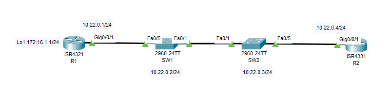

### ДЗ13. Настройка протоколов CDP, LLDP, NTP и SYSLOG.
------


### Задание.
----

Часть 1. Создание сети и настройка основных параметров устройства.

Часть 2. Обнаружение сетевых ресурсов с помощью протокола CDP.

Часть 3. Обнаружение сетевых ресурсов с помощью протокола LLDP.

Часть 4. Настройка и проверка NTP.

Часть 5. Системный журнал. Настройка SYSLOG сервера.

### Общие сведения/сценарий.

-----


Протокол Cisco Discovery Protocol (CDP) — собственный протокол Cisco для обнаружения сетевых ресурсов, функционирующий на канальном уровне. Он служит для обмена информацией, например именами устройств и версиями ПО IOS, с другими физически подключенными устройствами Cisco.  

Протокол Link Layer Discovery Protocol (LLDP) — это не зависящий от производителя протокол для обнаружения сетевых ресурсов, функционирующий на канальном уровне. В основном он используется сетевыми устройствами в локальной сети (LAN). Сетевые устройства сообщают соседям такие данные о себе, как идентификаторы и сведения о функциональных возможностях.  

Протокол сетевого времени (NTP) служит для синхронизации времени между распределенными серверами времени и клиентами. В качестве транспортного протокола NTP использует протокол UDP. Все операции обмена данными по протоколу NTP выполняются по времени в формате UTC.

Сервер NTP обычно получает данные о времени из достоверного источника, такого как атомные часы, к которым подключен сервер. Затем он распределяет это время по сети. Протокол NTP чрезвычайно эффективен; для синхронизации времени на двух компьютерах с временной разницей в пределах миллисекунды требуется отправлять не более одного пакета в минуту.

Системный журнал Syslog использует порт UDP 514 для отправки сообщений с уведомлением о событиях по сетям IP на средства сбора сообщений о событиях.
Сервис ведения системного журнала выполняет три основные функции:
* сбор информации в журнал для мониторинга и устранения неполадок;
* выбор типа информации, сбор которой будет осуществляться;
* определение получателей собранных сообщений syslog.

----

### Часть 1. Создание сети и настройка основных параметров устройства.

----



#### Шаг 1. Создайте сеть согласно топологии.
Для выполнения работы изменим топологию. Добавим маршрутизатор R2 - IP  10.22.0.4/24 и S1 - сервер SYSLOG - IP 10.22.0.5/24


#### Шаг 2. Настройте базовые параметры для маршрутизаторов.

----
a.	Назначьте маршрутизатору имя устройства.  
b.	Отключите поиск DNS, чтобы предотвратить попытки маршрутизатора неверно преобразовывать введенные команды таким образом, как будто они являются именами узлов.  
c.	Назначьте class в качестве зашифрованного пароля привилегированного режима EXEC.  
d.	Назначьте cisco в качестве пароля консоли и включите вход в систему по паролю.  
e.	Назначьте cisco в качестве пароля VTY и включите вход в систему по паролю.
f.	Зашифруйте открытые пароли.  
g.	Создайте баннер с предупреждением о запрете несанкционированного доступа к устройству.  
h.	Настройка интерфейсов, перечисленных в таблице выше.  
i.	Сохраните текущую конфигурацию в файл загрузочной конфигурации.

#### Шаг 3. Настройте базовые параметры каждого коммутатора.

----

a.	Присвойте коммутатору имя устройства.  
b.	Отключите поиск DNS, чтобы предотвратить попытки маршрутизатора неверно преобразовывать введенные команды таким образом, как будто они являются именами узлов.  
c.	Назначьте class в качестве зашифрованного пароля привилегированного режима EXEC.  
d.	Назначьте cisco в качестве пароля консоли и включите вход в систему по паролю.  
e.	Назначьте cisco в качестве пароля VTY и включите вход в систему по паролю.
f.	Зашифруйте открытые пароли.  
g.	Создайте баннер, который предупреждает всех, кто обращается к устройству, видит баннерное сообщение «Только авторизованные пользователи!».   
h.	Отключите неиспользуемые интерфейсы.  
i.	Сохраните текущую конфигурацию в файл загрузочной конфигурации.


#### Шаг 4. Проверим IP связанность всех узлов сети.

-----
 IP связанность имеется.

Создание сети и настройка основных параметров устройства закончена.

### Часть 2. Обнаружение сетевых ресурсов с помощью протокола CDP.

-------

На устройствах Cisco протокол CDP включен по умолчанию. Воспользуйтесь CDP, чтобы обнаружить порты, к которым подключены кабели.

a.	На R1 используйте соответствующую команду show cdp, чтобы определить, сколько интерфейсов включено CDP, сколько из них включено и сколько отключено.
 ```
R1#
R1#sh cdp interface 
Vlan1 is administratively down, line protocol is down
  Sending CDP packets every 60 seconds
  Holdtime is 180 seconds
GigabitEthernet0/0/0 is administratively down, line protocol is down
  Sending CDP packets every 60 seconds
  Holdtime is 180 seconds
GigabitEthernet0/0/1 is up, line protocol is up
  Sending CDP packets every 60 seconds
  Holdtime is 180 seconds
R1#
```

Вопрос:
Сколько интерфейсов участвует в объявлениях CDP? Какие из них активны?

На маршрутизаторе R1 все порты участвует в объявлениях CDP - VLAN 1, G0/0/0, G0/0/1.
Активным является 1 порт - G0/0/1

b. На R1 используйте соответствующую команду show cdp, чтобы определить информацию о соседних сетевых устройствах.

```
R1#
R1#sh cdp neighbors 
Capability Codes: R - Router, T - Trans Bridge, B - Source Route Bridge
                  S - Switch, H - Host, I - IGMP, r - Repeater, P - Phone
Device ID    Local Intrfce   Holdtme    Capability   Platform    Port ID
SW1          Gig 0/0/1        154            S       2960        Fas 0/5
R1#

```
Соседний коммутатор SW1 портом Fa0/5 подключен к порту G0/0/1 маршрутизатора R1.

Можно получить более полную информацию с помощью команды **sh cdp neighbors detail**
```
R1#sh cdp neighbors det
R1#sh cdp neighbors detail 

Device ID: SW1
Entry address(es): 
  IP address : 10.22.0.2
Platform: cisco 2960, Capabilities: Switch
Interface: GigabitEthernet0/0/1, Port ID (outgoing port): FastEthernet0/5
Holdtime: 120

Version :
Cisco IOS Software, C2960 Software (C2960-LANBASEK9-M), Version 15.0(2)SE4, RELEASE SOFTWARE (fc1)
Technical Support: http://www.cisco.com/techsupport
Copyright (c) 1986-2013 by Cisco Systems, Inc.
Compiled Wed 26-Jun-13 02:49 by mnguyen

advertisement version: 2
Duplex: full

R1#
```


c.	Аналогичную информацию о коммутаторе SW1 можно получить используя команду **sh cdp entry SW1**.

```
R1#sh cdp entry SW1

Device ID: SW1
Entry address(es): 
  IP address : 10.22.0.2
Platform: cisco 2960, Capabilities: Switch
Interface: GigabitEthernet0/0/1, Port ID (outgoing port): FastEthernet0/5
Holdtime: 124

Version :
Cisco IOS Software, C2960 Software (C2960-LANBASEK9-M), Version 15.0(2)SE4, RELEASE SOFTWARE (fc1)
Technical Support: http://www.cisco.com/techsupport
Copyright (c) 1986-2013 by Cisco Systems, Inc.
Compiled Wed 26-Jun-13 02:49 by mnguyen

advertisement version: 2
Duplex: full

R1#
```
На коммутаторе SW1 используется версия ОС - **Cisco IOS Software, C2960 Software (C2960-LANBASEK9-M), Version 15.0(2)SE4, RELEASE SOFTWARE (fc1)**

d.	На S1 используйте соответствующую команду show cdp, чтобы определить, сколько пакетов CDP было выданных.

**S1# show cdp traffic**

В CPT данной версии нет возможности использовать команду **show cdp traffic**


e. С помощью соответствующей команды sh cdp gросмотрим информацию о соседях коммутатора SW1.

```
SW1#
SW1#sh cdp nei
Capability Codes: R - Router, T - Trans Bridge, B - Source Route Bridge
                  S - Switch, H - Host, I - IGMP, r - Repeater, P - Phone
Device ID    Local Intrfce   Holdtme    Capability   Platform    Port ID
SW2          Fas 0/1          172            S       2960        Fas 0/1
R1           Fas 0/5          127            R       ISR4300     Gig 0/0/1
SW1#
SW1#sh cdp neighbors detail 

Device ID: SW2
Entry address(es): 
  IP address : 10.22.0.3
Platform: cisco 2960, Capabilities: Switch
Interface: FastEthernet0/1, Port ID (outgoing port): FastEthernet0/1
Holdtime: 127

Version :
Cisco IOS Software, C2960 Software (C2960-LANBASEK9-M), Version 15.0(2)SE4, RELEASE SOFTWARE (fc1)
Technical Support: http://www.cisco.com/techsupport
Copyright (c) 1986-2013 by Cisco Systems, Inc.
Compiled Wed 26-Jun-13 02:49 by mnguyen

advertisement version: 2
Duplex: full
---------------------------

Device ID: R1
Entry address(es): 
  IP address : 10.22.0.1
Platform: cisco ISR4300, Capabilities: Router
Interface: FastEthernet0/5, Port ID (outgoing port): GigabitEthernet0/0/1
Holdtime: 142

Version :
Cisco IOS XE Software, Version 03.13.04.S - Extended Support Release
Cisco IOS Software, ISR Software (X86_64_LINUX_IOSD-UNIVERSALK9-M), Version 15.5(3)S5, RELEASE SOFTWARE (fc2)
Technical Support: http://www.cisco.com/techsupport
Copyright (c) 1986-2017 by Cisco Systems, Inc.
Compiled Mon 05-Oct-15 11:24 by mcpre

advertisement version: 2
Duplex: full

SW1#
```


---
### Часть 3. Обнаружение сетевых ресурсов с помощью протокола LLDP.

----
На устройствах Cisco протокол LLDP может быть выключен по умолчанию. Воспользуйтесь LLDP, чтобы обнаружить порты, к которым подключены кабели.


